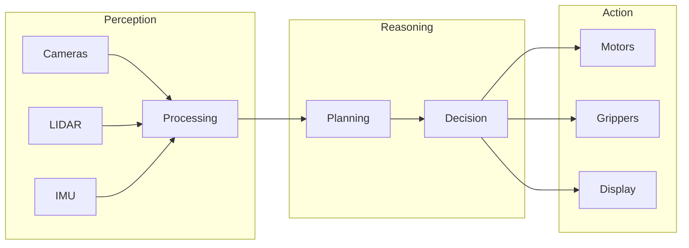

# Lesson 1: Physical AI & the Robotic Nervous System

**Learning Objectives**

After completing this lesson, you will be able to:
1. **Define** Physical AI and distinguish it from traditional digital AI
2. **Explain** the principles of embodied intelligence
3. **Describe** the concept of the robotic nervous system
4. **Identify** key components in modern humanoid robot systems

## 1.1 What is Physical AI?

Physical AI represents a paradigm shift in artificial intelligence—moving from algorithms that exist purely in software to intelligent systems that interact with the physical world through robotic bodies.

Unlike traditional AI that processes data in isolation, Physical AI systems must:
- **Perceive** the environment through sensors (cameras, LIDAR, force sensors)
- **Reason** about actions considering physical constraints
- **Act** on the world through actuators (motors, grippers, joints)
- **Adapt** in real-time to unexpected changes

Consider the difference: A chess-playing AI operates in a perfectly defined digital environment with discrete moves. A humanoid robot picking up a cup must account for lighting variations, cup positions, grip forces, balance adjustments, and countless other physical variables—all in real-time.

This is the challenge and promise of Physical AI: creating machines that can operate intelligently in our unpredictable, continuous, physical world.

## 1.2 Embodied Intelligence Principles

The field of embodied intelligence recognizes that intelligence cannot be separated from the physical body that houses it. This insight, pioneered by roboticists like Rodney Brooks, fundamentally changed how we approach AI for robots.

### Key Principles

**Sensorimotor Coupling**: Intelligence emerges from the tight integration of sensing and acting. A robot's understanding of "heavy" comes not from a dictionary definition but from the experience of lifting objects and sensing resistance.

**Environmental Interaction**: The world itself serves as an external memory and computational resource. Rather than building complex internal models, embodied systems can use the environment directly—touching a surface to determine if it's stable rather than computing physics simulations.

**Morphological Computation**: The physical structure of the robot contributes to intelligent behavior. Human hands are not just actuators—their shape, flexibility, and compliance enable grasping without complex control algorithms. Similarly, well-designed robot morphology simplifies control.

**Real-Time Constraints**: Physical systems operate under strict timing requirements. A falling robot cannot pause to think—responses must be fast enough to prevent damage.

These principles guide modern humanoid robotics, where success depends not just on powerful algorithms but on thoughtful integration of perception, cognition, and physical form.

## 1.3 The Robotic Nervous System Concept

Just as the human nervous system coordinates perception and action throughout the body, robots need a communication infrastructure that connects sensors, processors, and actuators into a coherent whole.

This is where **ROS 2** (Robot Operating System 2) enters the picture.

ROS 2 provides:
- **Standardized communication** between software components (nodes)
- **Hardware abstraction** allowing the same code to run on different robots
- **Real-time capabilities** for time-critical control loops
- **Distributed computing** to spread processing across multiple machines

Think of ROS 2 as the nervous system infrastructure: it doesn't tell the robot what to do, but it ensures that sensor data reaches the brain, decisions propagate to muscles, and everything stays coordinated.

## 1.4 Real-World Humanoid Robotics

The convergence of Physical AI and advanced robotics has produced remarkable humanoid systems:

| Robot | Organization | Key Capability |
|-------|--------------|----------------|
| Atlas | Boston Dynamics | Dynamic locomotion, parkour |
| Optimus | Tesla | Manufacturing tasks, human environments |
| Figure 01 | Figure AI | General-purpose manipulation |
| Digit | Agility Robotics | Warehouse logistics, bipedal walking |

These systems share common architectural patterns:
- **Distributed sensor networks** providing environmental awareness
- **Hierarchical control** from high-level planning to low-level motor control
- **Real-time middleware** (often ROS 2 or custom alternatives) for coordination
- **Machine learning** for perception and adaptive behavior

Throughout this course, you'll learn the foundational skills needed to understand and build similar systems—starting with the nervous system itself.

## Summary

In this lesson, we explored the foundations of Physical AI:

- **Physical AI** extends artificial intelligence into the real world through robotic embodiment
- **Embodied intelligence** principles show that intelligent behavior emerges from the interaction of mind, body, and environment
- **The robotic nervous system** concept frames ROS 2 as the communication infrastructure enabling coordinated robot behavior
- **Modern humanoids** demonstrate these principles in increasingly capable systems

In the next lesson, we'll dive deep into ROS 2 architecture—understanding the nodes, topics, services, and actions that form the building blocks of the robotic nervous system.

---

## References

1. Brooks, R. A. (1999). *Cambrian Intelligence: The Early History of the New AI*. MIT Press.
2. Pfeifer, R., & Bongard, J. (2007). *How the Body Shapes the Way We Think: A New View of Intelligence*. MIT Press.
3. Macenski, S., Foote, T., Gerkey, B., Lalancette, C., & Woodall, W. (2022). Robot Operating System 2: Design, architecture, and uses in the wild. *Science Robotics*, 7(66).
