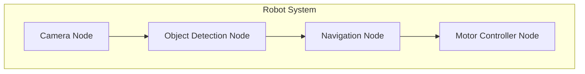
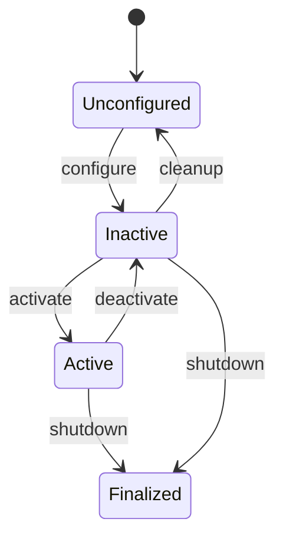
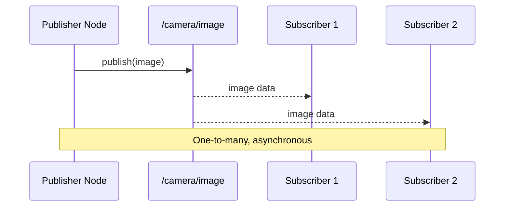
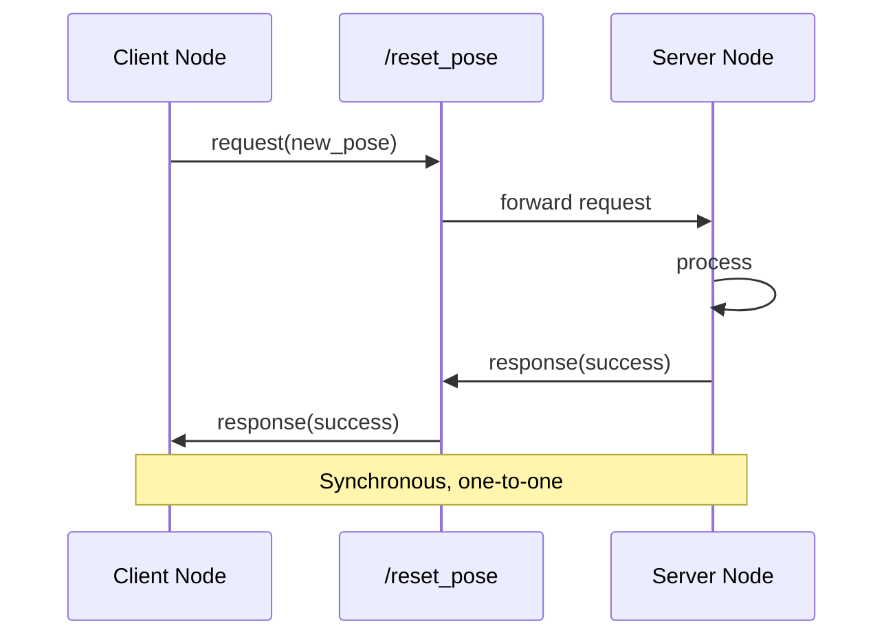
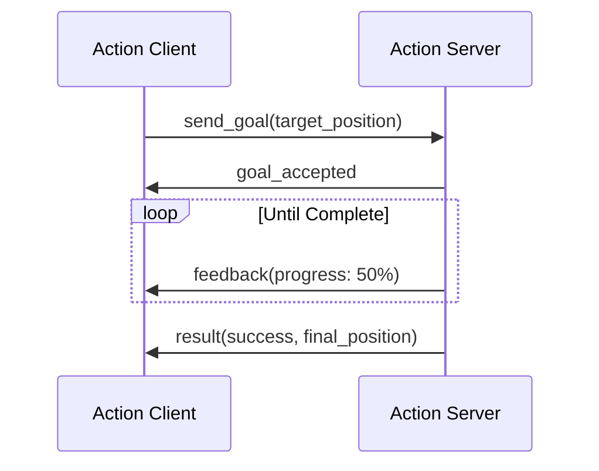
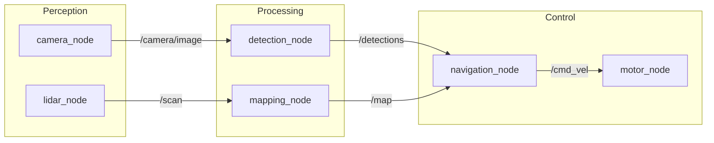

# Lesson 2: ROS 2 Core Architecture

<div className="learning-objectives">

**Learning Objectives**

After completing this lesson, you will be able to:
1. **Explain** why ROS 2 serves as the robotic nervous system
2. **Describe** the role of nodes as independent processing units
3. **Differentiate** between topics, services, and actions
4. **Visualize** the ROS graph and understand message flow

</div>

## 2.1 ROS 2 as the Robotic Nervous System

In Lesson 1, we introduced the concept of the robotic nervous system. Now we'll examine how ROS 2 implements this architecture.

ROS 2 is **middleware**—software that sits between the operating system and application code, providing:

- **Communication infrastructure**: Standardized protocols for data exchange
- **Hardware abstraction**: Common interfaces regardless of underlying hardware
- **Tool ecosystem**: Visualization, debugging, and development utilities

Built on the **Data Distribution Service (DDS)** standard, ROS 2 enables real-time, reliable communication suitable for safety-critical robotics applications.

:::info Why ROS 2 over ROS 1?
ROS 2 addresses key limitations of its predecessor: real-time support, security features, multi-robot systems, and production-ready reliability. All new robotics projects should use ROS 2.
:::

## 2.2 Nodes - Independent Processes

A **node** is the fundamental unit of computation in ROS 2. Each node is a separate process responsible for a specific task.



### Node Characteristics

- **Single responsibility**: Each node handles one well-defined task
- **Independence**: Nodes can be started, stopped, and restarted independently
- **Composability**: Nodes combine to form complex systems
- **Discoverability**: Nodes automatically find each other on the network

### Node Lifecycle

ROS 2 managed nodes follow a defined lifecycle:



This lifecycle enables controlled startup sequences—critical for robots where sensor initialization must precede motion planning.

## 2.3 Topics - Asynchronous Messaging

**Topics** provide publish-subscribe communication for continuous data streams.



### When to Use Topics

- **Sensor data**: Camera images, LIDAR scans, IMU readings
- **State information**: Robot pose, joint positions, battery level
- **Continuous streams**: Any data produced at regular intervals

### Message Types

Topics carry **typed messages**. Common ROS 2 message packages include:

| Package | Example Messages |
|---------|------------------|
| `std_msgs` | `String`, `Int32`, `Float64` |
| `geometry_msgs` | `Twist`, `Pose`, `Point` |
| `sensor_msgs` | `Image`, `LaserScan`, `Imu` |

For humanoid robots, `geometry_msgs/Twist` frequently carries velocity commands (linear and angular), while `sensor_msgs/JointState` reports joint positions and velocities.

## 2.4 Services - Request-Response

**Services** provide synchronous request-response communication for discrete operations.



### When to Use Services

- **Configuration changes**: Setting parameters, changing modes
- **Discrete actions**: Taking a photo, saving data
- **Queries**: Getting current status, reading configuration

Services are inappropriate for continuous data or time-sensitive operations since the client blocks waiting for the response.

## 2.5 Actions - Long-Running Tasks

**Actions** handle goals that take time to complete, providing feedback during execution and the ability to cancel.



### When to Use Actions

- **Navigation**: Move to a waypoint (may take minutes)
- **Manipulation**: Pick and place operations
- **Complex behaviors**: Any task with intermediate states

Actions are essential for humanoid robots performing multi-step tasks like walking to a location or manipulating objects.

## 2.6 The ROS Graph

The **ROS graph** visualizes all nodes and their connections—the complete nervous system at a glance.



### Inspecting the Graph

ROS 2 provides CLI tools for graph inspection:

```bash
# List all nodes
ros2 node list

# List all topics
ros2 topic list

# View topic message type
ros2 topic info /camera/image

# Echo topic messages
ros2 topic echo /cmd_vel
```

These tools are invaluable for debugging—when a robot misbehaves, the graph often reveals disconnected nodes or missing data streams.

## Summary

This lesson covered the core architecture of ROS 2:

- **Middleware role**: ROS 2 provides communication, abstraction, and tooling
- **Nodes**: Independent processes with single responsibilities
- **Topics**: Asynchronous publish-subscribe for continuous data
- **Services**: Synchronous request-response for discrete operations
- **Actions**: Goal-oriented communication for long-running tasks
- **ROS Graph**: Visual representation of the system's nervous connections

In the next lesson, we'll write Python code to create nodes, publishers, subscribers, and services—bringing this architecture to life.

---

## References

1. Quigley, M., Conley, K., Gerkey, B., Faust, J., Foote, T., Leibs, J., Wheeler, R., & Ng, A. Y. (2009). ROS: an open-source Robot Operating System. *ICRA Workshop on Open Source Software*.
2. Macenski, S., Foote, T., Gerkey, B., Lalancette, C., & Woodall, W. (2022). Robot Operating System 2: Design, architecture, and uses in the wild. *Science Robotics*, 7(66).
3. ROS 2 Documentation. (2024). *Understanding ROS 2 Nodes*. https://docs.ros.org/en/humble/
4. ROS 2 Documentation. (2024). *About Quality of Service Settings*. https://docs.ros.org/en/humble/
