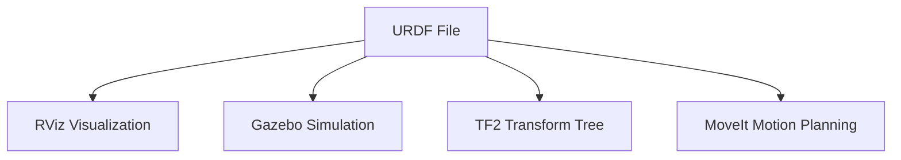
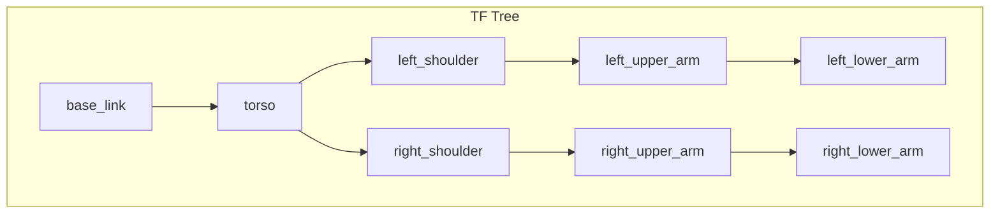

# Lesson 4: Humanoid URDF Fundamentals

<div className="learning-objectives">

**Learning Objectives**

After completing this lesson, you will be able to:
1. **Explain** the purpose and XML structure of URDF files
2. **Define** links and joints in robot models
3. **Create** a simple 2-DOF robotic arm URDF
4. **Understand** coordinate frames and transformations

</div>

## 4.1 What is URDF?

**URDF** (Unified Robot Description Format) is an XML format for describing robot physical structure. It defines:

- **What** parts the robot has (links)
- **How** those parts connect (joints)
- **Where** they exist in 3D space (transformations)

Every robot in ROS 2—from industrial arms to humanoids—starts with a URDF file that describes its physical form.



### Why URDF Matters

| Use Case | How URDF Helps |
|----------|----------------|
| Visualization | RViz renders robot model from URDF |
| Simulation | Gazebo uses URDF for physics simulation |
| Motion Planning | MoveIt computes trajectories from kinematic model |
| Transform Tracking | TF2 broadcasts frame relationships |

## 4.2 Links - Robot Body Parts

A **link** represents a rigid body part of the robot. Each link can have:

- **Visual geometry**: What the link looks like (for display)
- **Collision geometry**: Simplified shape for physics (for simulation)
- **Inertial properties**: Mass and moments of inertia (for dynamics)

### Basic Link Structure

```xml
<link name="base_link">
  <visual>
    <geometry>
      <box size="0.1 0.1 0.05"/>
    </geometry>
    <material name="gray">
      <color rgba="0.5 0.5 0.5 1.0"/>
    </material>
  </visual>
  <collision>
    <geometry>
      <box size="0.1 0.1 0.05"/>
    </geometry>
  </collision>
  <inertial>
    <mass value="1.0"/>
    <inertia ixx="0.001" ixy="0" ixz="0"
             iyy="0.001" iyz="0" izz="0.001"/>
  </inertial>
</link>
```

### Geometry Types

| Type | Example | Use Case |
|------|---------|----------|
| `box` | `<box size="x y z"/>` | Rectangular bodies |
| `cylinder` | `<cylinder radius="r" length="l"/>` | Arms, legs |
| `sphere` | `<sphere radius="r"/>` | Joints, heads |
| `mesh` | `<mesh filename="model.stl"/>` | Complex shapes |

## 4.3 Joints - Connections

A **joint** connects two links and defines how they move relative to each other.

### Joint Types

| Type | Motion | DOF | Example |
|------|--------|-----|---------|
| `revolute` | Rotation with limits | 1 | Elbow, knee |
| `continuous` | Unlimited rotation | 1 | Wheel |
| `prismatic` | Linear sliding | 1 | Linear actuator |
| `fixed` | No motion | 0 | Sensor mount |
| `floating` | All motion | 6 | Free-flying robot |

### Basic Joint Structure

```xml
<joint name="shoulder_joint" type="revolute">
  <parent link="torso"/>
  <child link="upper_arm"/>
  <origin xyz="0 0.1 0" rpy="0 0 0"/>
  <axis xyz="0 1 0"/>
  <limit lower="-1.57" upper="1.57" effort="10" velocity="1.0"/>
</joint>
```

Key attributes:
- **parent/child**: Which links this joint connects
- **origin**: Position and rotation of joint frame
- **axis**: Rotation or translation axis
- **limit**: Motion constraints (radians for revolute)

## 4.4 Coordinate Frames

Every link in URDF has its own coordinate frame. The **TF2** library tracks these frames and computes transformations between them.



### Origin and Axis Conventions

- **xyz**: Position offset from parent frame (meters)
- **rpy**: Roll, pitch, yaw rotation (radians)
- **axis**: Unit vector defining rotation/translation direction

Understanding coordinate frames is crucial for:
- Computing end-effector positions (forward kinematics)
- Planning arm motions (inverse kinematics)
- Transforming sensor data between frames

## 4.5 Simplified Humanoid Model

Let's examine a 2-DOF arm—the simplest humanoid-relevant structure:

```xml
<?xml version="1.0"?>
<robot name="simple_arm">
  <!-- Base link (fixed to world) -->
  <link name="base_link">
    <visual>
      <geometry><box size="0.1 0.1 0.05"/></geometry>
    </visual>
  </link>

  <!-- Shoulder joint (revolute) -->
  <joint name="shoulder" type="revolute">
    <parent link="base_link"/>
    <child link="upper_arm"/>
    <origin xyz="0 0 0.05"/>
    <axis xyz="0 1 0"/>
    <limit lower="-1.57" upper="1.57" effort="10" velocity="1"/>
  </joint>

  <!-- Upper arm link -->
  <link name="upper_arm">
    <visual>
      <origin xyz="0 0 0.15"/>
      <geometry><cylinder radius="0.02" length="0.3"/></geometry>
    </visual>
  </link>

  <!-- Elbow joint (revolute) -->
  <joint name="elbow" type="revolute">
    <parent link="upper_arm"/>
    <child link="lower_arm"/>
    <origin xyz="0 0 0.3"/>
    <axis xyz="0 1 0"/>
    <limit lower="0" upper="2.35" effort="10" velocity="1"/>
  </joint>

  <!-- Lower arm link -->
  <link name="lower_arm">
    <visual>
      <origin xyz="0 0 0.1"/>
      <geometry><cylinder radius="0.015" length="0.2"/></geometry>
    </visual>
  </link>
</robot>
```

This 2-DOF arm has:
- **base_link**: Fixed mounting point
- **shoulder**: Revolute joint (±90°)
- **upper_arm**: First arm segment
- **elbow**: Revolute joint (0° to 135°)
- **lower_arm**: Second arm segment

### Humanoid Extension

A full humanoid upper body extends this pattern:

| Component | Joints | DOF |
|-----------|--------|-----|
| Torso | Waist pitch, yaw | 2 |
| Each Arm | Shoulder (3) + Elbow (1) + Wrist (2) | 6 |
| Head | Neck pitch, yaw | 2 |
| **Total** | | **16** |

The same link-joint-link pattern scales from simple arms to complex humanoids.

## Summary

This lesson covered URDF fundamentals:

- **URDF** describes robot physical structure in XML
- **Links** represent rigid body parts with visual, collision, and inertial properties
- **Joints** connect links and define their relative motion
- **Coordinate frames** track spatial relationships via TF2
- **Scalable patterns** let simple 2-DOF arms extend to complex humanoids

In the next lesson, we'll connect URDF models with ROS 2 nodes in simulation, completing our Module 1 foundation.

---

## Lab Exercise

Complete the hands-on lab to practice URDF modeling:

- **[Lab 4: URDF Basics](/labs/module-01/lab-04-urdf-basics)** - Create a 2-DOF robotic arm (120 min)

---

## References

1. ROS 2 Documentation. (2024). *URDF XML Specification*. https://docs.ros.org/en/humble/
2. Willow Garage. (2012). *URDF Tutorial*. ROS Wiki.
3. ROS 2 Documentation. (2024). *TF2 Concepts*. https://docs.ros.org/en/humble/
