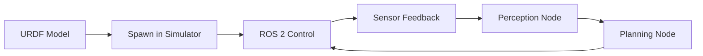
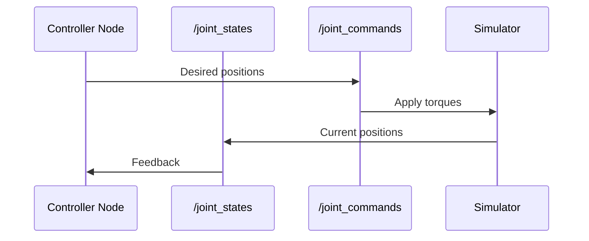

# Lesson 5: Simulation, Practice & Review

<div className="learning-objectives">

**Learning Objectives**

After completing this lesson, you will be able to:
1. **Explain** the simulation workflow for robotics development
2. **Connect** URDF models with ROS 2 control nodes
3. **Apply** Module 1 concepts through mini-projects
4. **Demonstrate** understanding through the review quiz

</div>

## 5.1 Simulation Workflow

Simulation is essential for robotics development—it allows testing without risking expensive hardware or safety.



### The Development Cycle

1. **Model**: Create URDF describing robot structure
2. **Spawn**: Load model into simulator (Gazebo, Isaac Sim)
3. **Control**: Send commands via ROS 2 topics/actions
4. **Sense**: Receive simulated sensor data
5. **Iterate**: Test, debug, refine algorithms

This cycle runs thousands of times faster than hardware testing, enabling rapid algorithm development.

## 5.2 Gazebo/Isaac Sim Overview

### Gazebo Classic

**Gazebo** is the most widely-used open-source robotics simulator:

| Feature | Description |
|---------|-------------|
| Physics Engine | ODE/Bullet for realistic dynamics |
| Sensors | Camera, LIDAR, IMU, depth sensors |
| ROS 2 Integration | Native ros2_control support |
| Environments | Custom worlds with obstacles, terrain |

```bash
# Launch Gazebo with ROS 2
ros2 launch gazebo_ros gazebo.launch.py

# Spawn robot
ros2 run gazebo_ros spawn_entity.py -file robot.urdf -entity my_robot
```

### NVIDIA Isaac Sim

For advanced simulation with GPU acceleration:

- **Photorealistic rendering**: Ray-traced visuals for perception testing
- **Domain randomization**: Automatic scene variations for ML training
- **Large-scale**: Simulate warehouses, factories, outdoor environments

Isaac Sim is covered in depth in later modules.

## 5.3 Connecting URDF with ROS 2 Nodes

The power of ROS 2 comes from connecting your URDF model to control nodes.

### The Control Loop



### Key Topics

| Topic | Message Type | Direction |
|-------|--------------|-----------|
| `/joint_states` | `sensor_msgs/JointState` | Simulator → Controller |
| `/joint_commands` | `std_msgs/Float64MultiArray` | Controller → Simulator |
| `/cmd_vel` | `geometry_msgs/Twist` | Controller → Mobile Base |

### Example: Reading Joint States

```python
import rclpy
from rclpy.node import Node
from sensor_msgs.msg import JointState

class JointMonitor(Node):
    def __init__(self):
        super().__init__('joint_monitor')
        self.subscription = self.create_subscription(
            JointState, '/joint_states', self.joint_callback, 10)

    def joint_callback(self, msg):
        for name, position in zip(msg.name, msg.position):
            self.get_logger().info(f'{name}: {position:.3f} rad')

def main(args=None):
    rclpy.init(args=args)
    node = JointMonitor()
    rclpy.spin(node)
    node.destroy_node()
    rclpy.shutdown()
```

## 5.4 Mini-Project Descriptions

Apply your Module 1 knowledge with these hands-on projects:

### Mini-Project 1: Robot Talker System

**Objective**: Create a multi-node system where robots exchange status messages.

**Requirements**:
- 3+ nodes communicating via topics
- Custom message content (robot name, status, battery)
- Status dashboard node that aggregates all robots
- Service to query individual robot status

**Skills Applied**: Nodes, topics, services, message design

**Duration**: 2-3 hours

[Start Mini-Project 1 →](/labs/module-01/mini-project-01-robot-talker)

### Mini-Project 2: Arm Controller

**Objective**: Control your 2-DOF arm URDF with keyboard commands.

**Requirements**:
- Load URDF in RViz or Gazebo
- Keyboard teleop node for joint control
- Joint limits respected
- Visual feedback of arm position
- Emergency stop service

**Skills Applied**: URDF, joint control, services, topics

**Duration**: 3-4 hours

[Start Mini-Project 2 →](/labs/module-01/mini-project-02-arm-controller)

## 5.5 Module 1 Summary

Congratulations on completing Module 1! Here's what you've learned:

### Key Concepts

| Lesson | Core Concept | Key Skill |
|--------|--------------|-----------|
| 1 | Physical AI | Understand embodied intelligence |
| 2 | ROS 2 Architecture | Navigate nodes, topics, services |
| 3 | rclpy Programming | Write Python ROS 2 nodes |
| 4 | URDF Modeling | Create robot descriptions |
| 5 | Simulation | Connect models to control |

### Skills Checklist

- [ ] Explain Physical AI vs digital AI
- [ ] Create ROS 2 nodes with rclpy
- [ ] Implement publisher-subscriber communication
- [ ] Build request-response services
- [ ] Write valid URDF files
- [ ] Visualize robots in RViz
- [ ] Understand the simulation development cycle

## Module 1 Review Quiz

Test your understanding with this comprehensive quiz covering all five lessons.

import QuizComponent from '@site/src/components/QuizComponent';

<QuizComponent
  questions={[
    {
      question: "What distinguishes Physical AI from traditional digital AI?",
      options: [
        "Physical AI operates on physical hardware in the real world",
        "Physical AI uses more powerful GPUs",
        "Physical AI only runs on robots",
        "Physical AI doesn't use neural networks"
      ],
      correctIndex: 0,
      explanation: "Physical AI systems interact with the physical world through sensors and actuators, unlike digital AI which operates purely in software environments."
    },
    {
      question: "In ROS 2, what communication pattern should you use for continuous sensor data?",
      options: [
        "Services",
        "Actions",
        "Topics",
        "Parameters"
      ],
      correctIndex: 2,
      explanation: "Topics use publish-subscribe for continuous data streams like sensor readings. Services are for discrete request-response, and actions for long-running tasks."
    },
    {
      question: "What does rclpy.spin() do in a ROS 2 node?",
      options: [
        "Rotates the robot",
        "Keeps the node running and processes callbacks",
        "Sends messages to all topics",
        "Initializes the node"
      ],
      correctIndex: 1,
      explanation: "rclpy.spin() is the main loop that keeps the node alive and processes incoming messages and timer callbacks."
    },
    {
      question: "In URDF, what element connects two links?",
      options: [
        "Connector",
        "Joint",
        "Bridge",
        "Link"
      ],
      correctIndex: 1,
      explanation: "Joints in URDF define how links are connected and how they can move relative to each other (revolute, prismatic, fixed, etc.)."
    },
    {
      question: "Which joint type allows unlimited rotation (like a wheel)?",
      options: [
        "revolute",
        "prismatic",
        "continuous",
        "fixed"
      ],
      correctIndex: 2,
      explanation: "Continuous joints allow unlimited rotation without position limits, perfect for wheels. Revolute joints have rotation limits."
    },
    {
      question: "What is the primary benefit of simulation in robotics development?",
      options: [
        "Simulations are more accurate than real robots",
        "Safe and fast testing without risking hardware",
        "Simulations don't require programming",
        "Real robots are not available"
      ],
      correctIndex: 1,
      explanation: "Simulation allows rapid iteration and testing without risking expensive hardware damage or safety incidents."
    },
    {
      question: "Which ROS 2 message type is commonly used for velocity commands?",
      options: [
        "std_msgs/String",
        "sensor_msgs/Image",
        "geometry_msgs/Twist",
        "std_msgs/Float64"
      ],
      correctIndex: 2,
      explanation: "geometry_msgs/Twist contains linear and angular velocity vectors, making it the standard for robot velocity commands."
    },
    {
      question: "What does DDS stand for in ROS 2 architecture?",
      options: [
        "Direct Data Service",
        "Data Distribution Service",
        "Distributed Device System",
        "Dynamic Data Structure"
      ],
      correctIndex: 1,
      explanation: "DDS (Data Distribution Service) is the middleware standard that ROS 2 uses for real-time, reliable communication."
    },
    {
      question: "In a URDF link, what is the purpose of the <inertial> element?",
      options: [
        "Define visual appearance",
        "Set collision boundaries",
        "Specify mass and moments of inertia for physics",
        "Configure joint limits"
      ],
      correctIndex: 2,
      explanation: "The <inertial> element defines mass and inertia tensor, which are essential for accurate physics simulation."
    },
    {
      question: "What is the correct order of operations when using rclpy?",
      options: [
        "spin → init → shutdown",
        "init → create node → spin → shutdown",
        "create node → init → shutdown",
        "shutdown → init → spin"
      ],
      correctIndex: 1,
      explanation: "The correct order is: rclpy.init(), create the node, rclpy.spin() to run, then cleanup with node.destroy_node() and rclpy.shutdown()."
    }
  ]}
/>

## Summary

Module 1 has established your foundation in Physical AI and ROS 2:

- **Physical AI** brings intelligence to robots operating in the real world
- **ROS 2** provides the communication infrastructure—the robotic nervous system
- **rclpy** enables Python-based robot programming
- **URDF** describes robot physical structure
- **Simulation** accelerates development through safe, fast testing

You're now ready for **Module 2: Perception Systems**, where you'll learn how robots sense and understand their environment.

---

## Mini-Projects

Complete at least one mini-project to solidify your learning:

1. **[Mini-Project 1: Robot Talker](/labs/module-01/mini-project-01-robot-talker)** - Multi-node communication system
2. **[Mini-Project 2: Arm Controller](/labs/module-01/mini-project-02-arm-controller)** - URDF control with keyboard

---

## References

1. Gazebo Documentation. (2024). *Getting Started with Gazebo*. https://gazebosim.org/
2. NVIDIA Isaac Sim. (2024). *Isaac Sim Documentation*. https://developer.nvidia.com/isaac-sim
3. ROS 2 Documentation. (2024). *ros2_control*. https://control.ros.org/
4. Macenski, S., et al. (2022). Robot Operating System 2: Design, architecture, and uses in the wild. *Science Robotics*, 7(66).
