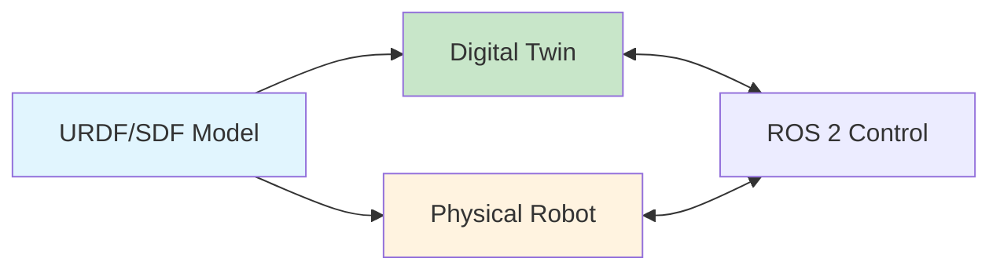
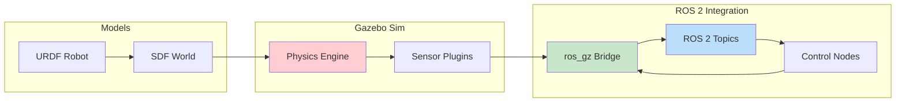
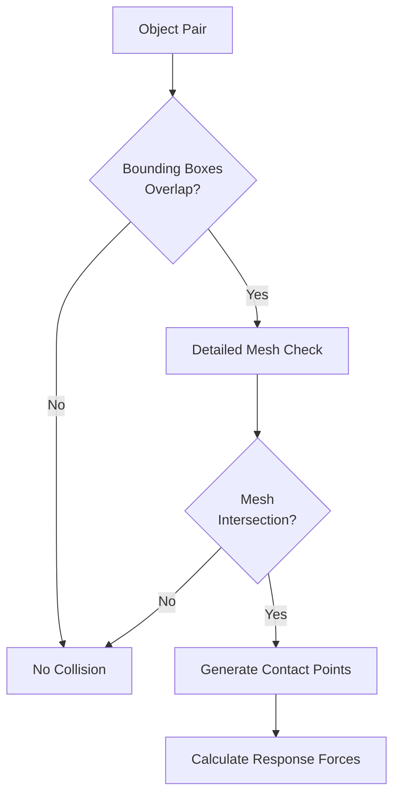
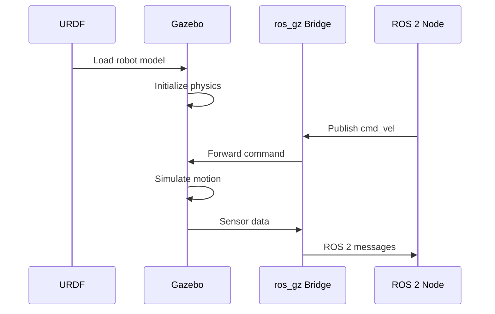

import Tabs from '@theme/Tabs';
import TabItem from '@theme/TabItem';

# Lesson 1: Digital Twin & Physics Simulation

## Learning Objectives

By the end of this lesson, you will be able to:

1. **LO-01**: Explain the digital twin concept in robotics and its role in development workflows
2. **LO-02**: Understand physics-based simulation fundamentals (rigid body dynamics, collision detection, friction models)

---

## 1.1 What is a Digital Twin?

A **digital twin** is a synchronized virtual replica of a physical robot that mirrors its behavior in real-time or near-real-time. In robotics, digital twins enable developers to test, validate, and iterate on control algorithms without risking damage to expensive hardware.

### The Core Concept

Think of a digital twin as a "virtual laboratory" where you can:
- Test dangerous maneuvers safely
- Run thousands of trials in minutes (faster than real-time)
- Reproduce exact conditions for debugging
- Validate changes before deploying to physical hardware

The key insight is that your **URDF/SDF model** from Module 1 serves as the shared "blueprint" that defines both the simulated robot and guides the construction of the physical robot.



### Real-World Examples

**Boston Dynamics**: Before testing Atlas humanoid walking gaits on hardware, engineers validate thousands of variations in simulation. Each foot placement, balance recovery, and terrain adaptation is first proven safe virtually.

**NASA Mars Rovers**: Curiosity and Perseverance rovers were extensively tested in digital twin environments simulating Martian gravity (0.38g), terrain, and communication delays before their multi-billion dollar missions.

**Agility Robotics**: Digit robots operating in warehouses train their manipulation and navigation algorithms in simulated environments, enabling 24/7 development without wearing out physical motors.

### Benefits of Simulation-First Development

| Benefit | Description |
|---------|-------------|
| **Safety** | Test failure modes without damaging hardware or injuring operators |
| **Cost** | Avoid expensive hardware repairs; simulate before you fabricate |
| **Speed** | Run simulations faster than real-time; parallelize across GPUs |
| **Repeatability** | Reproduce exact conditions for debugging and regression testing |

---

## 1.2 The Simulation Pipeline

Understanding how simulation connects to your robot is crucial. The following diagram shows the complete data flow:



**Key Components**:
1. **URDF/SDF Models**: Define robot structure, joints, and world environment
2. **Physics Engine**: Calculates motion, collisions, and forces (ODE, Bullet, DART)
3. **Sensor Plugins**: Generate synthetic camera images, LiDAR scans, IMU readings
4. **ros_gz Bridge**: Translates Gazebo data to ROS 2 messages and vice versa
5. **Control Nodes**: Your Python/C++ algorithms that command the robot

---

## 1.3 Physics Simulation Fundamentals

Physics simulation is the mathematical engine that makes digital twins behave realistically. Understanding these fundamentals helps you debug simulation issues and bridge the "sim-to-real gap."

### Rigid Body Dynamics

In simulation, robots are modeled as collections of **rigid bodies** (links) connected by **joints**. Each rigid body has:

- **Mass** (kg): How heavy the link is
- **Inertia Tensor**: How mass is distributed (affects rotation)
- **Center of Mass**: The balance point of the link

When you defined `<inertial>` properties in your URDF (Module 1), you were specifying these values. Accurate values mean realistic simulation behavior.

:::tip Why Inertia Matters
A robot arm with incorrect inertia values will swing unnaturally - too fast or too slow - making your control algorithms fail when transferred to real hardware.
:::

### Collision Detection

The physics engine must determine when objects touch or intersect. This involves:

1. **Bounding Box Check**: Fast, approximate check using axis-aligned boxes
2. **Mesh Collision**: Detailed check using actual geometry vertices
3. **Contact Points**: Where exactly objects touch (used for force calculation)



**Collision Geometry Choices**:
- **Box/Cylinder/Sphere**: Fast computation, approximate shape
- **Mesh**: Accurate shape, slower computation
- **Convex Hull**: Good balance of accuracy and speed

### Friction Models

Friction determines how objects slide (or don't slide) against each other. The **Coulomb friction model** is most common:

F_friction is less than or equal to (μ * F_normal)

Where:
- μ = friction coefficient (0 = ice, 1 = rubber on concrete)
- F_normal = force pressing surfaces together

**Friction States**:
- **Static Friction**: Objects at rest resist initial motion
- **Dynamic Friction**: Objects in motion experience sliding resistance
- **Slip/No-Slip**: Whether wheels grip or spin freely

:::info Sim-to-Real Gap
Friction is one of the biggest sources of sim-to-real mismatch. Real-world friction varies with surface wear, contamination, and temperature. Simulation uses idealized values.
:::

### Time Stepping

Simulation advances in discrete **time steps**. Key parameters:

| Parameter | Description | Typical Value |
|-----------|-------------|---------------|
| **Step Size** | Duration of each physics update | 0.001s (1ms) |
| **Real-Time Factor** | Simulation speed vs wall-clock time | 1.0 (real-time) |
| **Solver Iterations** | Accuracy vs speed tradeoff | 50-100 |

**Fixed vs Variable Step**:
- **Fixed Step**: Consistent physics (recommended for robotics)
- **Variable Step**: Adapts to complexity (can cause instability)

```python
# Example: Gazebo physics configuration in SDF
# <physics name="1ms" type="ode">
#   <max_step_size>0.001</max_step_size>
#   <real_time_factor>1.0</real_time_factor>
#   <real_time_update_rate>1000</real_time_update_rate>
# </physics>
```

### Physics Engine Comparison

Gazebo supports multiple physics engines:

| Engine | Strengths | Use Case |
|--------|-----------|----------|
| **ODE** | Stable, well-tested, default | General robotics |
| **Bullet** | Good for complex constraints | Manipulation |
| **DART** | Accurate dynamics, research-focused | Legged robots |
| **TPE** | Simple, fast | Basic testing |

For most educational purposes, **ODE** (the default) is sufficient. Advanced users working on contact-rich manipulation may prefer Bullet or DART.

---

## 1.4 Connecting to Module 1

Remember the URDF you created in Module 1? Here's how it connects to simulation:

1. **URDF defines the robot** → Gazebo loads it as a simulated entity
2. **Joint types** (revolute, prismatic) → Physics engine calculates motion
3. **Collision geometry** → Used for contact detection
4. **Inertial properties** → Determine dynamic response

The **ros_gz bridge** then connects your ROS 2 nodes to the simulated robot, allowing the same code to control both simulation and real hardware.



---

## Summary

In this lesson, you learned:

- **Digital twins** are synchronized virtual replicas that enable safe, fast, repeatable development
- The **simulation pipeline** connects URDF models through physics engines to ROS 2 control
- **Physics fundamentals** include rigid body dynamics, collision detection, friction, and time stepping
- **Physics engines** like ODE, Bullet, and DART each have different strengths

### Key Takeaways

1. Always validate algorithms in simulation before deploying to hardware
2. Accurate inertial properties in URDF lead to realistic simulation
3. The "sim-to-real gap" exists - simulation is an approximation
4. Understanding physics parameters helps debug unexpected behavior

---

## What's Next

In [Lesson 2: Gazebo Simulation Workflows](./lesson-02-gazebo-workflows), you'll:
- Launch Gazebo with ROS 2 integration
- Create custom simulation worlds using SDF
- Spawn and control robots via ROS 2 topics

---

## References

Citations for this lesson are available in the [References](/docs/appendix/references) section under Module 2.
