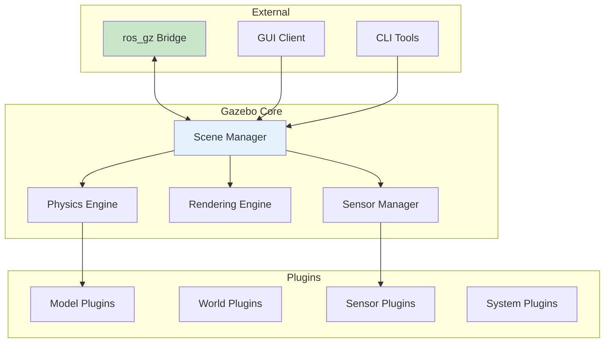
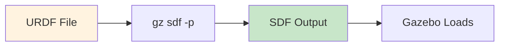
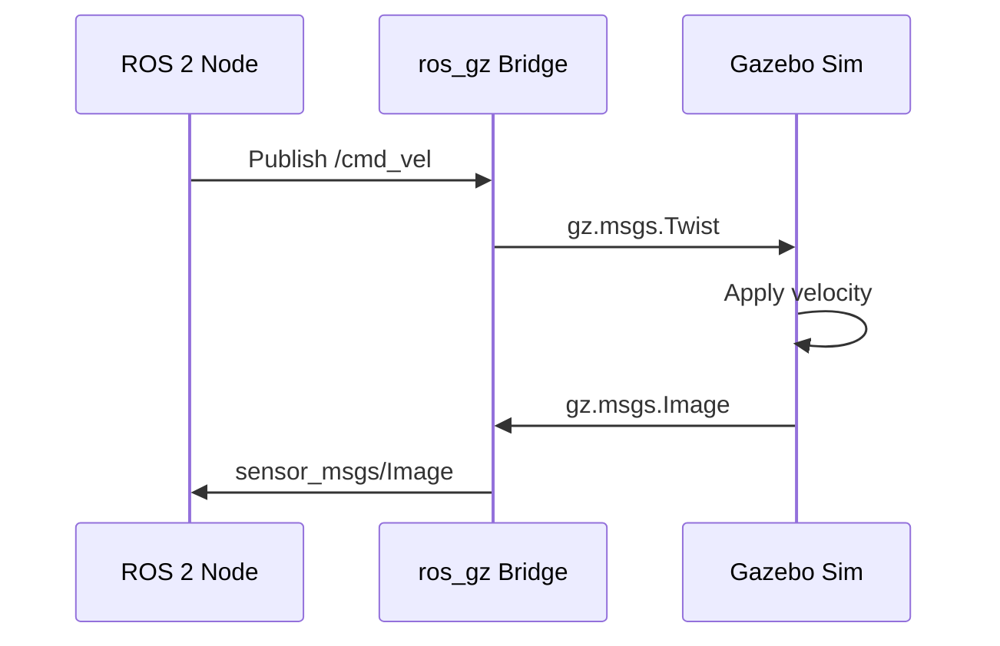

import Tabs from '@theme/Tabs';
import TabItem from '@theme/TabItem';

# Lesson 2: Gazebo Simulation Workflows

## Learning Objectives

By the end of this lesson, you will be able to:

1. **LO-03**: Use Gazebo for robot-environment simulation with ROS 2 integration
2. Configure and launch Gazebo worlds
3. Understand SDF format and URDF-to-SDF conversion
4. Control robots in simulation via ROS 2 topics

---

## 2.1 Gazebo Architecture

Gazebo (now "Gazebo Sim" in modern versions) is the de-facto standard open-source robotics simulator. Understanding its architecture helps you configure simulations effectively.



**Key Components**:

- **Scene Manager**: Coordinates physics, rendering, and sensors
- **Physics Engine**: ODE, Bullet, DART, or TPE (configurable)
- **Rendering Engine**: OGRE2 for visualization
- **Sensor Manager**: Generates synthetic sensor data
- **Plugins**: Extend functionality (controllers, sensors, world features)
- **ros_gz Bridge**: Bidirectional communication with ROS 2

### Gazebo Versions

| Version | Name | ROS 2 Support | Status |
|---------|------|---------------|--------|
| Gazebo 11 | Classic | Foxy, Humble (deprecated) | Legacy |
| Gazebo Fortress | Sim | Humble (recommended) | LTS until 2026 |
| Gazebo Garden | Sim | Humble, Iron | Released |
| Gazebo Harmonic | Sim | Jazzy, Rolling | Latest |

:::info Course Standard
This course uses **Gazebo Fortress** with **ROS 2 Humble** for stability and long-term support.
:::

---

## 2.2 World Files and SDF

**SDF (Simulation Description Format)** is the native format for Gazebo worlds. While URDF describes robots, SDF describes complete simulation environments.

### SDF vs URDF

| Feature | URDF | SDF |
|---------|------|-----|
| **Origin** | ROS-native | Gazebo-native |
| **Scope** | Robot models only | Robots, worlds, objects |
| **Physics** | Limited joints | Full physics support |
| **Sensors** | Requires plugins | Native sensor tags |
| **Nested Models** | Not supported | Supported |

**Best Practice**: Use **URDF for robots** (familiar from Module 1), **SDF for worlds**.

### Basic World Structure

```xml
<?xml version="1.0" ?>
<sdf version="1.8">
  <world name="my_world">
    <!-- Physics Configuration -->
    <physics name="1ms" type="ode">
      <max_step_size>0.001</max_step_size>
      <real_time_factor>1.0</real_time_factor>
    </physics>

    <!-- Required Plugins -->
    <plugin filename="gz-sim-physics-system"
            name="gz::sim::systems::Physics"/>
    <plugin filename="gz-sim-scene-broadcaster-system"
            name="gz::sim::systems::SceneBroadcaster"/>

    <!-- Lighting -->
    <light type="directional" name="sun">
      <cast_shadows>true</cast_shadows>
      <pose>0 0 10 0 0 0</pose>
      <diffuse>0.8 0.8 0.8 1</diffuse>
      <specular>0.2 0.2 0.2 1</specular>
    </light>

    <!-- Ground Plane -->
    <model name="ground_plane">
      <static>true</static>
      <link name="link">
        <collision name="collision">
          <geometry>
            <plane><normal>0 0 1</normal></plane>
          </geometry>
        </collision>
        <visual name="visual">
          <geometry>
            <plane><normal>0 0 1</normal><size>100 100</size></plane>
          </geometry>
          <material>
            <ambient>0.8 0.8 0.8 1</ambient>
          </material>
        </visual>
      </link>
    </model>

  </world>
</sdf>
```

### Adding Obstacles

Static obstacles enrich your simulation environment:

```xml
<!-- Box Obstacle -->
<model name="box_obstacle">
  <static>true</static>
  <pose>2 0 0.5 0 0 0</pose>
  <link name="link">
    <collision name="collision">
      <geometry>
        <box><size>1 1 1</size></box>
      </geometry>
    </collision>
    <visual name="visual">
      <geometry>
        <box><size>1 1 1</size></box>
      </geometry>
      <material>
        <ambient>0.8 0.2 0.2 1</ambient>
      </material>
    </visual>
  </link>
</model>

<!-- Cylinder Obstacle -->
<model name="cylinder_obstacle">
  <static>true</static>
  <pose>4 2 0.5 0 0 0</pose>
  <link name="link">
    <collision name="collision">
      <geometry>
        <cylinder><radius>0.5</radius><length>1</length></cylinder>
      </geometry>
    </collision>
    <visual name="visual">
      <geometry>
        <cylinder><radius>0.5</radius><length>1</length></cylinder>
      </geometry>
      <material>
        <ambient>0.2 0.8 0.2 1</ambient>
      </material>
    </visual>
  </link>
</model>
```

---

## 2.3 URDF-to-SDF Conversion

Gazebo automatically converts URDF to SDF when loading robot models. Understanding this process helps debug issues.

### Conversion Flow



**Convert Manually** (for debugging):
```bash
gz sdf -p my_robot.urdf > my_robot.sdf
```

### Gazebo-Specific URDF Extensions

To add Gazebo-specific features to URDF, use `<gazebo>` tags:

```xml
<robot name="my_robot">
  <!-- Standard URDF link -->
  <link name="base_link">
    <visual>...</visual>
    <collision>...</collision>
    <inertial>...</inertial>
  </link>

  <!-- Gazebo-specific extensions -->
  <gazebo reference="base_link">
    <material>Gazebo/Blue</material>
    <mu1>0.8</mu1>
    <mu2>0.8</mu2>
  </gazebo>

  <!-- Gazebo plugin for differential drive -->
  <gazebo>
    <plugin filename="gz-sim-diff-drive-system"
            name="gz::sim::systems::DiffDrive">
      <left_joint>left_wheel_joint</left_joint>
      <right_joint>right_wheel_joint</right_joint>
      <wheel_separation>0.5</wheel_separation>
      <wheel_radius>0.1</wheel_radius>
      <topic>cmd_vel</topic>
    </plugin>
  </gazebo>
</robot>
```

---

## 2.4 ROS 2 Integration with ros_gz

The **ros_gz** package family provides the bridge between Gazebo and ROS 2.

### Installing ros_gz

```bash
# For ROS 2 Humble + Gazebo Fortress
sudo apt install ros-humble-ros-gz
```

### Bridge Architecture



### Launching Gazebo with ROS 2

<Tabs>
<TabItem value="launch" label="Launch File">

```python
# launch/gazebo_sim.launch.py
from launch import LaunchDescription
from launch.actions import IncludeLaunchDescription
from launch.launch_description_sources import PythonLaunchDescriptionSource
from launch_ros.actions import Node
from ament_index_python.packages import get_package_share_directory
import os

def generate_launch_description():
    pkg_ros_gz_sim = get_package_share_directory('ros_gz_sim')

    # Launch Gazebo
    gazebo = IncludeLaunchDescription(
        PythonLaunchDescriptionSource(
            os.path.join(pkg_ros_gz_sim, 'launch', 'gz_sim.launch.py')
        ),
        launch_arguments={
            'gz_args': '-r empty.sdf'
        }.items()
    )

    # Bridge for cmd_vel and odom
    bridge = Node(
        package='ros_gz_bridge',
        executable='parameter_bridge',
        arguments=[
            '/cmd_vel@geometry_msgs/msg/Twist@gz.msgs.Twist',
            '/odom@nav_msgs/msg/Odometry@gz.msgs.Odometry',
        ],
        output='screen'
    )

    return LaunchDescription([gazebo, bridge])
```

</TabItem>
<TabItem value="cli" label="Command Line">

```bash
# Terminal 1: Launch Gazebo
ros2 launch ros_gz_sim gz_sim.launch.py gz_args:="-r empty.sdf"

# Terminal 2: Start bridge
ros2 run ros_gz_bridge parameter_bridge \
  /cmd_vel@geometry_msgs/msg/Twist@gz.msgs.Twist

# Terminal 3: Send velocity command
ros2 topic pub /cmd_vel geometry_msgs/msg/Twist \
  "{linear: {x: 0.5}, angular: {z: 0.1}}"
```

</TabItem>
</Tabs>

### Spawning Robots

```bash
# Spawn a URDF model into Gazebo
ros2 run ros_gz_sim create \
  -name my_robot \
  -file /path/to/my_robot.urdf \
  -x 0 -y 0 -z 0.5
```

Or via launch file:

```python
spawn_robot = Node(
    package='ros_gz_sim',
    executable='create',
    arguments=[
        '-name', 'my_robot',
        '-topic', 'robot_description',
        '-x', '0', '-y', '0', '-z', '0.5'
    ],
    output='screen'
)
```

---

## 2.5 Controlling Robots in Simulation

Once your robot is spawned and the bridge is running, control it like any ROS 2 robot.

### Publishing Velocity Commands

```python
#!/usr/bin/env python3
"""Simple velocity publisher for simulated robot."""

import rclpy
from rclpy.node import Node
from geometry_msgs.msg import Twist

class VelocityPublisher(Node):
    def __init__(self):
        super().__init__('velocity_publisher')
        self.publisher = self.create_publisher(Twist, '/cmd_vel', 10)
        self.timer = self.create_timer(0.1, self.timer_callback)
        self.get_logger().info('Velocity publisher started')

    def timer_callback(self):
        msg = Twist()
        msg.linear.x = 0.5   # Forward velocity (m/s)
        msg.angular.z = 0.1  # Rotation velocity (rad/s)
        self.publisher.publish(msg)

def main():
    rclpy.init()
    node = VelocityPublisher()
    rclpy.spin(node)
    rclpy.shutdown()

if __name__ == '__main__':
    main()
```

### Subscribing to Sensor Data

```python
#!/usr/bin/env python3
"""Subscribe to simulated camera images."""

import rclpy
from rclpy.node import Node
from sensor_msgs.msg import Image

class CameraSubscriber(Node):
    def __init__(self):
        super().__init__('camera_subscriber')
        self.subscription = self.create_subscription(
            Image,
            '/camera/image_raw',
            self.image_callback,
            10
        )

    def image_callback(self, msg):
        self.get_logger().info(
            f'Received image: {msg.width}x{msg.height}'
        )

def main():
    rclpy.init()
    node = CameraSubscriber()
    rclpy.spin(node)
    rclpy.shutdown()

if __name__ == '__main__':
    main()
```

---

## Summary

In this lesson, you learned:

- **Gazebo architecture**: Scene manager, physics engine, sensors, and plugins
- **SDF format**: Native world description for Gazebo environments
- **URDF-to-SDF conversion**: How Gazebo loads your robot models
- **ros_gz bridge**: Connecting Gazebo to ROS 2 topics
- **Robot control**: Publishing velocity commands and receiving sensor data

### Key Commands

```bash
# Launch Gazebo with ROS 2
ros2 launch ros_gz_sim gz_sim.launch.py gz_args:="-r world.sdf"

# Spawn robot
ros2 run ros_gz_sim create -name robot -file robot.urdf

# Bridge topics
ros2 run ros_gz_bridge parameter_bridge /cmd_vel@geometry_msgs/msg/Twist@gz.msgs.Twist

# Check bridged topics
ros2 topic list
```

---

## What's Next

In [Lesson 3: Sensors & Unity Comparison](./lesson-03-sensors-unity), you'll:
- Configure simulated sensors (camera, LiDAR, IMU)
- Visualize sensor data in RViz2
- Compare Gazebo and Unity for different use cases

---

## References

Citations for this lesson are available in the [References](/docs/appendix/references) section under Module 2.
