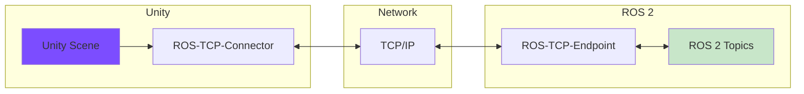
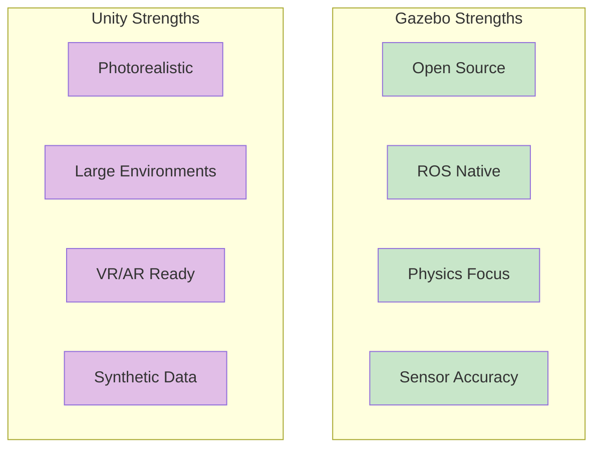
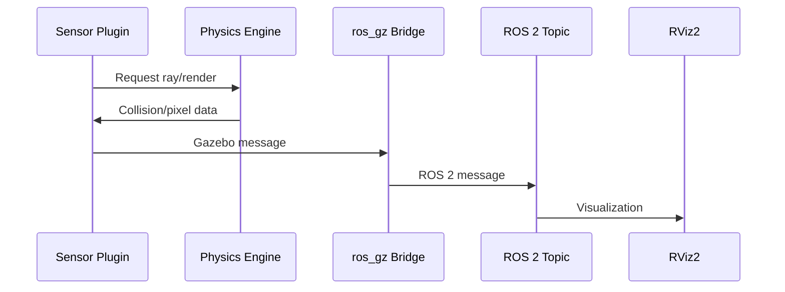
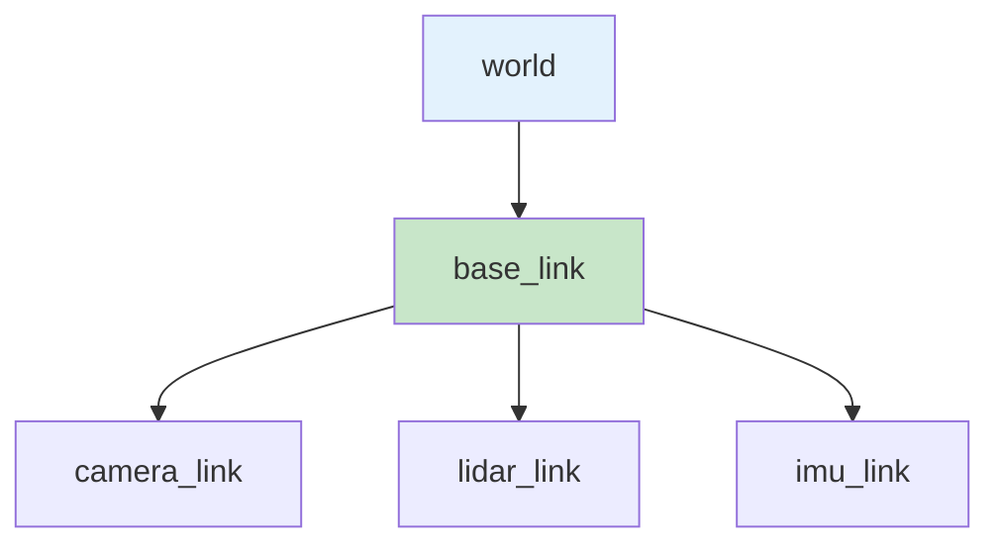

import Tabs from '@theme/Tabs';
import TabItem from '@theme/TabItem';
import QuizComponent from '@site/src/components/QuizComponent';

# Lesson 3: Sensors & Unity Comparison

## Learning Objectives

By the end of this lesson, you will be able to:

1. **LO-04**: Understand Unity's role in high-fidelity visual interaction and rendering
2. **LO-05**: Configure simulated sensors (cameras, LiDAR, IMU) and their data pipelines to ROS 2
3. Compare Gazebo and Unity for different robotics scenarios

---

## 3.1 Unity for Robotics Overview

While Gazebo excels at physics-accurate simulation, **Unity** offers compelling advantages for specific robotics applications, particularly those requiring high-fidelity visuals.

### What is Unity?

Unity is a proprietary game engine that has expanded into robotics simulation through the **Unity Robotics Hub**. It provides:

- **Photorealistic Rendering**: Ray-traced graphics, HDR lighting
- **Large Environment Support**: Cities, warehouses, outdoor terrains
- **VR/AR Integration**: Immersive robot teleoperation
- **Synthetic Data Generation**: Training data for computer vision

### Unity-ROS Bridge Architecture



Unlike Gazebo's native ros_gz bridge, Unity requires:
1. **ROS-TCP-Connector** (Unity package)
2. **ROS-TCP-Endpoint** (ROS 2 package)
3. Network communication (typically localhost)

:::note Educational Focus
This course focuses on Gazebo for hands-on labs. Unity content is **conceptual** - understanding when and why to choose Unity, without requiring Unity installation.
:::

---

## 3.2 Gazebo vs Unity Comparison

Choosing the right simulator depends on your project requirements.

### Comparison Table

| Dimension | Gazebo | Unity |
|-----------|--------|-------|
| **License** | Open Source (Apache 2.0) | Proprietary (free tier available) |
| **ROS Integration** | Native ros_gz bridge | ROS-Unity Bridge (TCP) |
| **Physics Accuracy** | High-fidelity engines (ODE, Bullet, DART) | Game-optimized (PhysX) |
| **Visual Quality** | Functional, moderate fidelity | Photorealistic rendering |
| **Sensor Simulation** | Native plugins, physically-based | Custom implementation required |
| **Learning Curve** | ROS/robotics background | Unity/C# background |
| **Performance** | CPU-based, lighter weight | GPU-accelerated, heavier |
| **Use Case** | Algorithm development, control | Visualization, synthetic data |



### Decision Framework

**Choose Gazebo when:**
- Developing and testing control algorithms
- Physics accuracy is critical (contact, friction)
- Working primarily with ROS 2 ecosystem
- Open-source requirement
- Limited GPU resources

**Choose Unity when:**
- Training vision models with synthetic data
- Creating photorealistic demonstrations
- Developing VR/AR teleoperation interfaces
- Building large-scale environments (cities, warehouses)
- Human-robot interaction studies

**Hybrid Approach:**
Some teams use both: Gazebo for algorithm development, Unity for final visualization and synthetic data generation.

---

## 3.3 Simulated Sensors Configuration

Sensors are the eyes and ears of your robot. Gazebo provides plugins to simulate common sensor types with ROS 2 integration.

### Sensor Data Flow



### Camera Sensor

The most common perception sensor. Generates RGB images.

**Gazebo Configuration (SDF):**

```xml
<sensor name="camera" type="camera">
  <pose>0 0 0.1 0 0 0</pose>
  <camera>
    <horizontal_fov>1.047</horizontal_fov>  <!-- 60 degrees -->
    <image>
      <width>640</width>
      <height>480</height>
      <format>R8G8B8</format>
    </image>
    <clip>
      <near>0.1</near>
      <far>100</far>
    </clip>
  </camera>
  <always_on>true</always_on>
  <update_rate>30</update_rate>
  <topic>camera/image_raw</topic>
</sensor>
```

**ROS 2 Message Type:** `sensor_msgs/msg/Image`

**Bridge Configuration:**
```bash
ros2 run ros_gz_bridge parameter_bridge \
  /camera/image_raw@sensor_msgs/msg/Image@gz.msgs.Image
```

### Depth Camera

Provides both color images and depth measurements (distance to each pixel).

**Gazebo Configuration:**

```xml
<sensor name="depth_camera" type="depth_camera">
  <pose>0 0 0.1 0 0 0</pose>
  <camera>
    <horizontal_fov>1.047</horizontal_fov>
    <image>
      <width>640</width>
      <height>480</height>
    </image>
    <clip>
      <near>0.1</near>
      <far>10</far>
    </clip>
  </camera>
  <always_on>true</always_on>
  <update_rate>30</update_rate>
  <topic>depth_camera/image</topic>
  <topic>depth_camera/points</topic>
</sensor>
```

**ROS 2 Message Types:**
- `sensor_msgs/msg/Image` (depth image)
- `sensor_msgs/msg/PointCloud2` (3D point cloud)

### LiDAR Sensor

Measures distances using laser rays. Essential for navigation and SLAM.

**Gazebo Configuration:**

```xml
<sensor name="lidar" type="gpu_lidar">
  <pose>0 0 0.2 0 0 0</pose>
  <lidar>
    <scan>
      <horizontal>
        <samples>360</samples>
        <resolution>1</resolution>
        <min_angle>-3.14159</min_angle>
        <max_angle>3.14159</max_angle>
      </horizontal>
    </scan>
    <range>
      <min>0.1</min>
      <max>30.0</max>
      <resolution>0.01</resolution>
    </range>
  </lidar>
  <always_on>true</always_on>
  <update_rate>10</update_rate>
  <topic>scan</topic>
</sensor>
```

**ROS 2 Message Type:** `sensor_msgs/msg/LaserScan`

**Bridge Configuration:**
```bash
ros2 run ros_gz_bridge parameter_bridge \
  /scan@sensor_msgs/msg/LaserScan@gz.msgs.LaserScan
```

### IMU Sensor

Measures orientation, angular velocity, and linear acceleration.

**Gazebo Configuration:**

```xml
<sensor name="imu" type="imu">
  <pose>0 0 0.1 0 0 0</pose>
  <imu>
    <angular_velocity>
      <x><noise type="gaussian"><mean>0</mean><stddev>0.01</stddev></noise></x>
      <y><noise type="gaussian"><mean>0</mean><stddev>0.01</stddev></noise></y>
      <z><noise type="gaussian"><mean>0</mean><stddev>0.01</stddev></noise></z>
    </angular_velocity>
    <linear_acceleration>
      <x><noise type="gaussian"><mean>0</mean><stddev>0.1</stddev></noise></x>
      <y><noise type="gaussian"><mean>0</mean><stddev>0.1</stddev></noise></y>
      <z><noise type="gaussian"><mean>0</mean><stddev>0.1</stddev></noise></z>
    </linear_acceleration>
  </imu>
  <always_on>true</always_on>
  <update_rate>100</update_rate>
  <topic>imu/data</topic>
</sensor>
```

**ROS 2 Message Type:** `sensor_msgs/msg/Imu`

:::tip Noise Models
Real sensors have noise. Configuring noise in simulation helps algorithms handle real-world imperfections.
:::

---

## 3.4 Sensor Data Pipelines

Once sensors are configured, you need to consume and visualize the data.

### Visualizing in RViz2

RViz2 is the standard ROS 2 visualization tool.

```bash
# Launch RViz2
ros2 run rviz2 rviz2

# Or with a saved configuration
ros2 run rviz2 rviz2 -d config.rviz
```

**Adding Displays:**
1. Click "Add" in the Displays panel
2. Select display type:
   - **Image**: For camera topics
   - **LaserScan**: For LiDAR topics
   - **PointCloud2**: For depth camera point clouds
   - **TF**: For coordinate frames
3. Set the topic name (e.g., `/camera/image_raw`)

### Processing Sensor Data

Example node that subscribes to multiple sensors:

```python
#!/usr/bin/env python3
"""Multi-sensor subscriber example."""

import rclpy
from rclpy.node import Node
from sensor_msgs.msg import Image, LaserScan, Imu

class SensorSubscriber(Node):
    def __init__(self):
        super().__init__('sensor_subscriber')

        # Camera subscription
        self.camera_sub = self.create_subscription(
            Image, '/camera/image_raw', self.camera_callback, 10)

        # LiDAR subscription
        self.lidar_sub = self.create_subscription(
            LaserScan, '/scan', self.lidar_callback, 10)

        # IMU subscription
        self.imu_sub = self.create_subscription(
            Imu, '/imu/data', self.imu_callback, 10)

        self.get_logger().info('Sensor subscriber started')

    def camera_callback(self, msg):
        self.get_logger().info(f'Camera: {msg.width}x{msg.height}')

    def lidar_callback(self, msg):
        min_range = min(msg.ranges)
        self.get_logger().info(f'LiDAR: min distance = {min_range:.2f}m')

    def imu_callback(self, msg):
        orientation = msg.orientation
        self.get_logger().info(
            f'IMU: orientation = ({orientation.x:.2f}, {orientation.y:.2f}, '
            f'{orientation.z:.2f}, {orientation.w:.2f})'
        )

def main():
    rclpy.init()
    node = SensorSubscriber()
    rclpy.spin(node)
    rclpy.shutdown()

if __name__ == '__main__':
    main()
```

### TF Coordinate Frames

Sensors have coordinate frames relative to the robot. The **TF2** system tracks these relationships.



**Checking TF tree:**
```bash
ros2 run tf2_tools view_frames
```

---

## 3.5 Module 2 Review Quiz

Test your understanding of digital twins, physics simulation, Gazebo, and sensors.

<QuizComponent
  questions={[
    {
      question: "What is a digital twin in robotics?",
      options: [
        "A backup copy of robot software",
        "A synchronized virtual replica that mirrors physical robot behavior",
        "A second physical robot for testing",
        "A robot's network connection"
      ],
      correctIndex: 1,
      explanation: "A digital twin is a virtual replica synchronized with the physical robot, enabling safe testing and validation."
    },
    {
      question: "Which of the following is NOT a benefit of simulation-first development?",
      options: [
        "Safety - test without hardware damage",
        "Speed - run faster than real-time",
        "Guaranteed perfect sim-to-real transfer",
        "Repeatability - reproduce exact conditions"
      ],
      correctIndex: 2,
      explanation: "The sim-to-real gap exists - simulation is an approximation. Transfer is never 'guaranteed perfect'."
    },
    {
      question: "What role does the inertia tensor play in physics simulation?",
      options: [
        "Determines the color of the robot",
        "Defines how mass is distributed for realistic rotation",
        "Controls the robot's speed limit",
        "Sets the robot's operating temperature"
      ],
      correctIndex: 1,
      explanation: "The inertia tensor describes mass distribution, affecting how the body rotates under applied torques."
    },
    {
      question: "In Gazebo, what is the recommended format for world files?",
      options: [
        "URDF",
        "JSON",
        "SDF",
        "YAML"
      ],
      correctIndex: 2,
      explanation: "SDF (Simulation Description Format) is native to Gazebo and supports full world description including physics and lighting."
    },
    {
      question: "What does the ros_gz bridge do?",
      options: [
        "Compiles ROS 2 code",
        "Connects Gazebo topics to ROS 2 topics",
        "Generates URDF files",
        "Controls robot motors directly"
      ],
      correctIndex: 1,
      explanation: "The ros_gz bridge translates between Gazebo's internal message types and ROS 2 message types."
    },
    {
      question: "When should you choose Unity over Gazebo?",
      options: [
        "When physics accuracy is the top priority",
        "When you need open-source software",
        "When creating photorealistic synthetic training data",
        "When running on systems without a GPU"
      ],
      correctIndex: 2,
      explanation: "Unity excels at photorealistic rendering, making it ideal for synthetic data generation and visual demonstrations."
    },
    {
      question: "Which ROS 2 message type does a LiDAR sensor typically publish?",
      options: [
        "sensor_msgs/msg/Image",
        "geometry_msgs/msg/Twist",
        "sensor_msgs/msg/LaserScan",
        "std_msgs/msg/String"
      ],
      correctIndex: 2,
      explanation: "LiDAR sensors publish LaserScan messages containing range measurements at different angles."
    },
    {
      question: "What is the purpose of adding noise to simulated sensors?",
      options: [
        "To make simulation slower",
        "To prepare algorithms for real-world sensor imperfections",
        "To increase GPU usage",
        "To break the simulation intentionally"
      ],
      correctIndex: 1,
      explanation: "Adding noise makes simulated sensors behave more like real sensors, helping algorithms handle real-world conditions."
    },
    {
      question: "Which physics engine is the default in Gazebo?",
      options: [
        "PhysX",
        "Bullet",
        "ODE",
        "Havok"
      ],
      correctIndex: 2,
      explanation: "ODE (Open Dynamics Engine) is Gazebo's default physics engine, known for stability and broad compatibility."
    },
    {
      question: "What tool visualizes sensor data and TF frames in ROS 2?",
      options: [
        "Gazebo",
        "RViz2",
        "Unity",
        "rqt_graph"
      ],
      correctIndex: 1,
      explanation: "RViz2 is the standard ROS 2 visualization tool for displaying sensor data, robot models, and TF coordinate frames."
    }
  ]}
/>

---

## Summary

In this lesson, you learned:

- **Unity's role**: High-fidelity visuals, synthetic data, VR/AR integration
- **Gazebo vs Unity**: Different strengths for physics vs rendering
- **Sensor configuration**: Camera, depth camera, LiDAR, IMU in Gazebo
- **Data pipelines**: Bridging to ROS 2 and visualizing in RViz2

### Module 2 Key Takeaways

1. **Digital twins** enable safe, fast, repeatable robot development
2. **Physics simulation** approximates reality - understand its limitations
3. **Gazebo** is the go-to for ROS 2 robotics simulation
4. **Unity** complements Gazebo for visualization-heavy applications
5. **Sensors** bridge perception to action - configure them with noise for realism

---

## What's Next

With Module 2 complete, you understand:
- How simulation enables robot development
- Gazebo configuration and ROS 2 integration
- Sensor data pipelines

In **Module 3**, you'll explore perception algorithms that process sensor data for navigation and manipulation.

---

## References

Citations for this module are available in the [References](/docs/appendix/references) section.
