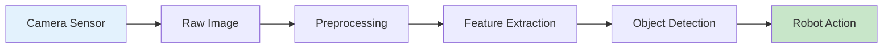
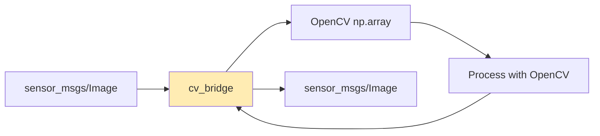

import Tabs from '@theme/Tabs';
import TabItem from '@theme/TabItem';

# Lesson 1: Computer Vision Fundamentals

## Learning Objectives

By the end of this lesson, you will be able to:

1. **LO-01**: Understand computer vision fundamentals and their role in robotics perception
2. **LO-02**: Use OpenCV for basic image processing operations in Python
3. **LO-03**: Subscribe to and process ROS 2 image topics using cv_bridge
4. **LO-04**: Explain camera calibration concepts and their importance

---

## 1.1 Introduction to Computer Vision

Computer vision enables robots to **interpret visual information** from cameras and other imaging sensors. Unlike humans who process visual data effortlessly, robots must transform raw pixel values into meaningful representations of the world.

### Why Computer Vision in Robotics?

Robots operating in the real world need to:
- **Detect obstacles** to navigate safely
- **Recognize objects** for manipulation tasks
- **Track movement** for dynamic interaction
- **Read signs and markers** for localization

The perception pipeline transforms raw sensor data into actionable information:



### The Role of OpenCV

**OpenCV** (Open Source Computer Vision Library) is the industry-standard library for image processing. Released in 2000 by Intel, it now powers vision systems in robots, autonomous vehicles, and industrial automation worldwide.

Key capabilities include:
- Image filtering and transformation
- Edge and contour detection
- Color space manipulation
- Object detection and tracking
- Camera calibration tools

:::tip Why OpenCV?
OpenCV processes images orders of magnitude faster than pure Python. A single OpenCV function call can replace hundreds of lines of manual pixel manipulation.
:::

---

## 1.2 OpenCV Basics with ROS 2

Before integrating with ROS 2, let's understand fundamental OpenCV operations. All robotics vision pipelines build on these primitives.

### Image Representation

Digital images are represented as multi-dimensional arrays:
- **Grayscale**: 2D array (height x width), values 0-255
- **Color (BGR)**: 3D array (height x width x 3 channels)
- **Depth**: 2D array with distance values (meters or millimeters)

```python
import cv2
import numpy as np

# Create a blank 480x640 color image (BGR format)
image = np.zeros((480, 640, 3), dtype=np.uint8)

# Access pixel at row 100, column 200
pixel = image[100, 200]  # Returns [B, G, R] values

# Set pixel to red (BGR: Blue=0, Green=0, Red=255)
image[100, 200] = [0, 0, 255]

# Get image dimensions
height, width, channels = image.shape
```

### Common Image Operations

**Color Conversion**: Robots often process grayscale images for efficiency.

```python
import cv2

# Load color image
color_img = cv2.imread('robot_view.png')

# Convert BGR to grayscale
gray_img = cv2.cvtColor(color_img, cv2.COLOR_BGR2GRAY)

# Convert BGR to HSV (better for color filtering)
hsv_img = cv2.cvtColor(color_img, cv2.COLOR_BGR2HSV)
```

**Gaussian Blur**: Reduces noise before edge detection.

```python
# Apply Gaussian blur with 5x5 kernel
blurred = cv2.GaussianBlur(gray_img, (5, 5), 0)
```

**Edge Detection**: Identifies boundaries using the Canny algorithm.

```python
# Canny edge detection
edges = cv2.Canny(blurred, threshold1=50, threshold2=150)
```

### Color Filtering Example

Color filtering is essential for tasks like following colored lines or detecting colored objects:

```python
import cv2
import numpy as np

def filter_red_objects(image):
    """Filter red objects from BGR image using HSV color space"""
    # Convert to HSV
    hsv = cv2.cvtColor(image, cv2.COLOR_BGR2HSV)

    # Define red color range (wraps around hue)
    lower_red1 = np.array([0, 100, 100])
    upper_red1 = np.array([10, 255, 255])
    lower_red2 = np.array([160, 100, 100])
    upper_red2 = np.array([180, 255, 255])

    # Create masks for both red ranges
    mask1 = cv2.inRange(hsv, lower_red1, upper_red1)
    mask2 = cv2.inRange(hsv, lower_red2, upper_red2)
    mask = cv2.bitwise_or(mask1, mask2)

    # Apply mask to original image
    result = cv2.bitwise_and(image, image, mask=mask)
    return result, mask
```

---

## 1.3 ROS 2 Image Transport

ROS 2 provides standardized infrastructure for transmitting image data between nodes. Understanding this transport layer is essential for building perception systems.

### The sensor_msgs/Image Message

Camera data flows through ROS 2 as `sensor_msgs/msg/Image` messages:

```yaml
# sensor_msgs/msg/Image structure
std_msgs/Header header    # Timestamp and frame_id
uint32 height             # Image height in pixels
uint32 width              # Image width in pixels
string encoding           # Pixel encoding (e.g., "bgr8", "mono8")
uint8 is_bigendian        # Data endianness
uint32 step               # Full row length in bytes
uint8[] data              # Actual image data
```

Common encodings include:
- `bgr8`: 8-bit BGR color (OpenCV default)
- `rgb8`: 8-bit RGB color
- `mono8`: 8-bit grayscale
- `32FC1`: 32-bit float single channel (depth images)

### The cv_bridge Package

**cv_bridge** converts between ROS 2 Image messages and OpenCV numpy arrays:



### Basic Image Subscriber Node

Here's a complete ROS 2 node that subscribes to camera images and processes them:

```python
import rclpy
from rclpy.node import Node
from sensor_msgs.msg import Image
from cv_bridge import CvBridge
import cv2

class ImageSubscriber(Node):
    def __init__(self):
        super().__init__('image_subscriber')
        self.bridge = CvBridge()
        self.subscription = self.create_subscription(
            Image,
            '/camera/image_raw',
            self.image_callback,
            10)

    def image_callback(self, msg):
        # Convert ROS Image to OpenCV format
        cv_image = self.bridge.imgmsg_to_cv2(msg, 'bgr8')

        # Process the image
        gray = cv2.cvtColor(cv_image, cv2.COLOR_BGR2GRAY)
        edges = cv2.Canny(gray, 50, 150)

        # Log processing result
        self.get_logger().info(f'Processed frame: {edges.shape}')

def main(args=None):
    rclpy.init(args=args)
    node = ImageSubscriber()
    rclpy.spin(node)
    node.destroy_node()
    rclpy.shutdown()
```

### Image Processing Pipeline Node

A more complete example that publishes processed results:

```python
import rclpy
from rclpy.node import Node
from sensor_msgs.msg import Image
from cv_bridge import CvBridge
import cv2
import numpy as np

class ImageProcessor(Node):
    def __init__(self):
        super().__init__('image_processor')
        self.bridge = CvBridge()

        # Subscriber for raw camera images
        self.sub = self.create_subscription(
            Image, '/camera/image_raw',
            self.process_image, 10)

        # Publisher for processed images
        self.pub = self.create_publisher(
            Image, '/camera/image_processed', 10)

    def process_image(self, msg):
        # Convert to OpenCV format
        frame = self.bridge.imgmsg_to_cv2(msg, 'bgr8')

        # Apply processing pipeline
        gray = cv2.cvtColor(frame, cv2.COLOR_BGR2GRAY)
        blurred = cv2.GaussianBlur(gray, (5, 5), 0)
        edges = cv2.Canny(blurred, 50, 150)

        # Convert edges back to BGR for publishing
        edges_bgr = cv2.cvtColor(edges, cv2.COLOR_GRAY2BGR)

        # Publish processed image
        out_msg = self.bridge.cv2_to_imgmsg(edges_bgr, 'bgr8')
        out_msg.header = msg.header  # Preserve timestamp
        self.pub.publish(out_msg)
```

---

## 1.4 Camera Calibration Concepts

Real cameras introduce **distortion** that must be corrected for accurate perception. Camera calibration determines the mathematical relationship between 3D world points and their 2D image projections.

### Why Calibration Matters

Uncalibrated cameras produce:
- **Barrel distortion**: Straight lines appear curved
- **Incorrect measurements**: Distance calculations are wrong
- **Poor 3D reconstruction**: Stereo vision fails

### Intrinsic Parameters

**Intrinsic parameters** describe the camera's internal geometry:

- **Focal length** ($f_x$, $f_y$): Lens magnification
- **Principal point** ($c_x$, $c_y$): Image center offset
- **Distortion coefficients**: Lens aberration correction

These form the **camera matrix**:

$$
K = \begin{bmatrix} f_x & 0 & c_x \\ 0 & f_y & c_y \\ 0 & 0 & 1 \end{bmatrix}
$$

### Extrinsic Parameters

**Extrinsic parameters** describe the camera's position and orientation in the world:

- **Rotation matrix** ($R$): Camera orientation
- **Translation vector** ($t$): Camera position

### Calibration Process Overview

1. Capture images of a known pattern (checkerboard)
2. Detect pattern corners in each image
3. Compute camera parameters using OpenCV
4. Store calibration for runtime use

```python
import cv2
import numpy as np

# Simplified calibration usage example
def undistort_image(image, camera_matrix, dist_coeffs):
    """Remove lens distortion from an image"""
    h, w = image.shape[:2]

    # Get optimal new camera matrix
    new_matrix, roi = cv2.getOptimalNewCameraMatrix(
        camera_matrix, dist_coeffs, (w, h), 1, (w, h))

    # Undistort the image
    undistorted = cv2.undistort(
        image, camera_matrix, dist_coeffs, None, new_matrix)

    return undistorted
```

:::info ROS 2 Camera Info
Calibration parameters are published on `/camera/camera_info` as `sensor_msgs/msg/CameraInfo` messages. Perception nodes should subscribe to this topic to access calibration data.
:::

---

## Summary

In this lesson, you learned:

- **Computer vision** transforms raw pixel data into meaningful robot perception
- **OpenCV** provides efficient image processing primitives (blur, edges, color filtering)
- **ROS 2 image transport** uses sensor_msgs/Image with cv_bridge for OpenCV integration
- **Camera calibration** corrects lens distortion for accurate measurements

### Key Takeaways

1. Always convert ROS 2 Images to OpenCV format using cv_bridge before processing
2. Grayscale conversion and blur are standard preprocessing steps
3. HSV color space is better than BGR for color-based filtering
4. Camera calibration is essential for any application requiring accurate measurements

---

## What's Next

In [Lesson 2: Multi-Sensor Integration](./lesson-02-multi-sensor), you'll:
- Work with LiDAR point clouds and depth sensors
- Understand IMU data for motion estimation
- Learn sensor fusion concepts for robust perception

---

## References

Citations for this lesson are available in the [References](/docs/appendix/references) section under Module 3.
