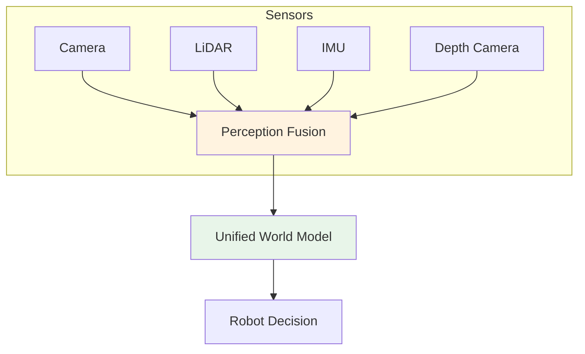
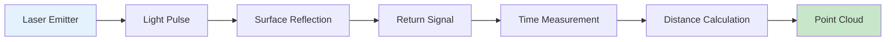
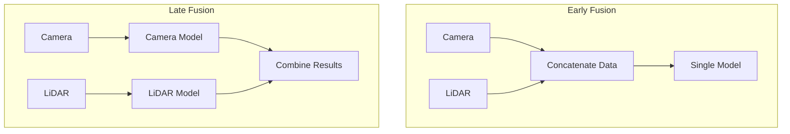

import Tabs from '@theme/Tabs';
import TabItem from '@theme/TabItem';

# Lesson 2: Multi-Sensor Integration

## Learning Objectives

By the end of this lesson, you will be able to:

1. **LO-01**: Understand different sensor types (LiDAR, IMU, depth cameras) and their applications
2. **LO-02**: Work with ROS 2 sensor message types (PointCloud2, Imu, Image)
3. **LO-03**: Subscribe to and process LiDAR point cloud data
4. **LO-04**: Explain sensor fusion concepts and their importance for robust perception

---

## 2.1 Sensor Types Overview

Modern robots rely on multiple sensors working together to perceive their environment. Each sensor type has unique strengths and limitations, making sensor diversity essential for robust perception.

### Why Multiple Sensors?

No single sensor is perfect in all conditions:

| Sensor | Strength | Weakness |
|--------|----------|----------|
| **Camera** | Rich color/texture, low cost | Affected by lighting, no direct depth |
| **LiDAR** | Precise 3D measurements, works in dark | Expensive, sparse data, no color |
| **IMU** | High-frequency motion data | Drift over time, no position |
| **Depth Camera** | Dense depth at low cost | Limited range, affected by sunlight |

By combining sensors, robots achieve **redundancy** (backup if one fails) and **complementarity** (one sensor fills gaps of another).



### Sensor Selection Guidelines

- **Indoor navigation**: Depth camera + IMU (cost-effective, good for SLAM)
- **Outdoor autonomy**: LiDAR + Camera + IMU (works in varying light)
- **Manipulation**: Camera + Depth camera (precise object localization)
- **High-speed motion**: IMU essential (high update rate for fast changes)

---

## 2.2 LiDAR and Point Clouds

**LiDAR** (Light Detection and Ranging) measures distances by emitting laser pulses and timing their return. The result is a **point cloud**: a collection of 3D points representing surfaces in the environment.

### How LiDAR Works

1. Laser emits a pulse of light
2. Light reflects off surfaces and returns
3. Time-of-flight determines distance: $d = \frac{c \cdot t}{2}$
4. Rotating mechanism scans multiple angles
5. Point cloud is assembled from all measurements



### PointCloud2 Message Type

LiDAR data is published as `sensor_msgs/msg/PointCloud2`:

```yaml
# sensor_msgs/msg/PointCloud2 structure
std_msgs/Header header       # Timestamp and frame_id
uint32 height                # Height (1 for unordered cloud)
uint32 width                 # Number of points
PointField[] fields          # Description of point data
bool is_bigendian            # Endianness
uint32 point_step            # Bytes per point
uint32 row_step              # Bytes per row
uint8[] data                 # Packed point data
bool is_dense                # True if no invalid points
```

Each point typically contains: `x`, `y`, `z` coordinates, plus optional `intensity` and `rgb` values.

### LiDAR Point Cloud Subscriber

```python
import rclpy
from rclpy.node import Node
from sensor_msgs.msg import PointCloud2
import sensor_msgs_py.point_cloud2 as pc2
import numpy as np

class LidarSubscriber(Node):
    def __init__(self):
        super().__init__('lidar_subscriber')
        self.subscription = self.create_subscription(
            PointCloud2,
            '/lidar/points',
            self.lidar_callback,
            10)

    def lidar_callback(self, msg):
        # Convert PointCloud2 to numpy array
        points = []
        for point in pc2.read_points(msg, skip_nans=True):
            points.append([point[0], point[1], point[2]])

        cloud = np.array(points)
        self.get_logger().info(
            f'Received {len(cloud)} points, '
            f'range: {cloud[:, 0].min():.2f} to {cloud[:, 0].max():.2f}m'
        )
```

### Common LiDAR Processing Operations

**Ground Plane Removal**: Filter out floor points to focus on obstacles:

```python
def remove_ground_plane(points, height_threshold=-0.3):
    """Remove points below height threshold (ground)"""
    mask = points[:, 2] > height_threshold
    return points[mask]
```

**Distance Filtering**: Keep only points within a range:

```python
def filter_by_distance(points, min_dist=0.5, max_dist=10.0):
    """Keep points within distance range"""
    distances = np.linalg.norm(points[:, :2], axis=1)
    mask = (distances > min_dist) & (distances < max_dist)
    return points[mask]
```

---

## 2.3 IMU and Inertial Sensing

An **IMU** (Inertial Measurement Unit) measures motion using accelerometers and gyroscopes. It provides high-frequency data about the robot's movement, essential for balancing and fast control.

### IMU Components

- **Accelerometer**: Measures linear acceleration (m/s^2) in 3 axes
- **Gyroscope**: Measures angular velocity (rad/s) in 3 axes
- **Magnetometer** (optional): Measures magnetic field for heading

### Imu Message Type

IMU data uses `sensor_msgs/msg/Imu`:

```yaml
# sensor_msgs/msg/Imu structure
std_msgs/Header header
geometry_msgs/Quaternion orientation       # Current orientation
float64[9] orientation_covariance
geometry_msgs/Vector3 angular_velocity     # Rotation rate (rad/s)
float64[9] angular_velocity_covariance
geometry_msgs/Vector3 linear_acceleration  # Acceleration (m/s^2)
float64[9] linear_acceleration_covariance
```

### IMU Data Processing

```python
import rclpy
from rclpy.node import Node
from sensor_msgs.msg import Imu
import math

class ImuProcessor(Node):
    def __init__(self):
        super().__init__('imu_processor')
        self.subscription = self.create_subscription(
            Imu, '/imu/data', self.imu_callback, 10)

    def imu_callback(self, msg):
        # Extract angular velocity
        omega_x = msg.angular_velocity.x
        omega_y = msg.angular_velocity.y
        omega_z = msg.angular_velocity.z

        # Extract linear acceleration
        accel_x = msg.linear_acceleration.x
        accel_y = msg.linear_acceleration.y
        accel_z = msg.linear_acceleration.z

        # Calculate tilt from accelerometer
        roll = math.atan2(accel_y, accel_z)
        pitch = math.atan2(-accel_x,
            math.sqrt(accel_y**2 + accel_z**2))

        self.get_logger().info(
            f'Roll: {math.degrees(roll):.1f} deg, '
            f'Pitch: {math.degrees(pitch):.1f} deg'
        )
```

:::tip IMU Drift
IMU orientation drifts over time due to integration errors. Combine with other sensors (GPS, visual odometry) for accurate long-term localization.
:::

---

## 2.4 Depth Sensors and 3D Perception

**Depth sensors** provide per-pixel distance measurements, creating dense 3D representations. They're widely used for manipulation and indoor navigation.

### Depth Sensor Technologies

| Technology | Example | How It Works | Best For |
|------------|---------|--------------|----------|
| **Structured Light** | Intel RealSense D400 | Projects IR pattern, measures distortion | Indoor, manipulation |
| **Time-of-Flight** | Microsoft Azure Kinect | Measures light round-trip time | Indoor/outdoor |
| **Stereo Vision** | ZED Camera | Triangulates from two cameras | Outdoor, long range |

### Depth Image Message

Depth data is published as `sensor_msgs/msg/Image` with special encodings:

- `16UC1`: 16-bit unsigned, depth in millimeters
- `32FC1`: 32-bit float, depth in meters

### Depth Image Processing

```python
import rclpy
from rclpy.node import Node
from sensor_msgs.msg import Image
from cv_bridge import CvBridge
import numpy as np

class DepthProcessor(Node):
    def __init__(self):
        super().__init__('depth_processor')
        self.bridge = CvBridge()
        self.subscription = self.create_subscription(
            Image, '/camera/depth/image_raw',
            self.depth_callback, 10)

    def depth_callback(self, msg):
        # Convert to numpy (32FC1 = meters)
        depth = self.bridge.imgmsg_to_cv2(msg, '32FC1')

        # Find minimum distance (closest obstacle)
        valid_depths = depth[depth > 0]  # Ignore invalid
        if len(valid_depths) > 0:
            min_dist = np.min(valid_depths)
            self.get_logger().info(
                f'Closest obstacle: {min_dist:.2f}m'
            )
```

---

## 2.5 Sensor Fusion Concepts

**Sensor fusion** combines data from multiple sensors to produce more accurate and reliable estimates than any single sensor alone.

### Why Sensor Fusion?

1. **Complementary data**: Camera provides color, LiDAR provides depth
2. **Redundancy**: If one sensor fails, others compensate
3. **Noise reduction**: Multiple measurements reduce uncertainty
4. **Coverage**: Different sensors cover different conditions

### Fusion Approaches



**Early Fusion**: Combine raw data before processing
- Pro: Full context available
- Con: Different data formats, complex alignment

**Late Fusion**: Process separately, combine results
- Pro: Simpler per-sensor processing
- Con: May lose correlations

### Time Synchronization

Sensors produce data at different rates and times. **Message filters** in ROS 2 help synchronize:

```python
import rclpy
from rclpy.node import Node
from sensor_msgs.msg import Image, PointCloud2
from message_filters import Subscriber, ApproximateTimeSynchronizer

class SensorSynchronizer(Node):
    def __init__(self):
        super().__init__('sensor_sync')

        # Create synchronized subscribers
        self.image_sub = Subscriber(self, Image, '/camera/image_raw')
        self.lidar_sub = Subscriber(self, PointCloud2, '/lidar/points')

        # Synchronize with 0.1s tolerance
        self.sync = ApproximateTimeSynchronizer(
            [self.image_sub, self.lidar_sub],
            queue_size=10,
            slop=0.1)
        self.sync.registerCallback(self.sync_callback)

    def sync_callback(self, image_msg, lidar_msg):
        """Called when synchronized messages arrive"""
        self.get_logger().info(
            f'Synced: image at {image_msg.header.stamp.sec}, '
            f'lidar at {lidar_msg.header.stamp.sec}'
        )
        # Process aligned camera + LiDAR data together
```

### Coordinate Frame Alignment

Sensors have different coordinate frames. Use **TF2** to transform between them:

```python
from tf2_ros import Buffer, TransformListener
import tf2_geometry_msgs

class FrameTransformer(Node):
    def __init__(self):
        super().__init__('frame_transformer')
        self.tf_buffer = Buffer()
        self.tf_listener = TransformListener(self.tf_buffer, self)

    def transform_point(self, point, from_frame, to_frame):
        """Transform point between coordinate frames"""
        try:
            transform = self.tf_buffer.lookup_transform(
                to_frame, from_frame,
                rclpy.time.Time())
            # Apply transformation
            return tf2_geometry_msgs.do_transform_point(
                point, transform)
        except Exception as e:
            self.get_logger().warn(f'Transform failed: {e}')
            return None
```

---

## Summary

In this lesson, you learned:

- **Multiple sensor types** provide complementary capabilities for robust perception
- **LiDAR** produces point clouds for precise 3D measurements
- **IMU** provides high-frequency motion data essential for balancing
- **Depth sensors** offer dense per-pixel distance information
- **Sensor fusion** combines data sources for improved accuracy

### Key Takeaways

1. No single sensor is perfect; combine multiple sensors for reliability
2. Use `sensor_msgs_py.point_cloud2` for efficient point cloud processing
3. IMU data drifts over time; fuse with other sensors for accuracy
4. Time synchronization is critical when combining multi-sensor data

---

## What's Next

In [Lesson 3: Perception Pipelines](./lesson-03-perception-pipelines), you'll:
- Build complete object detection pipelines
- Implement object tracking over time
- Connect perception to robot control systems

---

## References

Citations for this lesson are available in the [References](/docs/appendix/references) section under Module 3.
