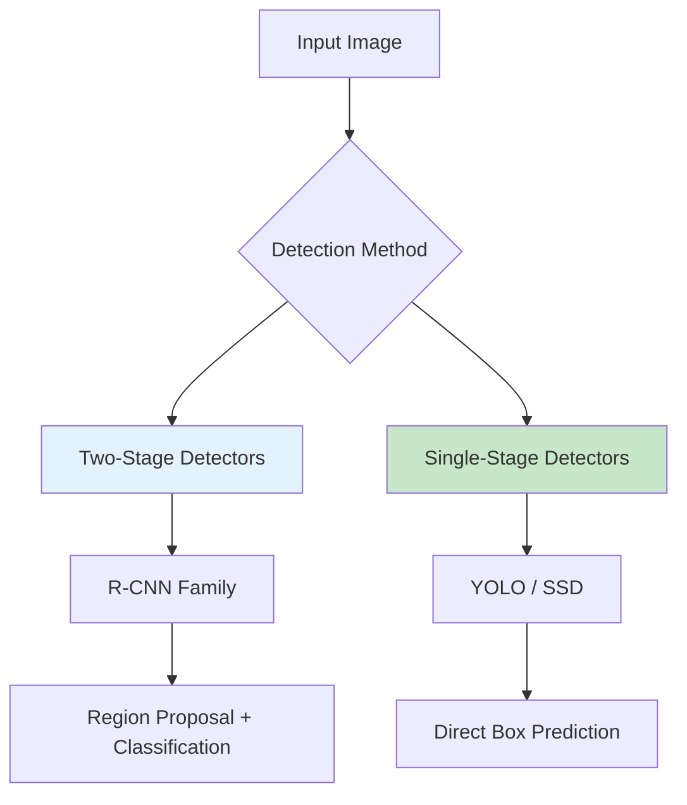
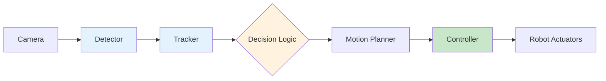

import Tabs from '@theme/Tabs';
import TabItem from '@theme/TabItem';
import QuizComponent from '@site/src/components/QuizComponent';

# Lesson 3: Perception Pipelines

## Learning Objectives

By the end of this lesson, you will be able to:

1. **LO-01**: Understand object detection fundamentals and common architectures
2. **LO-02**: Implement object tracking across video frames
3. **LO-03**: Connect perception outputs to robot control systems
4. **LO-04**: Evaluate perception performance using standard metrics

---

## 3.1 Object Detection Basics

Object detection identifies **what** objects are in an image and **where** they are located. This transforms raw pixels into semantic understanding that robots can act upon.

### Detection Output Format

Object detectors produce **bounding boxes** with:
- **Class label**: What the object is (person, chair, robot)
- **Confidence score**: How certain the detector is (0.0 to 1.0)
- **Bounding box**: Location as (x, y, width, height)

```python
# Example detection output
detection = {
    'class': 'person',
    'confidence': 0.95,
    'bbox': {
        'x': 120,      # top-left x
        'y': 80,       # top-left y
        'width': 100,
        'height': 200
    }
}
```

### Detection Approaches



**Two-Stage Detectors** (R-CNN, Faster R-CNN):
- First propose regions, then classify
- Higher accuracy, slower speed
- Best for accuracy-critical applications

**Single-Stage Detectors** (YOLO, SSD):
- Direct prediction from image
- Lower latency, real-time capable
- Best for robotics applications

---

## 3.2 YOLO and CNN Integration

**YOLO** (You Only Look Once) is the most popular detector for robotics due to its speed and accuracy balance. Modern versions (YOLOv5, YOLOv8) achieve real-time performance on embedded hardware.

### YOLO Architecture Overview

YOLO divides the image into a grid and predicts boxes for each cell:

1. Image passes through CNN backbone
2. Feature maps are produced at multiple scales
3. Detection heads predict boxes + classes
4. Non-Maximum Suppression removes duplicates

### Using YOLO in ROS 2

```python
import rclpy
from rclpy.node import Node
from sensor_msgs.msg import Image
from vision_msgs.msg import Detection2DArray, Detection2D
from cv_bridge import CvBridge
import cv2
import numpy as np

class ObjectDetector(Node):
    def __init__(self):
        super().__init__('object_detector')
        self.bridge = CvBridge()

        # Load YOLO model (using OpenCV DNN)
        self.net = cv2.dnn.readNetFromONNX('yolov5s.onnx')
        self.classes = self.load_classes('coco.names')

        self.subscription = self.create_subscription(
            Image, '/camera/image_raw',
            self.detect_callback, 10)

        self.detection_pub = self.create_publisher(
            Detection2DArray, '/detections', 10)

    def detect_callback(self, msg):
        # Convert to OpenCV
        frame = self.bridge.imgmsg_to_cv2(msg, 'bgr8')

        # Preprocess for YOLO
        blob = cv2.dnn.blobFromImage(
            frame, 1/255.0, (640, 640),
            swapRB=True, crop=False)

        # Run inference
        self.net.setInput(blob)
        outputs = self.net.forward()

        # Post-process detections
        detections = self.process_outputs(
            outputs, frame.shape[:2])

        # Publish as ROS message
        det_array = self.create_detection_msg(
            detections, msg.header)
        self.detection_pub.publish(det_array)

    def load_classes(self, filename):
        with open(filename, 'r') as f:
            return [line.strip() for line in f]
```

### Detection Message Format

ROS 2 uses `vision_msgs` for detection results:

```yaml
# vision_msgs/msg/Detection2D
std_msgs/Header header
ObjectHypothesisWithPose[] results  # Class + confidence
BoundingBox2D bbox                   # Location
```

---

## 3.3 Object Tracking Over Time

Detection alone treats each frame independently. **Tracking** maintains object identity across frames, enabling:
- Motion prediction
- Trajectory analysis
- Stable object references for control

### Simple Tracking by Detection

The basic approach: match detections between frames using overlap or distance.

```python
import numpy as np
from collections import defaultdict

class SimpleTracker:
    def __init__(self, max_distance=50):
        self.tracks = {}  # track_id -> last_bbox
        self.next_id = 0
        self.max_distance = max_distance

    def update(self, detections):
        """Match detections to existing tracks."""
        if not self.tracks:
            # Initialize tracks from first detections
            for det in detections:
                self.tracks[self.next_id] = det['bbox']
                det['track_id'] = self.next_id
                self.next_id += 1
            return detections

        # Calculate distances between tracks and detections
        matched = []
        unmatched_dets = list(range(len(detections)))

        for track_id, track_bbox in self.tracks.items():
            best_match = None
            best_dist = self.max_distance

            for i in unmatched_dets:
                dist = self.bbox_distance(
                    track_bbox, detections[i]['bbox'])
                if dist < best_dist:
                    best_dist = dist
                    best_match = i

            if best_match is not None:
                matched.append((track_id, best_match))
                unmatched_dets.remove(best_match)

        # Update matched tracks
        for track_id, det_idx in matched:
            self.tracks[track_id] = detections[det_idx]['bbox']
            detections[det_idx]['track_id'] = track_id

        # Create new tracks for unmatched detections
        for det_idx in unmatched_dets:
            self.tracks[self.next_id] = detections[det_idx]['bbox']
            detections[det_idx]['track_id'] = self.next_id
            self.next_id += 1

        return detections

    def bbox_distance(self, bbox1, bbox2):
        """Calculate center-to-center distance."""
        c1 = (bbox1['x'] + bbox1['width']/2,
              bbox1['y'] + bbox1['height']/2)
        c2 = (bbox2['x'] + bbox2['width']/2,
              bbox2['y'] + bbox2['height']/2)
        return np.sqrt((c1[0]-c2[0])**2 + (c1[1]-c2[1])**2)
```

### Advanced Tracking: Kalman Filter

For robust tracking with motion prediction:

```python
import cv2

class KalmanTracker:
    def __init__(self):
        # State: [x, y, vx, vy]
        self.kf = cv2.KalmanFilter(4, 2)

        # Transition matrix (constant velocity model)
        self.kf.transitionMatrix = np.array([
            [1, 0, 1, 0],
            [0, 1, 0, 1],
            [0, 0, 1, 0],
            [0, 0, 0, 1]
        ], dtype=np.float32)

        # Measurement matrix
        self.kf.measurementMatrix = np.array([
            [1, 0, 0, 0],
            [0, 1, 0, 0]
        ], dtype=np.float32)

    def predict(self):
        """Predict next position."""
        prediction = self.kf.predict()
        return prediction[0], prediction[1]

    def update(self, x, y):
        """Update with measurement."""
        measurement = np.array([[x], [y]], dtype=np.float32)
        self.kf.correct(measurement)
```

---

## 3.4 Perception to Action Pipeline

Perception must connect to robot control to be useful. This section covers the interface between perception outputs and robot actions.

### Perception-Control Interface



### Target Following Node

Example node that follows a detected person:

```python
import rclpy
from rclpy.node import Node
from vision_msgs.msg import Detection2DArray
from geometry_msgs.msg import Twist

class TargetFollower(Node):
    def __init__(self):
        super().__init__('target_follower')

        # Image dimensions
        self.image_width = 640
        self.image_center = self.image_width / 2

        # Control gains
        self.angular_gain = 0.005
        self.linear_gain = 0.002

        self.det_sub = self.create_subscription(
            Detection2DArray, '/detections',
            self.detection_callback, 10)

        self.cmd_pub = self.create_publisher(
            Twist, '/cmd_vel', 10)

    def detection_callback(self, msg):
        # Find person detection
        target = None
        for det in msg.detections:
            if det.results[0].hypothesis.class_id == 'person':
                if (target is None or
                    det.results[0].hypothesis.score >
                    target.results[0].hypothesis.score):
                    target = det

        cmd = Twist()

        if target is not None:
            # Calculate position error
            bbox = target.bbox
            target_x = bbox.center.position.x
            target_area = bbox.size_x * bbox.size_y

            # Angular: turn toward target
            x_error = target_x - self.image_center
            cmd.angular.z = -self.angular_gain * x_error

            # Linear: maintain distance (via bbox area)
            desired_area = 30000  # target bbox area
            area_error = desired_area - target_area
            cmd.linear.x = self.linear_gain * area_error
            cmd.linear.x = max(-0.5, min(0.5, cmd.linear.x))

        self.cmd_pub.publish(cmd)
```

---

## 3.5 Performance and Accuracy Metrics

Evaluating perception systems requires standard metrics to compare approaches and track improvements.

### Detection Metrics

**Intersection over Union (IoU)**:

IoU = Area of Overlap / Area of Union

A detection is considered correct if IoU with ground truth exceeds a threshold (typically 0.5).

**Precision and Recall**:
- **Precision**: Of all detections, how many are correct?
- **Recall**: Of all ground truth objects, how many were detected?

**Mean Average Precision (mAP)**:
- Average precision across all classes
- Standard benchmark metric (e.g., COCO mAP)

```python
def calculate_iou(box1, box2):
    """Calculate IoU between two boxes."""
    # box format: [x, y, width, height]
    x1 = max(box1[0], box2[0])
    y1 = max(box1[1], box2[1])
    x2 = min(box1[0]+box1[2], box2[0]+box2[2])
    y2 = min(box1[1]+box1[3], box2[1]+box2[3])

    intersection = max(0, x2-x1) * max(0, y2-y1)
    area1 = box1[2] * box1[3]
    area2 = box2[2] * box2[3]
    union = area1 + area2 - intersection

    return intersection / union if union > 0 else 0

def evaluate_detections(detections, ground_truth, iou_threshold=0.5):
    """Calculate precision and recall."""
    true_positives = 0
    false_positives = 0

    for det in detections:
        matched = False
        for gt in ground_truth:
            if calculate_iou(det, gt) >= iou_threshold:
                matched = True
                break
        if matched:
            true_positives += 1
        else:
            false_positives += 1

    precision = true_positives / (true_positives + false_positives)
    recall = true_positives / len(ground_truth)

    return precision, recall
```

### Tracking Metrics

**MOTA** (Multiple Object Tracking Accuracy):
- Combines false positives, false negatives, ID switches
- Standard tracking benchmark

**ID Switches**:
- Count of times a track changes identity
- Lower is better

---

## Summary

In this lesson, you learned:

- **Object detection** identifies and localizes objects in images
- **YOLO** provides real-time detection suitable for robotics
- **Tracking** maintains object identity across video frames
- **Perception-to-action** interfaces connect vision to robot control
- **Metrics** like IoU and mAP evaluate system performance

### Key Takeaways

1. Choose single-stage detectors (YOLO) for real-time robotics
2. Tracking adds temporal consistency essential for control
3. Simple visual servoing can be built with bounding box feedback
4. Always evaluate with standard metrics before deployment

---

## Module 3 Review Quiz

Test your understanding of Perception & Sensors concepts:

<QuizComponent questions={[
  {
    question: "What is the primary advantage of LiDAR over cameras for robotics perception?",
    options: [
      "Lower cost",
      "Direct depth measurement regardless of lighting",
      "Higher resolution images",
      "Color information"
    ],
    correctIndex: 1,
    explanation: "LiDAR measures distance directly using time-of-flight, working in complete darkness or bright sunlight where cameras may fail."
  },
  {
    question: "What does cv_bridge do in ROS 2?",
    options: [
      "Bridges WiFi to Ethernet",
      "Converts between ROS Image messages and OpenCV arrays",
      "Compresses video streams",
      "Calibrates cameras"
    ],
    correctIndex: 1,
    explanation: "cv_bridge provides bidirectional conversion between sensor_msgs/Image and numpy arrays for OpenCV processing."
  },
  {
    question: "Why is sensor fusion important for robotics?",
    options: [
      "It reduces the number of sensors needed",
      "It provides redundancy and complements sensor weaknesses",
      "It eliminates the need for calibration",
      "It simplifies the software architecture"
    ],
    correctIndex: 1,
    explanation: "Sensor fusion combines multiple sensors to provide redundancy (backup) and complementarity (one sensor covers another's weaknesses)."
  },
  {
    question: "What is the purpose of message_filters ApproximateTimeSynchronizer?",
    options: [
      "Compress messages to save bandwidth",
      "Synchronize messages from different sensors by timestamp",
      "Filter out invalid messages",
      "Speed up message processing"
    ],
    correctIndex: 1,
    explanation: "ApproximateTimeSynchronizer aligns messages from multiple topics based on their timestamps, essential for sensor fusion."
  },
  {
    question: "Which color space is best for color-based object filtering?",
    options: [
      "RGB",
      "BGR",
      "HSV",
      "Grayscale"
    ],
    correctIndex: 2,
    explanation: "HSV (Hue, Saturation, Value) separates color information from brightness, making color filtering more robust to lighting changes."
  },
  {
    question: "What does IoU measure in object detection?",
    options: [
      "Input/Output utilization",
      "Overlap between predicted and ground truth boxes",
      "Image quality",
      "Inference speed"
    ],
    correctIndex: 1,
    explanation: "Intersection over Union (IoU) measures how well a predicted bounding box matches the ground truth, calculated as overlap area divided by union area."
  },
  {
    question: "Why do single-stage detectors like YOLO run faster than two-stage detectors?",
    options: [
      "They use simpler neural networks",
      "They predict boxes directly without region proposal",
      "They process lower resolution images",
      "They skip classification"
    ],
    correctIndex: 1,
    explanation: "Single-stage detectors predict bounding boxes and classes in one pass, while two-stage detectors first propose regions then classify them."
  },
  {
    question: "What is the purpose of object tracking in a perception pipeline?",
    options: [
      "To detect more objects",
      "To maintain object identity across video frames",
      "To improve detection accuracy",
      "To reduce computational load"
    ],
    correctIndex: 1,
    explanation: "Tracking maintains consistent object IDs across frames, enabling motion analysis and stable references for robot control."
  },
  {
    question: "What sensor would you choose for measuring a humanoid robot's balance?",
    options: [
      "Camera",
      "LiDAR",
      "IMU",
      "Depth camera"
    ],
    correctIndex: 2,
    explanation: "IMU (Inertial Measurement Unit) provides high-frequency acceleration and angular velocity data essential for balance control."
  },
  {
    question: "What does camera calibration correct for?",
    options: [
      "Color accuracy",
      "Lens distortion and measurement accuracy",
      "Frame rate",
      "Focus speed"
    ],
    correctIndex: 1,
    explanation: "Camera calibration determines intrinsic parameters (focal length, distortion) needed to correct lens distortion and enable accurate 3D measurements."
  },
  {
    question: "What is the typical encoding for depth images in ROS 2?",
    options: [
      "bgr8",
      "rgb8",
      "32FC1 or 16UC1",
      "mono8"
    ],
    correctIndex: 2,
    explanation: "Depth images use 32FC1 (32-bit float, meters) or 16UC1 (16-bit unsigned, millimeters) to represent per-pixel distance values."
  },
  {
    question: "In visual servoing, what does the robot typically follow?",
    options: [
      "GPS coordinates",
      "Visual features like bounding box position",
      "Sound signals",
      "Temperature gradients"
    ],
    correctIndex: 1,
    explanation: "Visual servoing uses image features (like bounding box center position) as feedback to control robot motion toward or around targets."
  }
]} />

---

## What's Next

Congratulations on completing Module 3! You now have the foundation for building perception systems.

In **Module 4: Motion Planning & Control**, you'll learn:
- Path planning algorithms
- Motion control for manipulators
- Navigation stack integration

---

## References

Citations for this lesson are available in the [References](/docs/appendix/references) section under Module 3.
