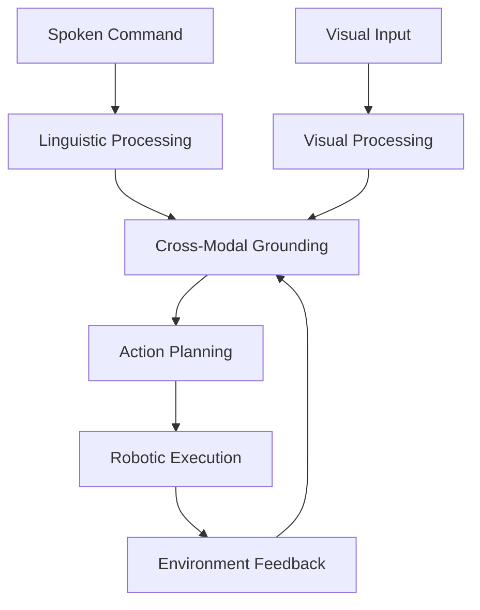
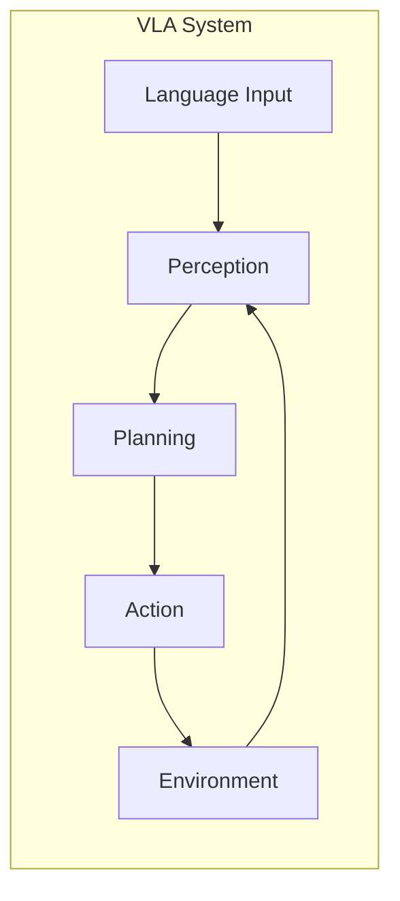

# Introduction to Vision-Language-Action (VLA) Paradigm

## Learning Objectives

By the end of this lesson, you will be able to:
- Define the Vision-Language-Action (VLA) paradigm and its significance in Physical AI
- Explain how VLA systems integrate vision, language, and action components
- Identify real-world applications of VLA systems in robotics
- Understand the relationship between multimodal AI and embodied cognition

## 1.1 What is VLA?

The Vision-Language-Action (VLA) paradigm represents a breakthrough approach in Physical AI where robots can understand natural language commands, perceive their environment through vision, and execute appropriate actions. This multimodal integration enables robots to operate in human environments with unprecedented flexibility and intelligence.

Traditional robotics systems often operate in isolation, with separate modules for perception, planning, and execution. In contrast, VLA systems create a unified framework where these components work together seamlessly. When a human says "Please bring me the red cup from the kitchen table," a VLA system must:

1. **Understand** the spoken command linguistically
2. **Perceive** the environment to locate the red cup
3. **Plan** a sequence of actions to reach and grasp the cup
4. **Execute** the plan using robotic actuators

This integrated approach mirrors human cognition, where perception, language, and action are deeply interconnected. The VLA paradigm enables robots to operate in unstructured environments with natural human interaction.

## 1.2 Multimodal AI Principles

Multimodal AI systems process information from multiple sensory channels simultaneously. In VLA systems, these channels include:

- **Visual Input**: Camera feeds, depth sensors, LiDAR data
- **Linguistic Input**: Spoken commands, written instructions
- **Action Output**: Motor commands, robotic movements

The key principle is **cross-modal grounding** - the ability to connect concepts across different modalities. For example, when a VLA system hears "the red ball," it must connect the linguistic concept "red" and "ball" to visual features in the environment.

```python
# Example: Cross-modal grounding in VLA systems
class CrossModalGrounding:
    def __init__(self):
        self.vision_model = VisionModel()
        self.language_model = LanguageModel()

    def ground_command(self, command, visual_input):
        # Parse linguistic command
        linguistic_features = self.language_model.parse(command)

        # Extract visual features
        visual_features = self.vision_model.analyze(visual_input)

        # Match linguistic concepts to visual entities
        grounded_entities = self.match_features(
            linguistic_features,
            visual_features
        )

        return grounded_entities
```

## 1.3 Embodied Cognition in VLA Systems

Embodied cognition suggests that intelligence emerges from the interaction between an agent and its environment. VLA systems embody this principle by:

- Using environmental feedback to refine understanding
- Adapting behavior based on physical constraints
- Learning through interaction with the world

In VLA systems, the robot's physical form and sensorimotor capabilities directly influence its cognitive processes. This differs from traditional AI that operates on abstract data, as VLA systems must account for real-world physics, spatial relationships, and temporal constraints.

## 1.4 Real-World VLA Applications

VLA systems are transforming various domains:

- **Assistive Robotics**: Helping elderly or disabled individuals with daily tasks
- **Industrial Automation**: Flexible manufacturing with human-robot collaboration
- **Service Robotics**: Customer service, cleaning, and hospitality applications
- **Search and Rescue**: Autonomous systems that understand and execute complex commands in disaster scenarios

Current research focuses on improving robustness, handling ambiguous commands, and scaling to diverse environments and tasks.

## Summary

The VLA paradigm represents a significant advancement in Physical AI, enabling robots to understand and execute natural language commands through integrated vision and action systems. This approach brings us closer to truly autonomous robots that can interact naturally with humans in everyday environments.

In the next lesson, we'll explore the specific components of VLA systems and how they integrate to form complete pipelines.

## Key Terms

- **Vision-Language-Action (VLA)**: Integrated system combining vision, language, and robotic action
- **Multimodal AI**: Systems processing multiple sensory inputs simultaneously
- **Cross-modal Grounding**: Connecting concepts across different sensory modalities
- **Embodied Cognition**: Intelligence emerging from agent-environment interaction



