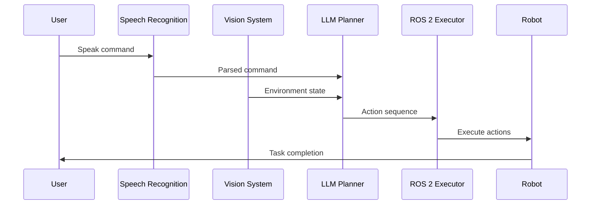
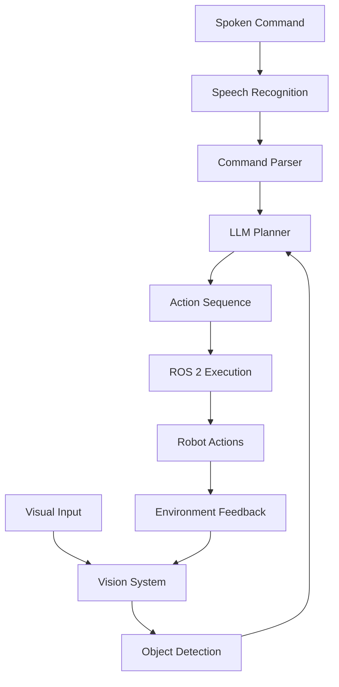

# VLA Pipeline Components & Integration

## Learning Objectives

By the end of this lesson, you will be able to:
- Describe the main components of a VLA pipeline
- Explain how speech recognition integrates with vision and action systems
- Understand LLM-based cognitive planning in VLA systems
- Identify the flow of information through a complete VLA pipeline
- Implement basic VLA pipeline components using ROS 2

## 2.1 VLA as Multimodal Integration

The VLA pipeline represents a sophisticated integration of multiple AI components working in harmony. Unlike traditional systems where components operate in isolation, VLA systems require tight coordination between vision, language, and action modules.

The key insight is that each component benefits from information provided by others. Visual context improves language understanding, linguistic commands guide visual attention, and both inform action selection. This creates a rich, interconnected system that can handle complex, real-world tasks.

## 2.2 Speech Recognition & Command Parsing

The speech recognition component converts spoken commands into structured text that can be processed by the system. Modern approaches use transformer-based models like OpenAI's Whisper, which provide high accuracy across diverse acoustic conditions.

```python
# Example: Speech recognition and command parsing
class SpeechRecognitionModule:
    def __init__(self):
        self.whisper_model = load_whisper_model()
        self.command_parser = CommandParser()

    def process_audio(self, audio_input):
        # Convert audio to text
        text = self.whisper_model.transcribe(audio_input)

        # Parse command structure
        parsed_command = self.command_parser.parse(text)

        return parsed_command

class CommandParser:
    def parse(self, text_command):
        # Extract action, object, and location
        action = self.extract_action(text_command)
        target_object = self.extract_object(text_command)
        location = self.extract_location(text_command)

        return {
            'action': action,
            'object': target_object,
            'location': location,
            'confidence': self.calculate_confidence(text_command)
        }
```

The command parser must handle ambiguous commands and potentially request clarification from the user. For example, "Pick up the ball" might require additional information about which ball if multiple are visible.

## 2.3 LLM-Based Cognitive Planning

Large Language Models (LLMs) serve as the cognitive planning component in VLA systems, transforming high-level commands into executable action sequences. The LLM must understand the command, consider environmental constraints, and generate a sequence of specific robot actions.

```python
# Example: LLM-based cognitive planning
class CognitivePlanner:
    def __init__(self, llm_model):
        self.llm = llm_model
        self.prompt_templates = PromptTemplates()

    def plan_sequence(self, command, environment_state):
        # Create prompt with command and environment context
        prompt = self.prompt_templates.create_planning_prompt(
            command=command,
            environment=environment_state
        )

        # Generate action sequence
        action_sequence = self.llm.generate(prompt)

        # Parse and validate action sequence
        validated_sequence = self.validate_actions(action_sequence)

        return validated_sequence

class PromptTemplates:
    def create_planning_prompt(self, command, environment):
        return f"""
        Given the command: "{command}"
        And the environment state: {environment}

        Generate a sequence of robot actions to fulfill the command.
        Each action should be specific and executable.
        Return in JSON format with action sequence.
        """
```

The planning component must consider robot capabilities, environmental constraints, and safety requirements when generating action sequences.

## 2.4 ROS 2 Action Execution

The action execution component translates planned sequences into actual robot movements using ROS 2 action interfaces. This involves sending goals to action servers, monitoring progress, and handling failures or unexpected conditions.

```python
# Example: ROS 2 action execution
import rclpy
from rclpy.action import ActionClient
from rcl_interfaces.action import FollowJointTrajectory

class ActionExecutor:
    def __init__(self, node):
        self.node = node
        self.action_client = ActionClient(
            node,
            FollowJointTrajectory,
            'joint_trajectory_controller/follow_joint_trajectory'
        )

    def execute_action(self, action_plan):
        for action in action_plan:
            # Send action goal
            goal = self.create_goal(action)
            future = self.action_client.send_goal_async(goal)

            # Wait for result with timeout
            rclpy.spin_until_future_complete(self.node, future)

            if not future.result().accepted:
                # Handle action rejection
                return self.handle_failure(action)

        return True

    def create_goal(self, action):
        # Convert action to ROS 2 trajectory goal
        pass
```

## 2.5 Vision Integration for Object-Aware Actions

Vision integration enables the VLA system to perceive and interact with objects in the environment. This includes object detection, pose estimation, and scene understanding that informs both the planning and execution phases.

```python
# Example: Vision integration
class VisionIntegration:
    def __init__(self):
        self.object_detector = ObjectDetector()
        self.pose_estimator = PoseEstimator()

    def analyze_environment(self):
        # Capture image
        image = self.capture_image()

        # Detect objects
        objects = self.object_detector.detect(image)

        # Estimate poses
        poses = self.pose_estimator.estimate(objects, image)

        # Create environment representation
        environment_state = {
            'objects': objects,
            'poses': poses,
            'relationships': self.compute_relationships(objects, poses)
        }

        return environment_state
```

## 2.6 The VLA Pipeline Flow

The complete VLA pipeline flows as follows:

1. **Input**: Spoken command received by speech recognition module
2. **Parsing**: Command converted to structured representation
3. **Environment Analysis**: Vision system analyzes current scene
4. **Planning**: LLM generates action sequence based on command and environment
5. **Execution**: ROS 2 interfaces execute action sequence
6. **Monitoring**: System monitors execution and provides feedback



## Summary

VLA pipeline integration requires careful coordination between speech recognition, vision processing, LLM planning, and ROS 2 execution components. Each component must provide appropriate interfaces and handle failures gracefully. The success of VLA systems depends on the seamless flow of information between these components.

In the next lesson, we'll explore complete system integration and implement end-to-end VLA systems with mini-projects.

## Key Terms

- **VLA Pipeline**: Integrated system for processing vision-language-action tasks
- **Speech Recognition**: Converting audio to text for processing
- **Cognitive Planning**: High-level task decomposition using LLMs
- **Action Execution**: Converting plans to robot movements
- **Multimodal Integration**: Combining information from multiple sensory channels

