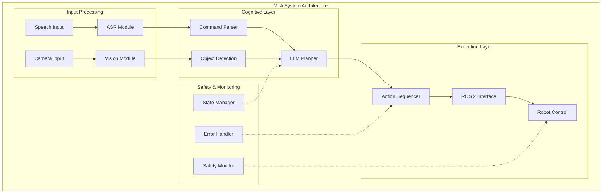

import QuizComponent from '@site/src/components/QuizComponent';

# End-to-End VLA Systems & Mini-Projects

## Learning Objectives

By the end of this lesson, you will be able to:
- Design and implement complete VLA system architectures
- Handle real-time processing constraints in VLA systems
- Implement safety and error handling mechanisms
- Build and deploy end-to-end VLA applications
- Evaluate VLA system performance and limitations

## 3.1 Complete VLA System Architecture

A complete VLA system integrates all components into a robust, real-time architecture capable of processing natural language commands and executing robotic actions. The architecture must handle:

- Real-time performance requirements
- Safety and reliability constraints
- Error recovery and fallback mechanisms
- User interaction and feedback



The architecture typically follows a state-based approach where the system transitions between different operational states based on inputs, execution status, and environmental conditions.

## 3.2 Integration Challenges

Building complete VLA systems presents several integration challenges:

### Timing and Synchronization
Different components operate at different speeds. Vision processing might take 100ms, LLM queries 1-2 seconds, and action execution variable time. The system must manage these timing differences effectively.

### Data Consistency
The environment changes during VLA processing. A plan generated based on a scene from 2 seconds ago might be invalid by the time it executes.

### Error Propagation
Errors in one component (e.g., misrecognized speech) can cascade through the entire pipeline, resulting in incorrect actions.

```python
# Example: VLA pipeline orchestrator
class VLAPipelineOrchestrator:
    def __init__(self):
        self.speech_recognizer = SpeechRecognitionModule()
        self.vision_system = VisionIntegration()
        self.planner = CognitivePlanner()
        self.executor = ActionExecutor()
        self.safety_monitor = SafetyMonitor()

    def process_command(self, audio_input):
        # Ensure all components are synchronized
        environment_state = self.vision_system.analyze_environment()
        command = self.speech_recognizer.process_audio(audio_input)

        # Plan with current state
        action_sequence = self.planner.plan_sequence(
            command, environment_state
        )

        # Validate safety before execution
        if self.safety_monitor.validate_action_sequence(action_sequence):
            return self.executor.execute_action(action_sequence)
        else:
            return self.handle_safety_violation(action_sequence)
```

## 3.3 Real-Time Processing Considerations

VLA systems must meet real-time constraints to provide responsive interaction:

- **Perception Latency**: Keep vision processing under 100ms
- **Planning Latency**: Optimize LLM queries for speed while maintaining accuracy
- **Action Execution**: Monitor and adapt to execution timing
- **Feedback Loop**: Provide intermediate feedback during long operations

## 3.4 Safety & Error Handling in VLA Systems

Safety is paramount in VLA systems that operate in human environments:

### Safety Monitoring
- Continuous monitoring of action plans against safety constraints
- Collision avoidance and workspace limitations
- Emergency stop mechanisms

### Error Handling
- Graceful degradation when components fail
- User feedback for ambiguous commands
- Recovery from execution failures

```python
# Example: Safety monitoring and error handling
class SafetyMonitor:
    def __init__(self):
        self.workspace_limits = self.load_workspace_limits()
        self.collision_checker = CollisionChecker()

    def validate_action_sequence(self, action_sequence):
        for action in action_sequence:
            if not self.is_safe(action):
                return False
        return True

    def is_safe(self, action):
        # Check workspace limits
        if not self.is_in_workspace(action):
            return False

        # Check for potential collisions
        if self.collision_checker.would_collide(action):
            return False

        return True

class ErrorHandler:
    def handle_execution_error(self, error, current_state):
        if error.type == "EXECUTION_FAILED":
            return self.plan_alternative_action(error, current_state)
        elif error.type == "PERCEPTION_FAILED":
            return self.request_perception_retry(error)
        elif error.type == "PLANNING_FAILED":
            return self.request_command_clarification(error)
```

## 3.5 Mini-Project Descriptions

In this section, we'll work on two comprehensive mini-projects that implement complete VLA systems:

### Mini-Project 1: Simple VLA System
Build a basic VLA system that can:
- Recognize simple spoken commands
- Detect objects in the environment
- Execute basic manipulation tasks
- Handle common error cases

### Mini-Project 2: Advanced VLA System
Extend the basic system with:
- Object-aware command processing
- Multi-step action planning
- Advanced safety monitoring
- Performance optimization

## Summary

Complete VLA systems represent the integration of multiple sophisticated AI components into cohesive, safe, and effective robotic systems. Success requires careful attention to real-time constraints, safety considerations, error handling, and system architecture. As these systems mature, they will enable more natural and intuitive human-robot interaction in everyday environments.

This concludes Module 4 on Vision-Language-Action systems. You now have the knowledge to design, implement, and evaluate complete VLA systems that integrate vision, language, and action in Physical AI applications.

## Key Terms

- **VLA System Architecture**: Complete system design for vision-language-action integration
- **Real-time Processing**: Meeting timing constraints for responsive operation
- **Safety Monitoring**: Continuous checking of system actions for safety compliance
- **Error Recovery**: Mechanisms for handling and recovering from system failures
- **State Management**: Tracking system state across different operational modes

## Module 4 Review Quiz

Test your understanding of Vision-Language-Action systems.

<QuizComponent
  questions={[
    {
      question: "What are the three main components of a VLA system?",
      options: [
        "Database, Server, Client",
        "Vision, Language, Action",
        "Input, Process, Output",
        "Hardware, Software, Network"
      ],
      correctIndex: 1,
      explanation: "VLA systems integrate Vision (perceiving the environment), Language (understanding commands), and Action (executing movements) components."
    },
    {
      question: "What is one of the main integration challenges in VLA systems?",
      options: [
        "Color matching between components",
        "Timing and synchronization between different processing speeds",
        "Finding compatible cables",
        "Language translation between countries"
      ],
      correctIndex: 1,
      explanation: "Different VLA components operate at different speeds - vision might take 100ms, LLM queries 1-2 seconds. Managing these timing differences is a key challenge."
    },
    {
      question: "What is the purpose of cross-modal grounding in VLA systems?",
      options: [
        "Connecting electrical components",
        "Linking language references to visual objects in the scene",
        "Attaching the robot to the floor",
        "Establishing network connections"
      ],
      correctIndex: 1,
      explanation: "Cross-modal grounding connects language references (e.g., 'the red cup') to actual objects detected in the visual scene."
    },
    {
      question: "Which of the following is a key safety consideration for VLA systems?",
      options: [
        "Color scheme of the user interface",
        "Emergency stop mechanisms and collision avoidance",
        "Marketing budget allocation",
        "Website design choices"
      ],
      correctIndex: 1,
      explanation: "Safety in VLA systems includes emergency stops, collision avoidance, workspace limits, and continuous monitoring of action safety."
    },
    {
      question: "How does embodied cognition relate to VLA systems?",
      options: [
        "It refers to the robot's physical body weight",
        "Intelligence emerges from the interaction between body, brain, and environment",
        "It describes the computer case design",
        "It measures electrical resistance"
      ],
      correctIndex: 1,
      explanation: "Embodied cognition suggests that intelligence is not just about processing information, but emerges from the dynamic interaction between an agent's body, brain, and environment."
    },
    {
      question: "What is the role of a cognitive planner in a VLA system?",
      options: [
        "To schedule team meetings",
        "To generate action sequences from natural language commands",
        "To plan the robot's power consumption",
        "To design the robot's appearance"
      ],
      correctIndex: 1,
      explanation: "The cognitive planner (often LLM-based) translates natural language commands into executable action sequences for the robot."
    },
    {
      question: "What is a key real-time processing consideration for VLA systems?",
      options: [
        "The robot's paint color",
        "Keeping perception latency under 100ms for responsive interaction",
        "The number of USB ports",
        "The screen resolution"
      ],
      correctIndex: 1,
      explanation: "VLA systems must meet real-time constraints - perception latency should be under 100ms to provide responsive interaction."
    },
    {
      question: "What should happen when a VLA system detects a potential collision?",
      options: [
        "Continue with the planned action",
        "Trigger emergency stop or navigate around the obstacle",
        "Ignore the warning",
        "Increase speed to finish faster"
      ],
      correctIndex: 1,
      explanation: "Safety monitoring should halt dangerous actions and either stop the robot or plan an alternative safe path."
    },
    {
      question: "What is error propagation in VLA systems?",
      options: [
        "Spreading error messages via email",
        "Errors in one component cascading through the entire pipeline",
        "Copying files incorrectly",
        "Network packet loss"
      ],
      correctIndex: 1,
      explanation: "Error propagation occurs when errors in one component (e.g., misrecognized speech) cascade through the entire VLA pipeline, resulting in incorrect actions."
    },
    {
      question: "Which component typically handles speech-to-text conversion in a VLA system?",
      options: [
        "The action executor",
        "The ASR (Automatic Speech Recognition) module",
        "The motor controller",
        "The power supply"
      ],
      correctIndex: 1,
      explanation: "The ASR (Automatic Speech Recognition) module converts spoken commands into text for processing by the language understanding components."
    }
  ]}
/>