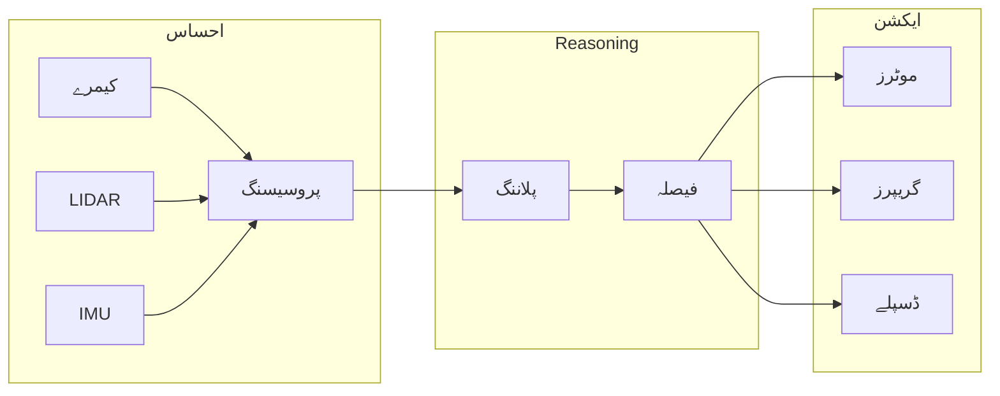

# لیسنس 1: فزکل AI اور روبوٹک نروس سسٹم

**سیکھنے کے اہداف**

اس لیسنس کو مکمل کرنے کے بعد، آپ کے اہل ہوں گے:
1. **وضاحت کریں** فزکل AI اور اس کو روایتی ڈیجیٹل AI سے الگ کریں
2. **وضاحت کریں** امبدڈ انٹیلی جنس کے اصول
3. **وضاحت کریں** روبوٹک نروس سسٹم کے تصور کو
4. **شناخت کریں** جدید ہیومنوڈ روبوٹ سسٹم میں کلیدی اجزاء

## 1.1 فزکل AI کیا ہے؟

فزکل AI مصنوعی ذہانت میں ایک پیراڈائم شفٹ کی نمائندگی کرتا ہے—صرف سافٹ ویئر میں موجود الگورتھم سے اس میں منتقل ہونا جو فزکل دنیا کے ساتھ روبوٹک جسم کے ذریعے بات چیت کرتے ہیں۔

روایتی AI کے برعکس جو تنہا ڈیٹا کو پروسیس کرتا ہے، فزکل AI سسٹم کو چاہیے:
- **احساس کریں** سینسرز کے ذریعے ماحول کا (کیمرے، LIDAR، فورس سینسرز)
- **Reason کریں** ایکشنز کے بارے میں فزکل پابندیوں کو مدنظر رکھتے ہوئے
- **ایکشن کریں** دنیا کے ساتھ ایکٹو ایٹرز کے ذریعے (موٹرز، گریپرز، جوائنٹس)
- **ایڈاپٹ کریں** غیر متوقع تبدیلیوں کے لیے ریل ٹائم میں

سیکھنے کا فرق سمجھیں: ایک چیس کھیلنے والی AI ایک مکمل طور پر وضاحت شدہ ڈیجیٹل ماحول میں کام کرتی ہے جس میں ڈسکریٹ موو ہوتے ہیں۔ ایک ہیومنوڈ روبوٹ جو کپ کو اٹھا رہا ہے اسے لائٹنگ کی تبدیلیوں، کپ کی پوزیشنز، گرپ فورسز، بیلنس ایڈجسٹمنٹس، اور لاتعداد دیگر فزکل ویریبلز کا احتساب کرنا ہوتا ہے—سب کچھ ریل ٹائم میں۔

یہی فزکل AI کا چیلنج اور وعدہ ہے: ایسی مشینیں بنانا جو ہماری غیر متوقع، جاری، فزکل دنیا میں انٹیلی جنٹ طریقے سے کام کر سکیں۔

## 1.2 امبدڈ انٹیلی جنس کے اصول

امبدڈ انٹیلی جنس کے شعبہ کو تسلیم کرتا ہے کہ انٹیلی جنس کو اس فزکل بادی سے الگ نہیں کیا جا سکتا جو اسے جگہ دیتا ہے۔ یہ بصیرت، جسے راڈنی بروکس جیسے روبوٹسٹس نے ترقی دی، نے بنیادی طور پر ہمیں روبوٹس کے لیے AI کے تعلق کو متاثر کیا۔

### کلیدی اصول

**سینسریموٹر کپلنگ**: انٹیلی جنس سینسنگ اور ایکٹنگ کی سخت ضمیمہ سے نکلتی ہے۔ ایک روبوٹ کو "بھاری" کی سمجھ ایک لغت کی وضاحت سے نہیں، بلکہ چیزوں کو اٹھانے اور مزاحمت کا احساس کرنے کے تجربے سے آتی ہے۔

**ماحولیاتی بات چیت**: دنیا خود ایک بیرونی میموری اور کمپیوٹیشنل وسائل کا کام کرتی ہے۔ اندرونی ماڈلز کو بنانے کے بجائے، امبدڈ سسٹم ماحول کو براہ راست استعمال کر سکتے ہیں—ایک سطح کو چھونا تاکہ یہ تعین کیا جا سکے کہ کیا یہ مستحکم ہے بجائے فزکس سیمولیشن کے حساب کے۔

**مورفولوجیکل کمپیوٹیشن**: روبوٹ کی فزکل سٹرکچر انٹیلی جنٹ برتاؤ میں حصہ ڈالتی ہے۔ انسانی ہاتھ صرف ایکٹو ایٹرز نہیں ہیں—ان کی شکل، لچک، اور مطیعیت گریپنگ کو آسان بنا دیتی ہے بغیر پیچیدہ کنٹرول الگورتھم کے۔ اسی طرح، اچھی طرح ڈیزائن شدہ روبوٹ مورفولوجی کنٹرول کو آسان بنا دیتی ہے۔

**ریل ٹائم پابندیاں**: فزکل سسٹم سخت ٹائم کی ضروریات کے تحت کام کرتے ہیں۔ ایک گرتا ہوا روبوٹ سوچنے کے لیے موقوف نہیں ہو سکتا—ریسپانسز کافی تیز ہونے چاہئیں تاکہ نقصان سے بچا جا سکے۔

یہ اصول جدید ہیومنوڈ روبوٹکس کی رہنمائی کرتے ہیں، جہاں کامیابی صرف طاقتور الگورتھم پر منحصر نہیں ہے بلکہ احساس، سوچ، اور فزکل فارم کے خیال مند انضمام پر منحصر ہے۔

## 1.3 روبوٹک نروس سسٹم کا تصور

جیسا کہ انسانی نروس سسٹم جسم کے پورے میں احساس اور ایکشن کو مربوط کرتا ہے، روبوٹس کو ایک کمیونیکیشن انفراسٹرکچر کی ضرورت ہوتی ہے جو سینسرز، پروسیسرز، اور ایکٹو ایٹرز کو ایک مربوط مکمل میں جوڑے۔

یہیں **ROS 2** (روبوٹ آپریٹنگ سسٹم 2) تصویر میں آتا ہے۔

ROS 2 فراہم کرتا ہے:
- ** معیاری کمیونیکیشن ** سافٹ ویئر کمپوننٹس (Nodes) کے درمیان
- **ہارڈ ویئر ابستریکشن ** جو ایک ہی کوڈ کو مختلف روبوٹس پر چلنے کی اجازت دیتا ہے
- **ریل ٹائم کی صلاحیتیں ** ٹائم کرٹیکل کنٹرول لوپس کے لیے
- **تقسیم شدہ کمپیوٹنگ ** متعدد مشینوں میں پروسیسنگ کو پھیلانے کے لیے

ROS 2 کو نروس سسٹم انفراسٹرکچر کے طور پر سمجھیں: یہ روبوٹ کو بتاتا نہیں کہ کیا کرنا ہے، لیکن یہ یقینی بناتا ہے کہ سینسر ڈیٹا دماغ تک پہنچے، فیصلے مسلز تک پھیلیں، اور سب کچھ مربوط رہے۔

## 1.4 حقیقی دنیا کی ہیومنوڈ روبوٹکس

فزکل AI اور جدید روبوٹکس کا اتحاد حیرت انگیز ہیومنوڈ سسٹم پیدا کر چکا ہے:

| روبوٹ | تنظیم | کلیدی صلاحیت |
|-------|--------------|----------------|
| ایٹلس | بوسٹن ڈائی نامکس | ڈائنامک لوکوموشن، پارکور |
| آپٹیمس | ٹیسلا | مینوفیکچرنگ کے کام، انسانی ماحول |
| فیگر 01 | فیگر AI | جنرل پرپز مینوپولیشن |
| ڈیجیٹ | ایگلٹی روبوٹکس | ویئر ہاؤس لا جسٹکس، بائی پیڈل چلنا |

یہ سسٹم عام طور پر معماری پیٹرنز شیئر کرتے ہیں:
- **تقسیم شدہ سینسر نیٹ ورکس ** جو ماحولیاتی آگاہی فراہم کرتے ہیں
- **ہیئرآرکیکل کنٹرول ** ہائی لیول پلاننگ سے لو لیول موٹر کنٹرول تک
- **ریل ٹائم مڈل ویئر ** (اکثر ROS 2 یا حسب ضرورت متبادل) تنظیم کے لیے
- **مشین لرننگ ** احساس اور ایڈاپٹو برتاؤ کے لیے

اس کورس کے دوران، آپ اسی طرح کے سسٹم کو سمجھنے اور بنانے کے لیے بنیادی مہارتوں کو سیکھیں گے—خود نروس سسٹم سے شروع کرتے ہوئے۔

## خلاصہ

اس لیسنس میں، ہم نے فزکل AI کی بنیادیں تلاش کیں:

- **فزکل AI** مصنوعی ذہانت کو روبوٹک امبدمنگ کے ذریعے حقیقی دنیا میں پھیلا دیتا ہے
- **امبدڈ انٹیلی جنس** کے اصول دکھاتے ہیں کہ انٹیلی جنٹ برتاؤ ذہن، بادی، اور ماحول کی بات چیت سے نکلتا ہے
- **روبوٹک نروس سسٹم** کا تصور ROS 2 کو روبوٹک برتاؤ کو مربوط کرنے والے کمیونیکیشن انفراسٹرکچر کے طور پر فریم کرتا ہے
- **جدید ہیومنوڈز** یہ اصول اسی طرح کے قابل سسٹم میں دکھاتے ہیں

اگلی لیسنس میں، ہم ROS 2 معماری میں گہرائی سے جائیں گے—روبوٹک نروس سسٹم کے بنیادی جوڑوں کو سمجھنے کے لیے، نوڈز، ٹاپکس، سروسز، اور ایکشنز کو۔

---

## حوالہ جات

1. بروکس، آر. اے. (1999). *کیمبیرین انٹیلی جنس: نئی AI کی ابتدائی تاریخ*. MIT پریس۔
2. پفیفر، آر.، اور بونگارڈ، جے. (2007). *دی بڈی کیسے ہم سوچتے ہیں کا شیپ کرتی ہے: انٹیلی جنس کا ایک نیا نظریہ*. MIT پریس۔
3. میسنسکی، ایس.، فوٹ، ٹی.، جرکی، بی.، لالانسیٹ، سی.، اور ووڈال، ڈبلیو. (2022). روبوٹ آپریٹنگ سسٹم 2: ڈیزائن، معماری، اور جنگل میں استعمال کے بارے میں. *سائنس روبوٹکس*, 7(66).