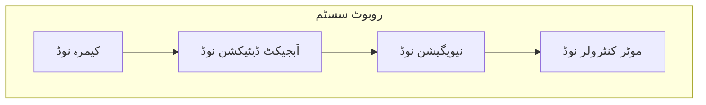
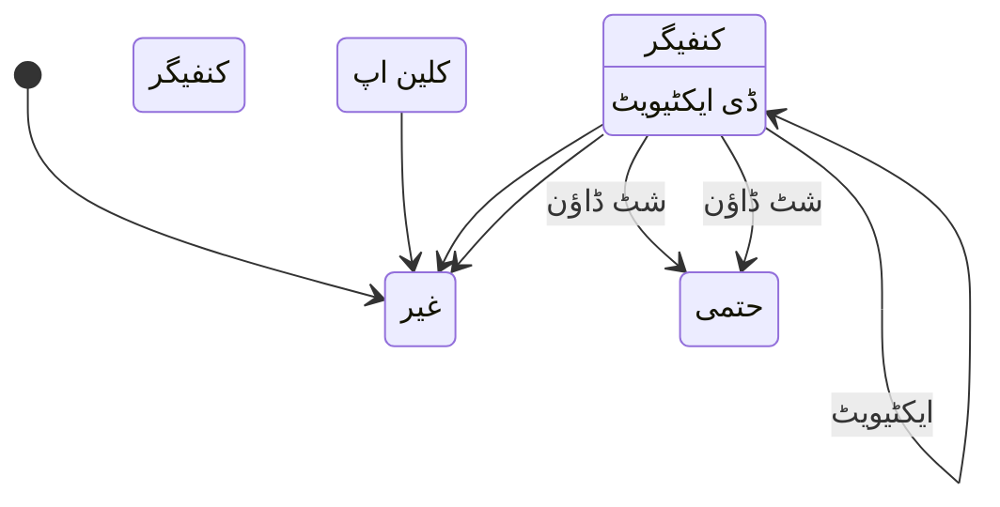
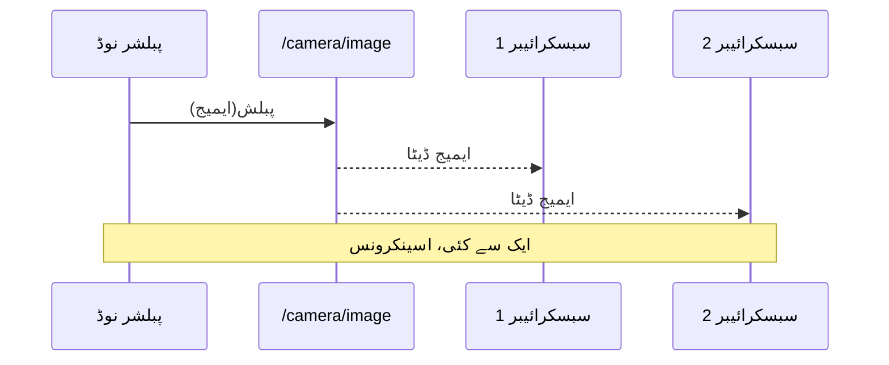
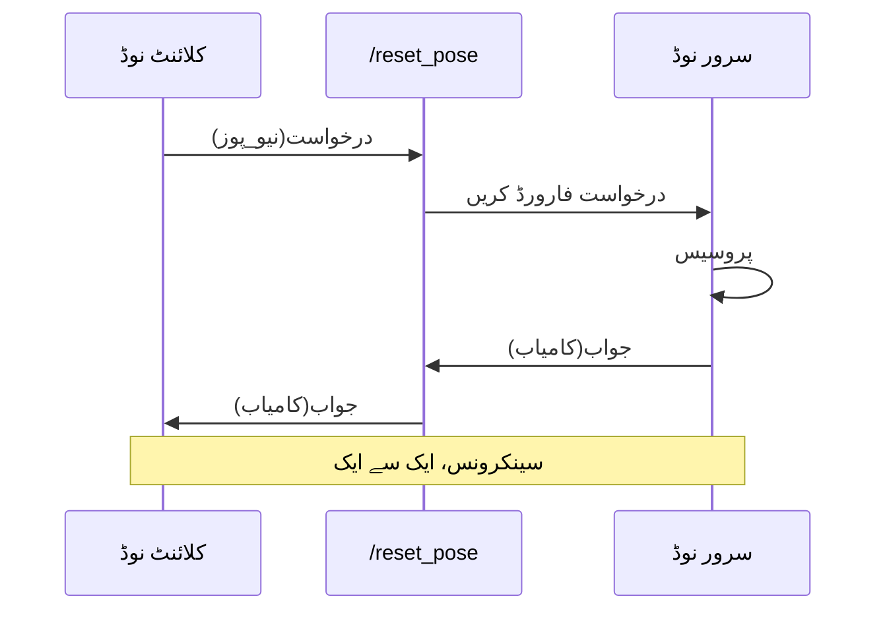
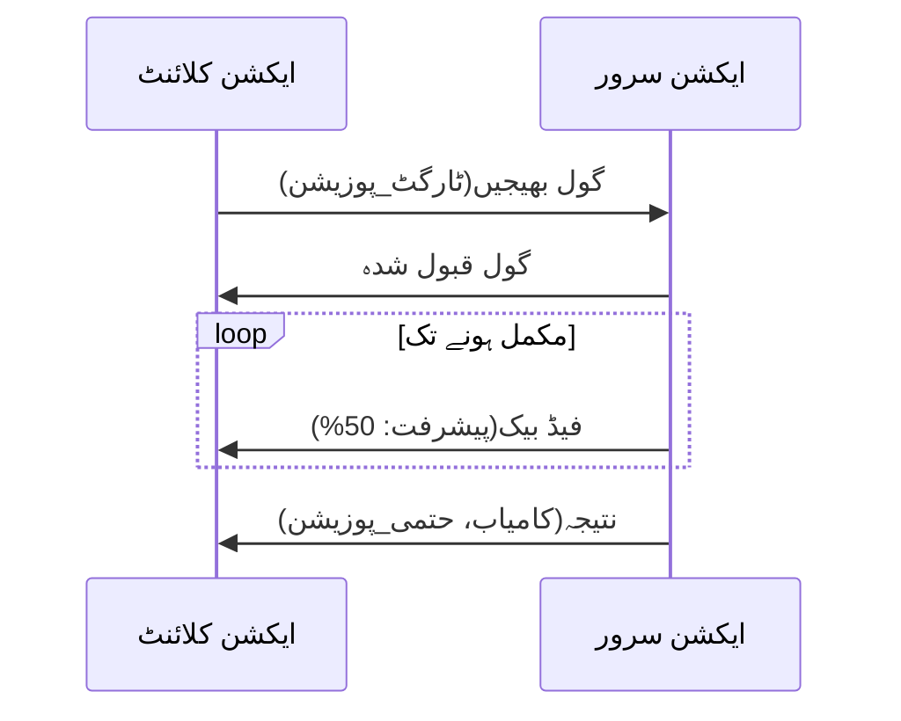
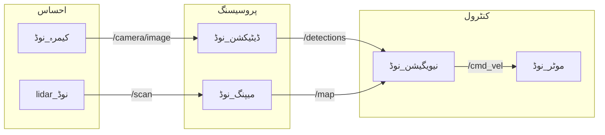

# لیسنس 2: ROS 2 کور معماری

<div className="learning-objectives">

**سیکھنے کے اہداف**

اس لیسنس کو مکمل کرنے کے بعد، آپ کے اہل ہوں گے:
1. **وضاحت کریں** کہ ROS 2 روبوٹک نروس سسٹم کے طور پر کیوں کام کرتا ہے
2. **وضاحت کریں** نوڈز کا کردار آزاد پروسیسنگ یونٹس کے طور پر
3. **تمیز کریں** ٹاپکس، سروسز، اور ایکشنز کے درمیان
4. **تصور کریں** ROS گراف اور میسج فلو کو سمجھیں

</div>

## 2.1 ROS 2 بطور روبوٹک نروس سسٹم

لیسنس 1 میں، ہم نے روبوٹک نروس سسٹم کے تصور کا تعارف کرایا۔ اب ہم دیکھیں گے کہ ROS 2 کیسے اس معماری کو لاگو کرتا ہے۔

ROS 2 **مڈل ویئر** ہے—سافٹ ویئر جو آپریٹنگ سسٹم اور ایپلیکیشن کوڈ کے درمیان بیٹھتا ہے، فراہم کرتا ہے:

- **کمیونیکیشن انفراسٹرکچر**: ڈیٹا ایکسچینج کے لیے معیاری پروٹوکولز
- **ہارڈ ویئر ابستریکشن**: بنیادی ہارڈ ویئر کے لحاظ سے عام انٹرفیسز
- **ٹول ایکو سسٹم**: وژولائزیشن، ڈیبگنگ، اور ڈیولپمنٹ یوٹیلیٹیز

**ڈیٹا ڈسٹری بیوشن سروس (DDS)** معیار پر تعمیل کر کے، ROS 2 ریل ٹائم، قابل اعتماد کمیونیکیشن کو فعال کرتا ہے جو سیفٹی کرٹیکل روبوٹکس ایپلیکیشنز کے لیے مناسب ہے۔

:::info ROS 2 کیوں ROS 1 پر؟
ROS 2 اپنے پیش رفت کی کلیدی حدود کو حل کرتا ہے: ریل ٹائم سپورٹ، سیکیورٹی فیچرز، متعدد روبوٹ سسٹم، اور پروڈکشن ریڈی قابلیت۔ تمام نئے روبوٹکس پروجیکٹس کو ROS 2 استعمال کرنا چاہئیں۔
:::

## 2.2 نوڈز - آزاد عمل

ایک **نوڈ** ROS 2 میں کمپیوٹیشن کی بنیادی یونٹ ہے۔ ہر نوڈ ایک الگ عمل ہے جو ایک مخصوص کام کے لیے ذمہ دار ہے۔



### نوڈ کی خصوصیات

- **سنگل ذمہ داری**: ہر نوڈ ایک اچھی طرح وضاحت شدہ کام کو سنبھالتا ہے
- **آزادی**: نوڈز کو الگ الگ شروع، بند، اور دوبارہ شروع کیا جا سکتا ہے
- **کمپوزیبلٹی**: نوڈز مکمل سسٹم بنانے کے لیے جڑ جاتے ہیں
- **ڈسکوریبلٹی**: نوڈز نیٹ ورک پر خود بخود ایک دوسرے کو تلاش کرتے ہیں

### نوڈ لائف سائیکل

ROS 2 منیجڈ نوڈز ایک وضاحت شدہ لائف سائیکل کو فالو کرتے ہیں:



یہ لائف سائیکل کنٹرولڈ اسٹارٹ اپ سیکوئنس کو فعال کرتا ہے—روبوٹس کے لیے اہم جہاں سینسر اینیشلائزیشن کو موشن پلاننگ سے پہلے ہونا چاہئے۔

## 2.3 ٹاپکس - اسینکرونس میسج نگ

**ٹاپکس** جاری ڈیٹا سٹریمز کے لیے پبلش-سبسکرائب کمیونیکیشن فراہم کرتے ہیں۔



### ٹاپکس کب استعمال کریں

- **سینسر ڈیٹا**: کیمرہ ایمیجز، LIDAR سکینز، IMU ریڈنگز
- **اسٹیٹ معلومات**: روبوٹ پوز، جوائنٹ پوزیشنز، بیٹری لیول
- **جاری سٹریمز**: کوئی بھی ڈیٹا جو منظم وقفوں پر پیدا ہوتا ہے

### میسج کی اقسام

ٹاپکس **ٹائپڈ میسجز** لے جاتے ہیں۔ ROS 2 میسج پیکجز میں عام میں شامل ہیں:

| پیکیج | مثال میسجز |
|---------|------------------|
| `std_msgs` | `String`, `Int32`, `Float64` |
| `geometry_msgs` | `Twist`, `Pose`, `Point` |
| `sensor_msgs` | `Image`, `LaserScan`, `Imu` |

ہیومنوڈ روبوٹس کے لیے، `geometry_msgs/Twist` اکثر ویلوسٹی کمانڈز (لینیئر اور اینگولر) لے جاتا ہے، جبکہ `sensor_msgs/JointState` جوائنٹ پوزیشنز اور ویلوسٹیز کی رپورٹ کرتا ہے۔

## 2.4 سروسز - درخواست-جواب

**سروسز** ڈسکریٹ آپریشنز کے لیے سینکرونس درخواست-جواب کمیونیکیشن فراہم کرتے ہیں۔



### سروسز کب استعمال کریں

- **کنفیگریشن تبدیلیاں**: پیرامیٹرز سیٹ کرنا، موڈز تبدیل کرنا
- **ڈسکریٹ ایکشنز**: تصویر لینا، ڈیٹا محفوظ کرنا
- **کویریز**: موجودہ اسٹیٹس حاصل کرنا، کنفیگریشن پڑھنا

سروسز جاری ڈیٹا یا ٹائم سینسیٹو آپریشنز کے لیے غیر مناسب ہیں کیونکہ کلائنٹ جواب کے انتظار میں بلاک ہو جاتا ہے۔

## 2.5 ایکشنز - طویل چلنے والے کام

**ایکشنز** ایسے اہداف کو سنبھالتے ہیں جن میں مکمل ہونے میں وقت لگتا ہے، انجام کے دوران فیڈ بیک فراہم کرتے ہیں اور منسوخ کرنے کی صلاحیت رکھتے ہیں۔



### ایکشنز کب استعمال کریں

- **نیویگیشن**: ویزپوائنٹ پر جانا (کئی منٹ لگ سکتے ہیں)
- **مینوپولیشن**: اٹھانے اور رکھنے کے کام
- **پیچیدہ برتاؤ**: کوئی بھی کام جس میں بین الاقوامی حالتیں ہوں

ایکشنز ہیومنوڈ روبوٹس کے لیے ضروری ہیں جو کئی اسٹیپس والے کام جیسے کسی جگہ پر چلنا یا چیزوں کو ہینڈل کرنا انجام دیتے ہیں۔

## 2.6 ROS گراف

**ROS گراف** تمام نوڈز اور ان کے کنیکشن کو وژولائز کرتا ہے—مکمل نروس سسٹم ایک نظر میں۔



### گراف کا معائنہ

ROS 2 گراف معائنہ کے لیے CLI ٹولز فراہم کرتا ہے:

```bash
# تمام نوڈز کو فہرست کریں
ros2 node list

# تمام ٹاپکس کو فہرست کریں
ros2 topic list

# ٹاپک میسج ٹائپ دیکھیں
ros2 topic info /camera/image

# ٹاپک میسجز ایکو کریں
ros2 topic echo /cmd_vel
```

یہ ٹولز ڈیبگنگ کے لیے بے بہا ہیں—جب روبوٹ غلط برتاؤ کرتا ہے، گراف اکثر نا مربوط نوڈز یا ڈیٹا سٹریمز کی کمی کو ظاہر کر دیتا ہے۔

## خلاصہ

اس لیسنس نے ROS 2 کی کور معماری کو احاطہ کیا:

- **مڈل ویئر کا کردار**: ROS 2 کمیونیکیشن، ابستریکشن، اور ٹولنگ فراہم کرتا ہے
- **نوڈز**: آزاد عمل جن کے پاس سنگل ذمہ داریاں ہیں
- **ٹاپکس**: جاری ڈیٹا کے لیے اسینکرونس پبلش-سبسکرائب
- **سروسز**: ڈسکریٹ آپریشنز کے لیے سینکرونس درخواست-جواب
- **ایکشنز**: طویل چلنے والے کاموں کے لیے گول-اورینٹڈ کمیونیکیشن
- **ROS گراف**: سسٹم کے نروس کنیکشن کی ویژوئل نمائندگی

اگلی لیسنس میں، ہم نوڈز، پبلشرز، سبسکرائیبرز، اور سروسز بنانے کے لیے پائی تھن کوڈ لکھیں گے—اس معماری کو زندگی میں لاتے ہوئے۔

---

## حوالہ جات

1. کوئگلے، ایم.، کونلی، کے.، جرکی، بی.، فاسٹ، جے.، فوٹ، ٹی.، لیبس، جے.، وہیلر، آر.، اور اینگ، اے. وائی. (2009). ROS: ایک اوپن سورس روبوٹ آپریٹنگ سسٹم. *ICRA ورکشاپ آن اوپن سورس سافٹ ویئر*.
2. میسنسکی، ایس.، فوٹ، ٹی.، جرکی، بی.، لالانسیٹ، سی.، اور ووڈال، ڈبلیو. (2022). روبوٹ آپریٹنگ سسٹم 2: ڈیزائن، معماری، اور جنگل میں استعمال کے بارے میں. *سائنس روبوٹکس*, 7(66).
3. ROS 2 دستاویزات. (2024). *ROS 2 نوڈز کو سمجھنا*. https://docs.ros.org/en/humble/
4. ROS 2 دستاویزات. (2024). *کوالٹی آف سروس سیٹنگز کے بارے میں*. https://docs.ros.org/en/humble/