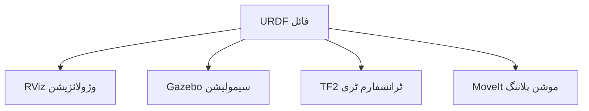
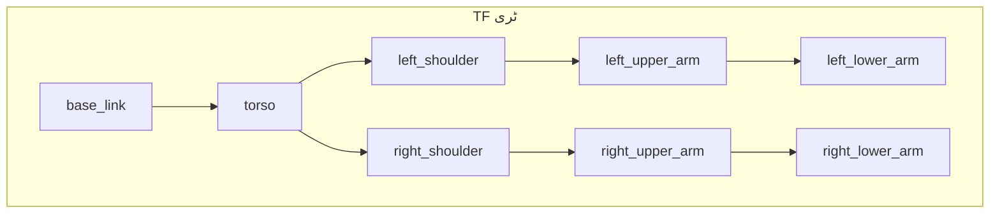

# لیسنس 4: ہیومنوڈ URDF بنیادیں

<div className="learning-objectives">

**سیکھنے کے اہداف**

اس لیسنس کو مکمل کرنے کے بعد، آپ کے اہل ہوں گے:
1. **وضاحت کریں** URDF فائلز کا مقصد اور XML سٹرکچر
2. **وضاحت کریں** روبوٹ ماڈلز میں لنکس اور جوائنٹس
3. **تخلیق کریں** ایک سادہ 2-DOF روبوٹک آرم URDF
4. **سمجھیں** کوآرڈینیٹ فریم اور ٹرانسفارمیشنز

</div>

## 4.1 URDF کیا ہے؟

**URDF** (یونیفائیڈ روبوٹ ڈسکرپشن فارمیٹ) روبوٹ فزکل سٹرکچر کی وضاحت کے لیے ایک XML فارمیٹ ہے۔ یہ وضاحت کرتا ہے:

- **کیا** حصے روبوٹ میں ہیں (لنکس)
- **کیسے** وہ حصے جڑے ہوئے ہیں (جوائنٹس)
- **کہاں** وہ 3D سپیس میں موجود ہیں (ٹرانسفارمیشنز)

ROS 2 میں ہر روبوٹ—صنعتی آرمز سے لے کر ہیومنوڈز تک—ایک URDF فائل کے ساتھ شروع ہوتا ہے جو اس کی فزکل شکل کی وضاحت کرتا ہے۔



### URDF کیوں اہم ہے

| استعمال کا کیس | URDF کیسے مدد کرتا ہے |
|----------|----------------|
| وژولائزیشن | RViz URDF سے روبوٹ ماڈل رینڈر کرتا ہے |
| سیمولیشن | Gazebo URDF کو فزکس سیمولیشن کے لیے استعمال کرتا ہے |
| موشن پلاننگ | MoveIt کنیمیٹک ماڈل سے ٹریجکٹریز کا حساب لگاتا ہے |
| ٹرانسفارم ٹریکنگ | TF2 فریم ریلیشن شپس براڈکاسٹ کرتا ہے |

## 4.2 لنکس - روبوٹ بادی کے حصے

ایک **لنک** روبوٹ کے ریجڈ بادی کے حصے کی نمائندگی کرتا ہے۔ ہر لنک میں ہو سکتا ہے:

- **وژول جیومیٹری**: لنک کیسا نظر آتا ہے (ڈسپلے کے لیے)
- **کولیژن جیومیٹری**: فزکس کے لیے سادہ شکل (سیمولیشن کے لیے)
- **انیشل پراپرٹیز**: ماس اور مومنٹس آف انیشیا (ڈائنامکس کے لیے)

### بنیادی لنک سٹرکچر

```xml
<link name="base_link">
  <visual>
    <geometry>
      <box size="0.1 0.1 0.05"/>
    </geometry>
    <material name="gray">
      <color rgba="0.5 0.5 0.5 1.0"/>
    </material>
  </visual>
  <collision>
    <geometry>
      <box size="0.1 0.1 0.05"/>
    </geometry>
  </collision>
  <inertial>
    <mass value="1.0"/>
    <inertia ixx="0.001" ixy="0" ixz="0"
             iyy="0.001" iyz="0" izz="0.001"/>
  </inertial>
</link>
```

### جیومیٹری کی اقسام

| قسم | مثال | استعمال کا کیس |
|------|---------|----------|
| `box` | `<box size="x y z"/>` | مستطیل اجسام |
| `cylinder` | `<cylinder radius="r" length="l"/>` | بازیں، ٹانگیں |
| `sphere` | `<sphere radius="r"/>` | جوائنٹس، سر |
| `mesh` | `<mesh filename="model.stl"/>` | پیچیدہ شکلیں |

## 4.3 جوائنٹس - کنیکشنز

ایک **جوائنٹ** دو لنکس کو جوڑتا ہے اور وضاحت کرتا ہے کہ وہ ایک دوسرے کے ساتھ کیسے حرکت کرتے ہیں۔

### جوائنٹ کی اقسام

| قسم | موشن | DOF | مثال |
|------|--------|-----|---------|
| `revolute` | حدود کے ساتھ گردش | 1 | کہنی، گھٹنہ |
| `continuous` | لامحدود گردش | 1 | پہیہ |
| `prismatic` | لکیری سلائیڈنگ | 1 | لکیری ایکچوایٹر |
| `fixed` | کوئی موشن نہیں | 0 | سینسر ماؤنٹ |
| `floating` | تمام موشن | 6 | فری فلائینگ روبوٹ |

### بنیادی جوائنٹ سٹرکچر

```xml
<joint name="shoulder_joint" type="revolute">
  <parent link="torso"/>
  <child link="upper_arm"/>
  <origin xyz="0 0.1 0" rpy="0 0 0"/>
  <axis xyz="0 1 0"/>
  <limit lower="-1.57" upper="1.57" effort="10" velocity="1.0"/>
</joint>
```

اہم ایٹریبیوٹس:
- **parent/child**: کون سے لنکس یہ جوائنٹ جوڑتا ہے
- **origin**: جوائنٹ فریم کی پوزیشن اور گردش
- **axis**: گردش یا ٹرانسلیشن ایکسز
- **limit**: موشن کنٹرول (ریوولیوٹ کے لیے ریڈینز)

## 4.4 کوآرڈینیٹ فریم

URDF میں ہر لنک کا اپنا کوآرڈینیٹ فریم ہوتا ہے۔ **TF2** لائبریری ان فریم کو ٹریک کرتی ہے اور ان کے درمیان ٹرانسفارمیشن کا حساب لگاتی ہے۔



### اوریجن اور ایکسز رواج

- **xyz**: والد فریم سے پوزیشن آفسیٹ (میٹر)
- **rpy**: رول، پچ، یوو گردش (ریڈینز)
- **axis**: یونٹ ویکٹر جو گردش/ٹرانسلیشن سمت کی وضاحت کرتا ہے

کوآرڈینیٹ فریم کو سمجھنا ضروری ہے:
- اینڈ ایفیکٹر پوزیشن کا حساب (فارورڈ کنیمیٹکس)
- بازو کی حرکت کی پلاننگ (انورس کنیمیٹکس)
- سینسر ڈیٹا کو فریم کے درمیان ٹرانسفارم کرنا

## 4.5 سادہ ہیومنوڈ ماڈل

آئیے ایک 2-DOF آرم کا جائزہ لیتے ہیں—سادہ ترین ہیومنوڈ متعلقہ سٹرکچر:

```xml
<?xml version="1.0"?>
<robot name="simple_arm">
  <!-- بیس لنک (دنیا سے منسلک) -->
  <link name="base_link">
    <visual>
      <geometry><box size="0.1 0.1 0.05"/></geometry>
    </visual>
  </link>

  <!-- شولڈر جوائنٹ (ریوولیوٹ) -->
  <joint name="shoulder" type="revolute">
    <parent link="base_link"/>
    <child link="upper_arm"/>
    <origin xyz="0 0 0.05"/>
    <axis xyz="0 1 0"/>
    <limit lower="-1.57" upper="1.57" effort="10" velocity="1"/>
  </joint>

  <!-- اپر آرم لنک -->
  <link name="upper_arm">
    <visual>
      <origin xyz="0 0 0.15"/>
      <geometry><cylinder radius="0.02" length="0.3"/></geometry>
    </visual>
  </link>

  <!-- کہنی جوائنٹ (ریوولیوٹ) -->
  <joint name="elbow" type="revolute">
    <parent link="upper_arm"/>
    <child link="lower_arm"/>
    <origin xyz="0 0 0.3"/>
    <axis xyz="0 1 0"/>
    <limit lower="0" upper="2.35" effort="10" velocity="1"/>
  </joint>

  <!-- لوور آرم لنک -->
  <link name="lower_arm">
    <visual>
      <origin xyz="0 0 0.1"/>
      <geometry><cylinder radius="0.015" length="0.2"/></geometry>
    </visual>
  </link>
</robot>
```

یہ 2-DOF آرم میں ہے:
- **base_link**: فکسڈ ماؤنٹنگ پوائنٹ
- **shoulder**: ریوولیوٹ جوائنٹ (±90°)
- **upper_arm**: پہلا آرم سیگمینٹ
- **elbow**: ریوولیوٹ جوائنٹ (0° to 135°)
- **lower_arm**: دوسرا آرم سیگمینٹ

### ہیومنوڈ توسیع

ایک مکمل ہیومنوڈ اپر بادی یہ پیٹرن بڑھاتی ہے:

| جزو | جوائنٹس | DOF |
|-----------|--------|-----|
| ٹورسو | کمر پچ، یوو | 2 |
| ہر بازو | شولڈر (3) + کہنی (1) + کلائی (2) | 6 |
| سر | گردن پچ، یوو | 2 |
| **کل** | | **16** |

وہی لنک-جوائنٹ-لنک پیٹرن سادہ آرمز سے لے کر پیچیدہ ہیومنوڈز تک پھیل سکتا ہے۔

## خلاصہ

اس لیسنس نے URDF بنیادیں کو احاطہ کیا:

- **URDF** XML میں روبوٹ فزکل سٹرکچر کی وضاحت کرتا ہے
- **لنکس** وژول، کولیژن، اور انیشل پراپرٹیز کے ساتھ ریجڈ بادی کے حصوں کی نمائندگی کرتے ہیں
- **جوائنٹس** لنکس کو جوڑتے ہیں اور ان کی ریلیٹو موشن کی وضاحت کرتے ہیں
- **کوآرڈینیٹ فریم** TF2 کے ذریعے سپیشل ریلیشن شپس کو ٹریک کرتے ہیں
- **اسکیل ایبل پیٹرنز** سادہ 2-DOF آرمز کو پیچیدہ ہیومنوڈز تک بڑھنے دیتے ہیں

اگلی لیسنس میں، ہم URDF ماڈلز کو سیمولیشن میں ROS 2 نوڈز کے ساتھ جوڑیں گے، ہمارا ماڈیول 1 کا بنیاد مکمل کرتے ہوئے۔

---

## لیب مشق

URDF ماڈلنگ کی مشق کرنے کے لیے ہاتھ سے کام کرنے والی لیب مکمل کریں:

- **[لیب 4: URDF بنیادیں](/labs/module-01/lab-04-urdf-basics)** - ایک 2-DOF روبوٹک آرم تخلیق کریں (120 منٹ)

---

## حوالہ جات

1. ROS 2 دستاویزات. (2024). *URDF XML سپیسیفکیشن*. https://docs.ros.org/en/humble/
2. ویلو گارج. (2012). *URDF ٹیوٹوریل*. ROS ویکی.
3. ROS 2 دستاویزات. (2024). *TF2 تصورات*. https://docs.ros.org/en/humble/