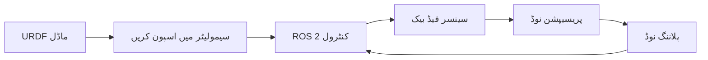
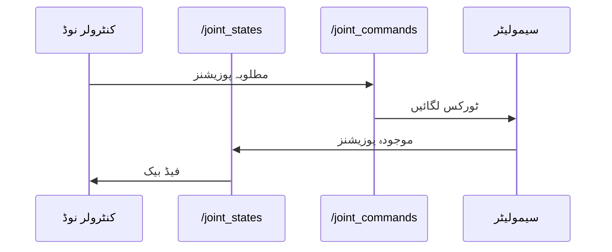

# لیسنس 5: سیمولیشن، مشق اور جائزہ

<div className="learning-objectives">

**سیکھنے کے اہداف**

اس لیسنس کو مکمل کرنے کے بعد، آپ کے اہل ہوں گے:
1. **وضاحت کریں** روبوٹکس ڈیولپمنٹ کے لیے سیمولیشن ورک فلو
2. **جوڑیں** URDF ماڈلز کو ROS 2 کنٹرول نوڈز کے ساتھ
3. **اطلاق کریں** ماڈیول 1 کے تصورات مینی پروجیکٹس کے ذریعے
4. **ظاہر کریں** جائزہ کوئز کے ذریعے سمجھ

</div>

## 5.1 سیمولیشن ورک فلو

سیمولیشن روبوٹکس ڈیولپمنٹ کے لیے ضروری ہے—یہ ٹیسٹنگ کی اجازت دیتا ہے بغیر قیمتی ہارڈ ویئر یا سیفٹی کے خطرے کے۔



### ڈیولپمنٹ سائیکل

1. **ماڈل**: روبوٹ سٹرکچر کی وضاحت کرنے والا URDF تخلیق کریں
2. **اسپون**: ماڈل کو سیمولیٹر میں لوڈ کریں (Gazebo، Isaac Sim)
3. **کنٹرول**: ROS 2 ٹاپکس/ایکشنز کے ذریعے کمانڈز بھیجیں
4. **سینس**: سیمولیٹڈ سینسر ڈیٹا وصول کریں
5. **آئٹریٹ**: الگورتھم ٹیسٹ، ڈیبگ، اور ریفائن کریں

یہ سائیکل ہارڈ ویئر ٹیسٹنگ سے ہزاروں گنا تیز چلتا ہے، تیز الگورتھم ڈیولپمنٹ کو فعال کرتا ہے۔

## 5.2 Gazebo/Isaac Sim کا جائزہ

### Gazebo کلاسک

**Gazebo** سب سے زیادہ استعمال کیا جانے والا اوپن سورس روبوٹکس سیمولیٹر ہے:

| فیچر | تفصیل |
|---------|-------------|
| فزکس انجن | حقیقی ڈائنامکس کے لیے ODE/Bullet |
| سینسرز | کیمرہ، LIDAR، IMU، ڈیپتھ سینسرز |
| ROS 2 انضمام | نیٹیو ros2_control سپورٹ |
| ماحول | رکاوٹوں، زمین کے ساتھ حسب ضرورت دنیا |

```bash
# ROS 2 کے ساتھ Gazebo لانچ کریں
ros2 launch gazebo_ros gazebo.launch.py

# روبوٹ اسپون کریں
ros2 run gazebo_ros spawn_entity.py -file robot.urdf -entity my_robot
```

### NVIDIA Isaac Sim

GPU ایکسلریشن کے ساتھ اعلی درجے کی سیمولیشن کے لیے:

- **فوٹو ریلسٹک رینڈرنگ**: پریسیپشن ٹیسٹنگ کے لیے رے ٹریسڈ وژولز
- **ڈومین رینڈمائزیشن**: ML ٹریننگ کے لیے خودکار منظر تبدیلیاں
- **بڑے پیمانے پر**: گودام، فیکٹری، آؤٹ ڈور ماحول کی سیمولیشن

Isaac Sim کو بعد کے ماڈیولز میں گہرائی میں دیکھا جائے گا۔

## 5.3 URDF کو ROS 2 نوڈز کے ساتھ جوڑنا

ROS 2 کی طاقت آپ کے URDF ماڈل کو کنٹرول نوڈز سے جوڑنے میں ہے۔

### کنٹرول لوپ



### کلیدی ٹاپکس

| ٹاپک | میسج ٹائپ | سمت |
|-------|--------------|-----------|
| `/joint_states` | `sensor_msgs/JointState` | سیمولیٹر → کنٹرولر |
| `/joint_commands` | `std_msgs/Float64MultiArray` | کنٹرولر → سیمولیٹر |
| `/cmd_vel` | `geometry_msgs/Twist` | کنٹرولر → موبائل بیس |

### مثال: جوائنٹ اسٹیٹس پڑھنا

```python
import rclpy
from rclpy.node import Node
from sensor_msgs.msg import JointState

class JointMonitor(Node):
    def __init__(self):
        super().__init__('joint_monitor')
        self.subscription = self.create_subscription(
            JointState, '/joint_states', self.joint_callback, 10)

    def joint_callback(self, msg):
        for name, position in zip(msg.name, msg.position):
            self.get_logger().info(f'{name}: {position:.3f} rad')

def main(args=None):
    rclpy.init(args=args)
    node = JointMonitor()
    rclpy.spin(node)
    node.destroy_node()
    rclpy.shutdown()
```

## 5.4 مینی پروجیکٹ کی تفصیل

ان ہاتھ سے کام کرنے والے پروجیکٹس کے ساتھ اپنا ماڈیول 1 کا علم اطلاق کریں:

### مینی پروجیکٹ 1: روبوٹ ٹاکر سسٹم

**مقصد**: ایک ملٹی نوڈ سسٹم تخلیق کریں جہاں روبوٹس اسٹیٹس میسجز کا تبادلہ کرتے ہیں۔

**ضروریات**:
- 3+ نوڈز ٹاپکس کے ذریعے بات چیت کر رہے ہیں
- حسب ضرورت میسج مواد (روبوٹ نام، اسٹیٹس، بیٹری)
- اسٹیٹس ڈیش بورڈ نوڈ جو تمام روبوٹس کو جمع کرتا ہے
- انفرادی روبوٹ اسٹیٹس کو کویری کرنے کے لیے سروس

**اطلاق کردہ مہارتیں**: نوڈز، ٹاپکس، سروسز، میسج ڈیزائن

**دورانیہ**: 2-3 گھنٹے

[مینی پروجیکٹ 1 شروع کریں →](/labs/module-01/mini-project-01-robot-talker)

### مینی پروجیکٹ 2: آرم کنٹرولر

**مقصد**: کی بورڈ کمانڈز کے ساتھ اپنے 2-DOF آرم URDF کو کنٹرول کریں۔

**ضروریات**:
- RViz یا Gazebo میں URDF لوڈ کریں
- جوائنٹ کنٹرول کے لیے کی بورڈ ٹیلی آپ نوڈ
- جوائنٹ حدود کا احترام
- آرم پوزیشن کا وژول فیڈ بیک
- ایمرجنسی سٹاپ سروس

**اطلاق کردہ مہارتیں**: URDF، جوائنٹ کنٹرول، سروسز، ٹاپکس

**دورانیہ**: 3-4 گھنٹے

[مینی پروجیکٹ 2 شروع کریں →](/labs/module-01/mini-project-02-arm-controller)

## 5.5 ماڈیول 1 کا خلاصہ

ماڈیول 1 مکمل کرنے پر مبارکباد! یہاں ہے جو آپ نے سیکھا:

### کلیدی تصورات

| لیسنس | کور تصور | کلیدی مہارت |
|--------|--------------|-----------|
| 1 | فزکل AI | امبدڈ انٹیلی جنس کو سمجھیں |
| 2 | ROS 2 معماری | نوڈز، ٹاپکس، سروسز کو نیویگیٹ کریں |
| 3 | rclpy پروگرامنگ | Python ROS 2 نوڈز لکھیں |
| 4 | URDF ماڈلنگ | روبوٹ کی وضاحتیں تخلیق کریں |
| 5 | سیمولیشن | ماڈلز کو کنٹرول سے جوڑیں |

### مہارت چیک لسٹ

- [ ] فزکل AI اور ڈیجیٹل AI کی وضاحت کریں
- [ ] rclpy کے ساتھ ROS 2 نوڈز تخلیق کریں
- [ ] پبلشر-سبسکرائیب کمیونیکیشن نافذ کریں
- [ ] درخواست-جواب سروسز تخلیق کریں
- [ ] درست URDF فائلز لکھیں
- [ ] RViz میں روبوٹس وژولائز کریں
- [ ] سیمولیشن ڈیولپمنٹ سائیکل کو سمجھیں

## ماڈیول 1 جائزہ کوئز

تمام پانچ لیسنسز کو احاطہ کرنے والے اس جامع کوئز کے ساتھ اپنی سمجھ کو ٹیسٹ کریں۔

import QuizComponent from '@site/src/components/QuizComponent';

<QuizComponent
  questions={[
    {
      question: "فزکل AI کو روایتی ڈیجیٹل AI سے کیا الگ کرتا ہے؟",
      options: [
        "فزکل AI حقیقی دنیا میں فزکل ہارڈ ویئر پر کام کرتا ہے",
        "فزکل AI زیادہ طاقتور GPU استعمال کرتا ہے",
        "فزکل AI صرف روبوٹس پر چلتا ہے",
        "فزکل AI نیورل نیٹ ورکس استعمال نہیں کرتا"
      ],
      correctIndex: 0,
      explanation: "فزکل AI سسٹم سینسرز اور ایکٹو ایٹرز کے ذریعے حقیقی دنیا کے ساتھ بات چیت کرتے ہیں، برخلاف ڈیجیٹل AI کے جو صرف سافٹ ویئر ماحول میں کام کرتا ہے۔"
    },
    {
      question: "ROS 2 میں، جاری سینسر ڈیٹا کے لیے آپ کون سا کمیونیکیشن پیٹرن استعمال کریں گے؟",
      options: [
        "سروسز",
        "ایکشنز",
        "ٹاپکس",
        "پیرامیٹرز"
      ],
      correctIndex: 2,
      explanation: "ٹاپکس جاری ڈیٹا سٹریمز جیسے سینسر ریڈنگز کے لیے پبلش-سبسکرائیب استعمال کرتے ہیں۔ سروسز ڈسکریٹ درخواست-جواب کے لیے ہیں، اور ایکشنز طویل چلنے والے کاموں کے لیے ہیں۔"
    },
    {
      question: "ROS 2 نوڈ میں rclpy.spin() کیا کرتا ہے؟",
      options: [
        "روبوٹ کو گھوماتا ہے",
        "نوڈ کو چلتا رکھتا ہے اور کال بیکس کو پروسیس کرتا ہے",
        "تمام ٹاپکس کو میسجز بھیجتا ہے",
        "نوڈ کو شروع کرتا ہے"
      ],
      correctIndex: 1,
      explanation: "rclpy.spin() مرکزی لوپ ہے جو نوڈ کو زندہ رکھتا ہے اور آنے والے میسجز اور ٹائمر کال بیکس کو پروسیس کرتا ہے۔"
    },
    {
      question: "URDF میں، دو لنکس کو کون سا عنصر جوڑتا ہے؟",
      options: [
        "کنیکٹر",
        "جوائنٹ",
        "بریج",
        "لنک"
      ],
      correctIndex: 1,
      explanation: "URDF میں جوائنٹس یہ وضاحت کرتے ہیں کہ لنکس کیسے جڑے ہوئے ہیں اور وہ ایک دوسرے کے ساتھ کیسے حرکت کر سکتے ہیں (ریوولیوٹ، پریزمیٹک، فکسڈ، وغیرہ)۔"
    },
    {
      question: "کون سا جوائنٹ ٹائپ لامحدود گردش کی اجازت دیتا ہے (جیسے ایک پہیہ)؟",
      options: [
        "revolute",
        "prismatic",
        "continuous",
        "fixed"
      ],
      correctIndex: 2,
      explanation: "کنٹینیوئس جوائنٹس لامحدود گردش کی اجازت دیتے ہیں بغیر پوزیشن حدود کے، پہیوں کے لیے مکمل۔ ریوولیوٹ جوائنٹس میں گردش حدود ہوتی ہیں۔"
    },
    {
      question: "روبوٹکس ڈیولپمنٹ میں سیمولیشن کا بنیادی فائدہ کیا ہے؟",
      options: [
        "سیمولیشن حقیقی روبوٹس سے زیادہ درست ہیں",
        "ہارڈ ویئر کے خطرے کے بغیر محفوظ اور تیز ٹیسٹنگ",
        "سیمولیشن کو پروگرامنگ کی ضرورت نہیں ہوتی",
        "حقیقی روبوٹس دستیاب نہیں ہیں"
      ],
      correctIndex: 1,
      explanation: "سیمولیشن تیز آئٹریشن اور ٹیسٹنگ کی اجازت دیتا ہے بغیر قیمتی ہارڈ ویئر کے نقصان یا سیفٹی واقعات کے خطرے کے۔"
    },
    {
      question: "ROS 2 میسج ٹائپ جو ویلوسٹی کمانڈز کے لیے عام طور پر استعمال ہوتا ہے؟",
      options: [
        "std_msgs/String",
        "sensor_msgs/Image",
        "geometry_msgs/Twist",
        "std_msgs/Float64"
      ],
      correctIndex: 2,
      explanation: "geometry_msgs/Twist لینیئر اور اینگولر ویلوسٹی ویکٹرز پر مشتمل ہے، روبوٹ ویلوسٹی کمانڈز کے لیے معیار بناتا ہے۔"
    },
    {
      question: "ROS 2 معماری میں DDS کا مطلب کیا ہے؟",
      options: [
        "ڈائریکٹ ڈیٹا سروس",
        "ڈیٹا ڈسٹری بیوشن سروس",
        "ڈسٹری بیوٹڈ ڈیوائس سسٹم",
        "ڈائنا مک ڈیٹا سٹرکچر"
      ],
      correctIndex: 1,
      explanation: "DDS (ڈیٹا ڈسٹری بیوشن سروس) وہ مڈل ویئر معیار ہے جسے ROS 2 ریل ٹائم، قابل اعتماد کمیونیکیشن کے لیے استعمال کرتا ہے۔"
    },
    {
      question: "URDF لنک میں، <inertial> عنصر کا مقصد کیا ہے؟",
      options: [
        "وژول ظہور کی وضاحت کریں",
        "کولیژن باؤنڈریز سیٹ کریں",
        "فزکس کے لیے ماس اور مومنٹس آف انیشیا کی وضاحت کریں",
        "جوائنٹ حدود کنفیگر کریں"
      ],
      correctIndex: 2,
      explanation: " <inertial> عنصر ماس اور انیشیا ٹینسر کی وضاحت کرتا ہے، جو درست فزکس سیمولیشن کے لیے ضروری ہے۔"
    },
    {
      question: "rclpy استعمال کرتے وقت آپریشنز کا صحیح ترتیب کیا ہے؟",
      options: [
        "spin → init → shutdown",
        "init → نوڈ تخلیق کریں → spin → shutdown",
        "نوڈ تخلیق کریں → init → shutdown",
        "shutdown → init → spin"
      ],
      correctIndex: 1,
      explanation: "صحیح ترتیب ہے: rclpy.init()، نوڈ تخلیق کریں، rclpy.spin() چلانے کے لیے، پھر صاف کرنا node.destroy_node() اور rclpy.shutdown() کے ساتھ۔"
    }
  ]}
/>

## خلاصہ

ماڈیول 1 نے فزکل AI اور ROS 2 میں آپ کی بنیاد قائم کر دی ہے:

- **فزکل AI** حقیقی دنیا میں کام کرنے والے روبوٹس میں انٹیلی جنس لاتا ہے
- **ROS 2** کمیونیکیشن انفراسٹرکچر فراہم کرتا ہے—روبوٹک نروس سسٹم
- **rclpy** پائی تھن بیسڈ روبوٹ پروگرامنگ کو فعال کرتا ہے
- **URDF** روبوٹ فزکل سٹرکچر کی وضاحت کرتا ہے
- **سیمولیشن** محفوظ، تیز ٹیسٹنگ کے ذریعے ڈیولپمنٹ کو تیز کرتا ہے

آپ اب **ماڈیول 2: پریسیپشن سسٹم** کے لیے تیار ہیں، جہاں آپ سیکھیں گے کہ روبوٹس اپنے ماحول کو کیسے سینس اور سمجھتے ہیں۔

---

## مینی پروجیکٹس

اپنی سیکھ کو مستحکم کرنے کے لیے کم از کم ایک مینی پروجیکٹ مکمل کریں:

1. **[مینی پروجیکٹ 1: روبوٹ ٹاکر](/labs/module-01/mini-project-01-robot-talker)** - ملٹی نوڈ کمیونیکیشن سسٹم
2. **[مینی پروجیکٹ 2: آرم کنٹرولر](/labs/module-01/mini-project-02-arm-controller)** - کی بورڈ کے ساتھ URDF کنٹرول

---

## حوالہ جات

1. Gazebo دستاویزات. (2024). *Gazebo کے ساتھ شروع کریں*. https://gazebosim.org/
2. NVIDIA Isaac Sim. (2024). *Isaac Sim دستاویزات*. https://developer.nvidia.com/isaac-sim
3. ROS 2 دستاویزات. (2024). *ros2_control*. https://control.ros.org/
4. میسنسکی، ایس.، وغیرہ. (2022). روبوٹ آپریٹنگ سسٹم 2: ڈیزائن، معماری، اور جنگل میں استعمال کے بارے میں. *سائنس روبوٹکس*, 7(66).