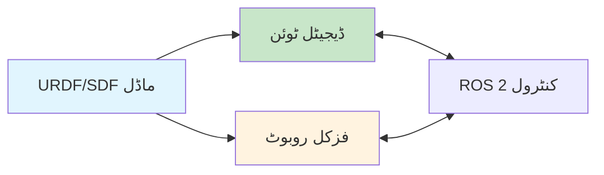
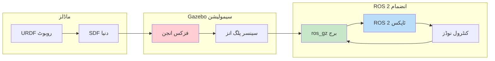
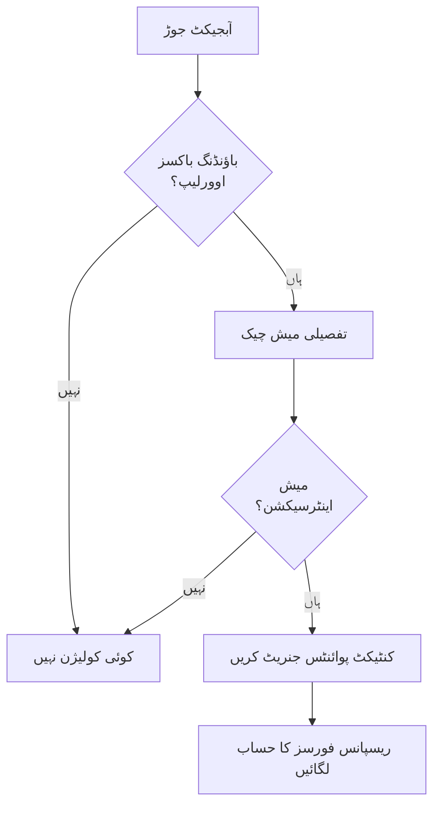
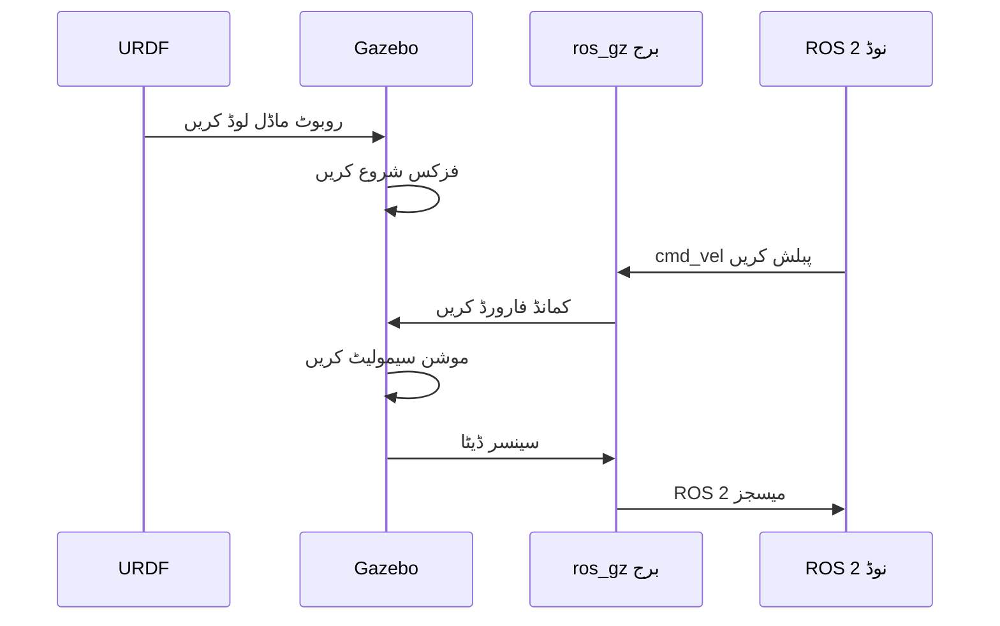

import Tabs from '@theme/Tabs';
import TabItem from '@theme/TabItem';

# لیسنس 1: ڈیجیٹل ٹوئن اور فزکس سیمولیشن

## سیکھنے کے اہداف

اس لیسنس کے اختتام تک، آپ کے اہل ہوں گے:

1. **LO-01**: روبوٹکس میں ڈیجیٹل ٹوئن تصور کی وضاحت کریں اور اس کا کردار ڈیولپمنٹ ورک فلو میں سمجھیں
2. **LO-02**: فزکس بیسڈ سیمولیشن بنیادیں سمجھیں (ریجڈ بادی ڈائنامکس، کولیژن ڈیٹیکشن، فریکشن ماڈلز)

---

## 1.1 ڈیجیٹل ٹوئن کیا ہے؟

ایک **ڈیجیٹل ٹوئن** ایک ہم وقت ساز شدہ مجازی نقل ہے ایک فزکل روبوٹ کی جو اس کے برتاؤ کو ریل ٹائم یا نیار ریل ٹائم میں عکاس کرتی ہے۔ روبوٹکس میں، ڈیجیٹل ٹوئن ڈیولپرز کو کنٹرول الگورتھم کو ٹیسٹ، تصدیق، اور آئٹریٹ کرنے کی اجازت دیتی ہے بغیر قیمتی ہارڈ ویئر کو نقصان پہنچائے۔

### کور تصور

ایک ڈیجیٹل ٹوئن کو ایک "مجازی لیب" کے طور پر سوچیں جہاں آپ کر سکتے ہیں:
- خطرناک مینوورز کو محفوظ طریقے سے ٹیسٹ کریں
- منٹوں میں ہزاروں ٹرائلز چلائیں (ریل ٹائم سے تیز)
- ڈیبگنگ کے لیے بالکل ویسی ہی شرائط دوبارہ پیدا کریں
- فزکل ہارڈ ویئر پر ڈیپلائے کرنے سے پہلے تبدیلیوں کی تصدیق کریں

کلیدی بصیرت یہ ہے کہ آپ کا **URDF/SDF ماڈل** ماڈیول 1 سے وہ مشترکہ "بلو پرنٹ" ہے جو سیمولیٹڈ روبوٹ کی وضاحت کرتا ہے اور فزکل روبوٹ کی تعمیر کی رہنمائی کرتا ہے۔



### حقیقی دنیا کی مثالیں

**بوسٹن ڈائی نامکس**: ہارڈ ویئر پر ایٹلس ہیومنوڈ چلنے کے گیٹس کو ٹیسٹ کرنے سے پہلے، انجینئرز سیمولیشن میں ہزاروں متغیرات کی تصدیق کرتے ہیں۔ ہر فوٹ پلیسمنٹ، بیلنس ریکوری، اور زمین کی اصلاح پہلے مجازی طور پر محفوظ ثابت ہوتی ہے۔

**NASA مارس روورز**: کیوریوسٹی اور پرسیورنس روورز کو مارشین گریویٹی (0.38g)، زمین، اور مواصلاتی تاخیر کو سیمولیٹ کرنے والے ڈیجیٹل ٹوئن ماحول میں بھرپور ٹیسٹ کیا گیا تھا ان کے کروڑوں ڈالر کے مشن سے پہلے۔

**اگیلٹی روبوٹکس**: ویئر ہاؤس میں کام کرنے والے ڈیجیٹ روبوٹس اپنی مینوپولیشن اور نیویگیشن الگورتھم کو سیمولیٹڈ ماحول میں تربیت دیتے ہیں، 24/7 ڈیولپمنٹ کو فعال کرتے ہوئے بغیر فزکل موٹرز کو خراب کیے۔

### سیمولیشن فرسٹ ڈیولپمنٹ کے فوائد

| فائدہ | تفصیل |
|---------|-------------|
| **سیفٹی** | ہارڈ ویئر کو نقصان پہنچائے یا آپریٹرز کو زخمی کیے بغیر ناکامی کے موڈ ٹیسٹ کریں |
| **لاگت** | قیمتی ہارڈ ویئر کی مرمت سے بچیں؛ تیار کرنے سے پہلے سیمولیٹ کریں |
| **رفتار** | ریل ٹائم سے تیز چلنے والی سیمولیشنز چلائیں؛ GPUز کے ذریعے پیراللائز |
| **دہرائی کی قابلیت** | ڈیبگنگ اور ریگریشن ٹیسٹنگ کے لیے بالکل ویسی ہی شرائط دوبارہ پیدا کریں |

---

## 1.2 سیمولیشن پائپ لائن

آپ کے روبوٹ سے سیمولیشن کیسے منسلک ہوتی ہے یہ سمجھنا انتہائی ضروری ہے۔ مندرجہ ذیل ڈائیاگرام مکمل ڈیٹا فلو دکھاتا ہے:



**اہم اجزاء**:
1. **URDF/SDF ماڈلز**: روبوٹ کی سٹرکچر، جوائنٹس، اور دنیا کا ماحول وضاحت کریں
2. **فزکس انجن**: موشن، کولیژن، اور فورسز کا حساب لگاتا ہے (ODE، بُلیٹ، DART)
3. **سینسر پلگ انز**: مصنوعی کیمرہ ایمیجز، LiDAR سکینز، IMU ریڈنگز جنریٹ کریں
4. **ros_gz برج**: Gazebo ڈیٹا کو ROS 2 میسجز میں ترجمہ کرتا ہے اور اس کے برعکس
5. **کنٹرول نوڈز**: آپ کے Python/C++ الگورتھم جو روبوٹ کو کمانڈ کرتے ہیں

---

## 1.3 فزکس سیمولیشن بنیادیں

فزکس سیمولیشن ریاضی کا انجن ہے جو ڈیجیٹل ٹوئن کو حقیقی طریقے سے برتاؤ کرنے کے قابل بناتا ہے۔ ان بنیادیات کو سمجھنا آپ کو سیمولیشن کے مسائل کو ڈیبگ کرنے اور "سیم ٹو ریل گیپ" کو پار کرنے میں مدد دیتا ہے۔

### ریجڈ بادی ڈائنامکس

سیمولیشن میں، روبوٹس کو **ریجڈ بادیز** (لنکس) کے مجموعے کے طور پر ماڈل کیا جاتا ہے جو **جوائنٹس** کے ذریعے منسلک ہوتے ہیں۔ ہر ریجڈ بادی کے پاس ہے:

- **ماس** (kg): لنک کتنا بھاری ہے
- **انیشیا ٹینسر**: ماس کیسے تقسیم ہے (گردش کو متاثر کرتا ہے)
- **سینٹر آف ماس**: لنک کا توازن کا پوائنٹ

جب آپ نے اپنے URDF (ماڈیول 1) میں `<inertial>` خصوصیات کی وضاحت کی تھی، تو آپ ان ویلیوز کی وضاحت کر رہے تھے۔ درست ویلیوز کا مطلب حقیقی سیمولیشن برتاؤ ہے۔

:::tip یہ سوچیں کہ انیشیا کیوں اہم ہے
غلط انیشیا ویلیوز والی ایک روبوٹ آرم غیر قدرتی طور پر جھومنے لگے گی - بہت تیز یا بہت سست - جس سے آپ کے کنٹرول الگورتھم ناکام ہو جائیں گے جب انہیں حقیقی ہارڈ ویئر پر منتقل کیا جائے گا۔
:::

### کولیژن ڈیٹیکشن

فزکس انجن کو یہ تعین کرنا چاہئے کہ اشیاء کب ٹچ یا ایک دوسرے کے ساتھ ملیں۔ اس میں شامل ہے:

1. **باؤنڈنگ باکس چیک**: فاسٹ، تقریبی چیک ایکسز ایلائینڈ باکسز کا استعمال کرتے ہوئے
2. **میش کولیژن**: تفصیلی چیک اصل جیومیٹری ورٹیسز کا استعمال کرتے ہوئے
3. **کنٹیکٹ پوائنٹس**: بالکل وہاں جہاں اشیاء ٹچ کرتی ہیں (فورس کے حساب کے لیے استعمال ہوتا ہے)



**کولیژن جیومیٹری کے انتخابات**:
- **باکس/سلنڈر/سپیئر**: فاسٹ کمپیوٹیشن، تقریبی شکل
- **میش**: درست شکل، سست کمپیوٹیشن
- **کانویکس ہل**: درستی اور رفتار کا اچھا توازن

### فریکشن ماڈلز

فریکشن یہ تعین کرتا ہے کہ اشیاء کیسے سلائیڈ کرتی ہیں (یا نہیں سلائیڈ کرتیں) ایک دوسرے کے خلاف۔ **کولمب فریکشن ماڈل** سب سے زیادہ عام ہے:

F_friction is less than or equal to (μ * F_normal)

جہاں:
- μ = فریکشن کوائف (0 = برف، 1 = کنکریٹ پر ربر)
- F_normal = سطح کو ساتھ لگانے والی فورس

**فریکشن اسٹیٹس**:
- **سٹیٹک فریکشن**: آبجیکٹس آرام پر ابتدائی موشن کو روکتے ہیں
- **ڈائنا مک فریکشن**: موشن میں آبجیکٹس سلائیڈنگ مزاحمت کا تجربہ کرتے ہیں
- **سلپ/نہ سلپ**: چاہے پہیے گرپ کریں یا آزادانہ سپن کریں

:::info سیم ٹو ریل گیپ
فریکشن سیم ٹو ریل میچ کے سب سے بڑے ذرائع میں سے ایک ہے۔ حقیقی دنیا کا فریکشن سطح کے پہناؤ، آلودگی، اور درجہ حرارت کے ساتھ مختلف ہوتا ہے۔ سیمولیشن مثالی ویلیوز کا استعمال کرتی ہے۔
:::

### ٹائم سٹیپنگ

سیمولیشن ڈسکریٹ **ٹائم سٹیپس** میں آگے بڑھتی ہے۔ کلیدی پیرامیٹرز:

| پیرامیٹر | تفصیل | عام ویلیو |
|-----------|-------------|---------------|
| **سٹیپ سائز** | ہر فزکس اپ ڈیٹ کی مدت | 0.001s (1ms) |
| **ریل ٹائم فیکٹر** | سیمولیشن رفتار بمقابلہ وال کلاک ٹائم | 1.0 (ریل ٹائم) |
| **سالور اٹریشنز** | ایکویسی اور رفتار کا ٹریڈ آف | 50-100 |

**فکسڈ بمقابلہ ویریبل سٹیپ**:
- **فکسڈ سٹیپ**: مسلسل فزکس (روبوٹکس کے لیے تجویز کردہ)
- **ویریبل سٹیپ**: پیچیدگی کے مطابق ایڈجسٹ ہوتا ہے (بے ثباتی کا سبب بن سکتا ہے)

```python
# مثال: SDF میں Gazebo فزکس کنفیگریشن
# <physics name="1ms" type="ode">
#   <max_step_size>0.001</max_step_size>
#   <real_time_factor>1.0</real_time_factor>
#   <real_time_update_rate>1000</real_time_update_rate>
# </physics>
```

### فزکس انجن کا موازنہ

Gazebo متعدد فزکس انجن کی حمایت کرتا ہے:

| انجن | مضبوطیاں | استعمال کا کیس |
|--------|-----------|----------|
| **ODE** | مستحکم، اچھی طرح ٹیسٹ شدہ، ڈیفالٹ | جنرل روبوٹکس |
| **بُلیٹ** | پیچیدہ کنٹرینٹس کے لیے اچھا | مینوپولیشن |
| **DART** | درست ڈائنامکس، تحقیق کے لیے مرکوز | لیگڈ روبوٹس |
| **TPE** | سادہ، تیز | بنیادی ٹیسٹنگ |

زیادہ تر تعلیمی مقاصد کے لیے، **ODE** (ڈیفالٹ) کافی ہے۔ کانٹیکٹ ریچ مینوپولیشن پر کام کرنے والے اعلی صارفین بُلیٹ یا DART کو ترجیح دے سکتے ہیں۔

---

## 1.4 ماڈیول 1 سے منسلک کرنا

یاد کریں URDF جو آپ نے ماڈیول 1 میں تخلیق کیا تھا؟ یہاں دیکھیں کہ یہ سیمولیشن سے کیسے منسلک ہوتا ہے:

1. **URDF روبوٹ کی وضاحت کرتا ہے** → Gazebo اسے ایک سیمولیٹڈ اینٹیٹی کے طور پر لوڈ کرتا ہے
2. **جوائنٹ ٹائپس** (ریوولیوٹ، پریزمیٹک) → فزکس انجن موشن کا حساب لگاتا ہے
3. **کولیژن جیومیٹری** → کنٹیکٹ ڈیٹیکشن کے لیے استعمال ہوتا ہے
4. **انیشیل پراپرٹیز** → ڈائنامک ریسپانس کا تعین کرتا ہے

پھر **ros_gz برج** آپ کے ROS 2 نوڈز کو سیمولیٹڈ روبوٹ سے منسلک کرتا ہے، ایک ہی کوڈ کو سیمولیشن اور حقیقی ہارڈ ویئر کنٹرول کرنے کی اجازت دیتا ہے۔



---

## خلاصہ

اس لیسنس میں، آپ نے سیکھا:

- **ڈیجیٹل ٹوئن** ہم وقت ساز شدہ مجازی نقل ہیں جو محفوظ، تیز، دہرائی کے قابل ڈیولپمنٹ کو فعال کرتی ہیں
- **سیمولیشن پائپ لائن** URDF ماڈلز کو فزکس انجن کے ذریعے ROS 2 کنٹرول سے منسلک کرتی ہے
- **فزکس بنیادیات** میں ریجڈ بادی ڈائنامکس، کولیژن ڈیٹیکشن، فریکشن، اور ٹائم سٹیپنگ شامل ہے
- **فزکس انجن** جیسے ODE، بُلیٹ، اور DART میں سے ہر ایک کے مختلف مضبوطیاں ہیں

### کلیدی نکات

1. ہمیشہ ہارڈ ویئر پر ڈیپلائے کرنے سے پہلے سیمولیشن میں الگورتھم کی تصدیق کریں
2. URDF میں درست انیشیل پراپرٹیز حقیقی سیمولیشن کی قیادت کرتی ہیں
3. "سیم ٹو ریل گیپ" موجود ہے - سیمولیشن ایک تقریب ہے
4. فزکس پیرامیٹرز کو سمجھنا غیر متوقع برتاؤ کو ڈیبگ کرنے میں مدد دیتا ہے

---

## اگلا کیا ہے

[لیسنس 2: Gazebo سیمولیشن ورک فلوز](./lesson-02-gazebo-workflows) میں، آپ:
- ROS 2 انضمام کے ساتھ Gazebo لانچ کریں گے
- SDF کا استعمال کرتے ہوئے حسب ضرورت سیمولیشن دنیا تخلیق کریں گے
- ROS 2 ٹاپکس کے ذریعے روبوٹس اسپون اور کنٹرول کریں گے

---

## حوالہ جات

اس لیسنس کے لیے حوالہ جات [حوالہ جات](/docs/appendix/references) سیکشن میں ماڈیول 2 کے تحت دستیاب ہیں۔