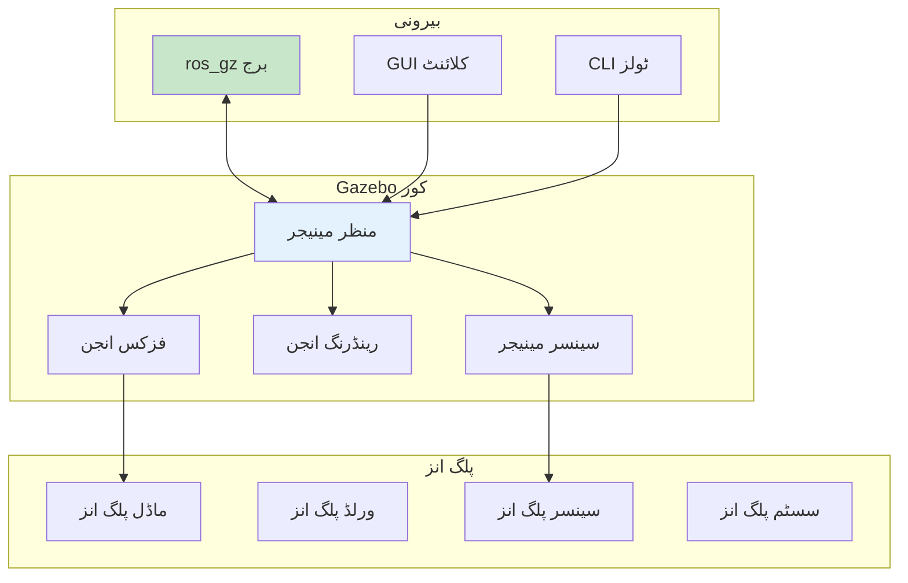
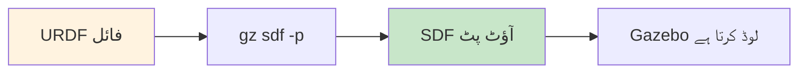
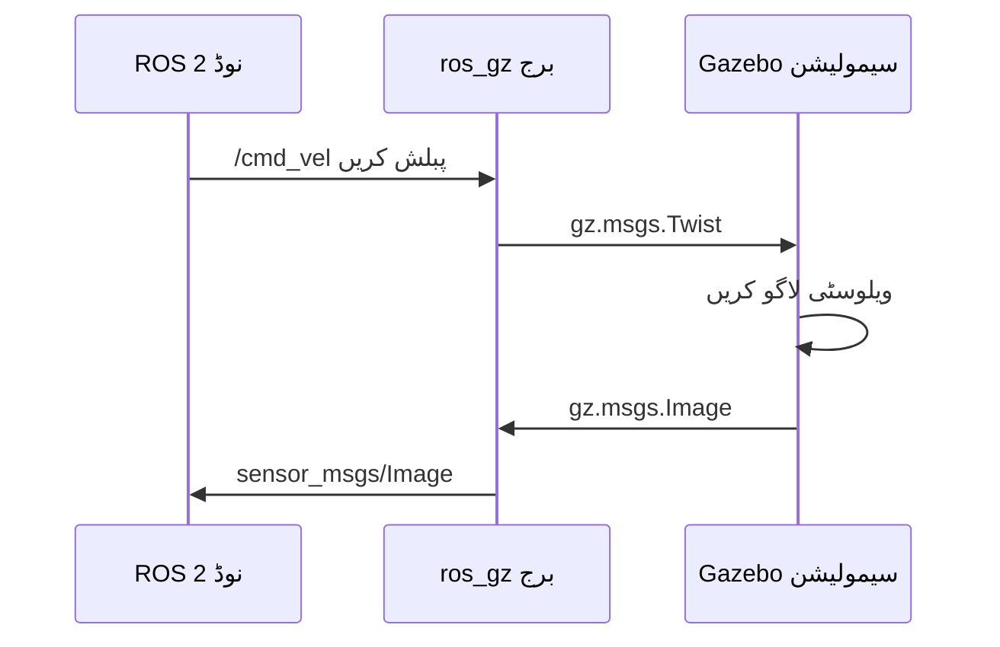

import Tabs from '@theme/Tabs';
import TabItem from '@theme/TabItem';

# لیسنس 2: Gazebo سیمولیشن ورک فلوز

## سیکھنے کے اہداف

اس لیسنس کے اختتام تک، آپ کے اہل ہوں گے:

1. **LO-03**: ROS 2 انضمام کے ساتھ روبوٹ-ماحول سیمولیشن کے لیے Gazebo استعمال کریں
2. Gazebo دنیا کنفیگر اور لانچ کریں
3. SDF فارمیٹ اور URDF-سے-SDF تبدیلی سمجھیں
4. ROS 2 ٹاپکس کے ذریعے سیمولیشن میں روبوٹس کنٹرول کریں

---

## 2.1 Gazebo معماری

Gazebo (اب "Gazebo Sim" جدید ورژن میں) معروف اوپن سورس روبوٹکس سیمولیٹر ہے۔ اس کی معماری کو سمجھنا آپ کو سیمولیشنز کو مؤثر طریقے سے کنفیگر کرنے میں مدد دیتا ہے۔



**اہم اجزاء**:

- **منظر مینیجر**: فزکس، رینڈرنگ، اور سینسرز کو مربوط کرتا ہے
- **فزکس انجن**: ODE، بُلیٹ، DART، یا TPE (کنفیگر ایبل)
- **رینڈرنگ انجن**: OGRE2 ویژولائزیشن کے لیے
- **سینسر مینیجر**: مصنوعی سینسر ڈیٹا جنریٹ کرتا ہے
- **پلگ انز**: فعالیت کو بڑھاتا ہے (کنٹرولرز، سینسرز، ورلڈ خصوصیات)
- **ros_gz برج**: ROS 2 کے ساتھ دو طرفہ کمیونیکیشن

### Gazebo ورژن

| ورژن | نام | ROS 2 سپورٹ | حیثیت |
|---------|------|---------------|--------|
| Gazebo 11 | کلاسک | Foxy، Humble (deprecatd) | لیگیسی |
| Gazebo Fortress | Sim | Humble (تجویز کردہ) | LTS 2026 تک |
| Gazebo Garden | Sim | Humble، Iron | جاری |
| Gazebo Harmonic | Sim | Jazzy، Rolling | تازہ ترین |

:::info کورس معیار
یہ کورس **Gazebo Fortress** کو **ROS 2 Humble** کے ساتھ استحکام اور طویل مدتی سپورٹ کے لیے استعمال کرتا ہے۔
:::

---

## 2.2 ورلڈ فائلز اور SDF

**SDF (سیمولیشن ڈسکرپشن فارمیٹ)** Gazebo دنیا کے لیے مقامی فارمیٹ ہے۔ جبکہ URDF روبوٹس کی وضاحت کرتا ہے، SDF مکمل سیمولیشن ماحول کی وضاحت کرتا ہے۔

### SDF بمقابلہ URDF

| خصوصیت | URDF | SDF |
|---------|------|-----|
| **اصل** | ROS-مقامی | Gazebo-مقامی |
| **دائرہ کار** | صرف روبوٹ ماڈلز | روبوٹس، دنیا، اشیاء |
| **فزکس** | محدود جوائنٹس | مکمل فزکس سپورٹ |
| **سینسرز** | پلگ انز کی ضرورت ہے | مقامی سینسر ٹیگز |
| **نیسٹڈ ماڈلز** | تعاون یافتہ نہیں | تعاون یافتہ |

**بہترین طریقہ**: **روبوٹس کے لیے URDF استعمال کریں** (ماڈیول 1 سے واقف)، **دنیا کے لیے SDF**۔

### بنیادی ورلڈ سٹرکچر

```xml
<?xml version="1.0" ?>
<sdf version="1.8">
  <world name="my_world">
    <!-- فزکس کنفیگریشن -->
    <physics name="1ms" type="ode">
      <max_step_size>0.001</max_step_size>
      <real_time_factor>1.0</real_time_factor>
    </physics>

    <!-- ضروری پلگ انز -->
    <plugin filename="gz-sim-physics-system"
            name="gz::sim::systems::Physics"/>
    <plugin filename="gz-sim-scene-broadcaster-system"
            name="gz::sim::systems::SceneBroadcaster"/>

    <!-- لائٹنگ -->
    <light type="directional" name="sun">
      <cast_shadows>true</cast_shadows>
      <pose>0 0 10 0 0 0</pose>
      <diffuse>0.8 0.8 0.8 1</diffuse>
      <specular>0.2 0.2 0.2 1</specular>
    </light>

    <!-- زمینی سطح -->
    <model name="ground_plane">
      <static>true</static>
      <link name="link">
        <collision name="collision">
          <geometry>
            <plane><normal>0 0 1</normal></plane>
          </geometry>
        </collision>
        <visual name="visual">
          <geometry>
            <plane><normal>0 0 1</normal><size>100 100</size></plane>
          </geometry>
          <material>
            <ambient>0.8 0.8 0.8 1</ambient>
          </material>
        </visual>
      </link>
    </model>

  </world>
</sdf>
```

### رکاوٹیں شامل کرنا

سٹیٹک رکاوٹیں آپ کے سیمولیشن ماحول کو امیر بناتی ہیں:

```xml
<!-- باکس رکاوٹ -->
<model name="box_obstacle">
  <static>true</static>
  <pose>2 0 0.5 0 0 0</pose>
  <link name="link">
    <collision name="collision">
      <geometry>
        <box><size>1 1 1</size></box>
      </geometry>
    </collision>
    <visual name="visual">
      <geometry>
        <box><size>1 1 1</size></box>
      </geometry>
      <material>
        <ambient>0.8 0.2 0.2 1</ambient>
      </material>
    </visual>
  </link>
</model>

<!-- سلنڈر رکاوٹ -->
<model name="cylinder_obstacle">
  <static>true</static>
  <pose>4 2 0.5 0 0 0</pose>
  <link name="link">
    <collision name="collision">
      <geometry>
        <cylinder><radius>0.5</radius><length>1</length></cylinder>
      </geometry>
    </collision>
    <visual name="visual">
      <geometry>
        <cylinder><radius>0.5</radius><length>1</length></cylinder>
      </geometry>
      <material>
        <ambient>0.2 0.8 0.2 1</ambient>
      </material>
    </visual>
  </link>
</model>
```

---

## 2.3 URDF-سے-SDF تبدیلی

Gazebo روبوٹ ماڈلز لوڈ کرتے وقت خود بخود URDF کو SDF میں تبدیل کرتا ہے۔ اس عمل کو سمجھنا مسائل کو ڈیبگ کرنے میں مدد دیتا ہے۔

### تبدیلی فلو



**دستی طور پر تبدیل کریں** (ڈیبگنگ کے لیے):
```bash
gz sdf -p my_robot.urdf > my_robot.sdf
```

### Gazebo مخصوص URDF ایکسٹینشنز

URDF میں Gazebo مخصوص خصوصیات شامل کرنے کے لیے، `<gazebo>` ٹیگز استعمال کریں:

```xml
<robot name="my_robot">
  <!-- معیاری URDF لنک -->
  <link name="base_link">
    <visual>...</visual>
    <collision>...</collision>
    <inertial>...</inertial>
  </link>

  <!-- Gazebo مخصوص ایکسٹینشنز -->
  <gazebo reference="base_link">
    <material>Gazebo/Blue</material>
    <mu1>0.8</mu1>
    <mu2>0.8</mu2>
  </gazebo>

  <!-- ڈفرینشل ڈرائیو کے لیے Gazebo پلگ ان -->
  <gazebo>
    <plugin filename="gz-sim-diff-drive-system"
            name="gz::sim::systems::DiffDrive">
      <left_joint>left_wheel_joint</left_joint>
      <right_joint>right_wheel_joint</right_joint>
      <wheel_separation>0.5</wheel_separation>
      <wheel_radius>0.1</wheel_radius>
      <topic>cmd_vel</topic>
    </plugin>
  </gazebo>
</robot>
```

---

## 2.4 ros_gz کے ساتھ ROS 2 انضمام

**ros_gz** پیکیج فیملی Gazebo اور ROS 2 کے درمیان برج فراہم کرتی ہے۔

### ros_gz انسٹال کریں

```bash
# ROS 2 Humble + Gazebo Fortress کے لیے
sudo apt install ros-humble-ros-gz
```

### برج معماری



### ROS 2 کے ساتھ Gazebo لانچ کرنا

<Tabs>
<TabItem value="launch" label="لانچ فائل">

```python
# launch/gazebo_sim.launch.py
from launch import LaunchDescription
from launch.actions import IncludeLaunchDescription
from launch.launch_description_sources import PythonLaunchDescriptionSource
from launch_ros.actions import Node
from ament_index_python.packages import get_package_share_directory
import os

def generate_launch_description():
    pkg_ros_gz_sim = get_package_share_directory('ros_gz_sim')

    # Gazebo لانچ کریں
    gazebo = IncludeLaunchDescription(
        PythonLaunchDescriptionSource(
            os.path.join(pkg_ros_gz_sim, 'launch', 'gz_sim.launch.py')
        ),
        launch_arguments={
            'gz_args': '-r empty.sdf'
        }.items()
    )

    # cmd_vel اور odom کے لیے برج
    bridge = Node(
        package='ros_gz_bridge',
        executable='parameter_bridge',
        arguments=[
            '/cmd_vel@geometry_msgs/msg/Twist@gz.msgs.Twist',
            '/odom@nav_msgs/msg/Odometry@gz.msgs.Odometry',
        ],
        output='screen'
    )

    return LaunchDescription([gazebo, bridge])
```

</TabItem>
<TabItem value="cli" label="کمانڈ لائن">

```bash
# ٹرمنل 1: Gazebo لانچ کریں
ros2 launch ros_gz_sim gz_sim.launch.py gz_args:="-r empty.sdf"

# ٹرمنل 2: برج شروع کریں
ros2 run ros_gz_bridge parameter_bridge \
  /cmd_vel@geometry_msgs/msg/Twist@gz.msgs.Twist

# ٹرمنل 3: ویلوسٹی کمانڈ بھیجیں
ros2 topic pub /cmd_vel geometry_msgs/msg/Twist \
  "{linear: {x: 0.5}, angular: {z: 0.1}}"
```

</TabItem>
</Tabs>

### روبوٹس اسپون کرنا

```bash
# Gazebo میں URDF ماڈل اسپون کریں
ros2 run ros_gz_sim create \
  -name my_robot \
  -file /path/to/my_robot.urdf \
  -x 0 -y 0 -z 0.5
```

یا لانچ فائل کے ذریعے:

```python
spawn_robot = Node(
    package='ros_gz_sim',
    executable='create',
    arguments=[
        '-name', 'my_robot',
        '-topic', 'robot_description',
        '-x', '0', '-y', '0', '-z', '0.5'
    ],
    output='screen'
)
```

---

## 2.5 سیمولیشن میں روبوٹس کنٹرول کرنا

ایک بار جب آپ کا روبوٹ اسپون ہو جائے اور برج چل رہا ہو، تو اسے کسی بھی ROS 2 روبوٹ کی طرح کنٹرول کریں۔

### ویلوسٹی کمانڈز پبلش کرنا

```python
#!/usr/bin/env python3
"""سیمولیٹڈ روبوٹ کے لیے سادہ ویلوسٹی پبلشر۔"

import rclpy
from rclpy.node import Node
from geometry_msgs.msg import Twist

class VelocityPublisher(Node):
    def __init__(self):
        super().__init__('velocity_publisher')
        self.publisher = self.create_publisher(Twist, '/cmd_vel', 10)
        self.timer = self.create_timer(0.1, self.timer_callback)
        self.get_logger().info('ویلوسٹی پبلشر شروع ہوا')

    def timer_callback(self):
        msg = Twist()
        msg.linear.x = 0.5   # فارورڈ ویلوسٹی (میٹر/سیکنڈ)
        msg.angular.z = 0.1  # گردش ویلوسٹی (ریڈین/سیکنڈ)
        self.publisher.publish(msg)

def main():
    rclpy.init()
    node = VelocityPublisher()
    rclpy.spin(node)
    rclpy.shutdown()

if __name__ == '__main__':
    main()
```

### سینسر ڈیٹا کو سبسکرائیب کرنا

```python
#!/usr/bin/env python3
"""سیمولیٹڈ کیمرہ ایمیجز کو سبسکرائیب کریں۔"

import rclpy
from rclpy.node import Node
from sensor_msgs.msg import Image

class CameraSubscriber(Node):
    def __init__(self):
        super().__init__('camera_subscriber')
        self.subscription = self.create_subscription(
            Image,
            '/camera/image_raw',
            self.image_callback,
            10
        )

    def image_callback(self, msg):
        self.get_logger().info(
            f'ایمیج وصول ہوا: {msg.width}x{msg.height}'
        )

def main():
    rclpy.init()
    node = CameraSubscriber()
    rclpy.spin(node)
    rclpy.shutdown()

if __name__ == '__main__':
    main()
```

---

## خلاصہ

اس لیسنس میں، آپ نے سیکھا:

- **Gazebo معماری**: منظر مینیجر، فزکس انجن، سینسرز، اور پلگ انز
- **SDF فارمیٹ**: Gazebo ماحول کے لیے مقامی ورلڈ ڈسکرپشن
- **URDF-سے-SDF تبدیلی**: Gazebo آپ کے روبوٹ ماڈلز کو کیسے لوڈ کرتا ہے
- **ros_gz برج**: Gazebo کو ROS 2 ٹاپکس سے منسلک کرنا
- **روبوٹ کنٹرول**: ویلوسٹی کمانڈز پبلش کرنا اور سینسر ڈیٹا وصول کرنا

### کلیدی کمانڈز

```bash
# ROS 2 کے ساتھ Gazebo لانچ کریں
ros2 launch ros_gz_sim gz_sim.launch.py gz_args:="-r world.sdf"

# روبوٹ اسپون کریں
ros2 run ros_gz_sim create -name robot -file robot.urdf

# ٹاپکس برج کریں
ros2 run ros_gz_bridge parameter_bridge /cmd_vel@geometry_msgs/msg/Twist@gz.msgs.Twist

# برج کردہ ٹاپکس چیک کریں
ros2 topic list
```

---

## اگلا کیا ہے

[لیسنس 3: سینسرز اور یونیٹی موازنہ](./lesson-03-sensors-unity) میں، آپ:
- سیمولیٹڈ سینسرز (کیمرہ، LiDAR، IMU) کنفیگر کریں گے
- RViz2 میں سینسر ڈیٹا ویژولائز کریں گے
- مختلف استعمال کے کیسز کے لیے Gazebo اور یونیٹی کا موازنہ کریں گے

---

## حوالہ جات

اس لیسنس کے لیے حوالہ جات [حوالہ جات](/docs/appendix/references) سیکشن میں ماڈیول 2 کے تحت دستیاب ہیں۔