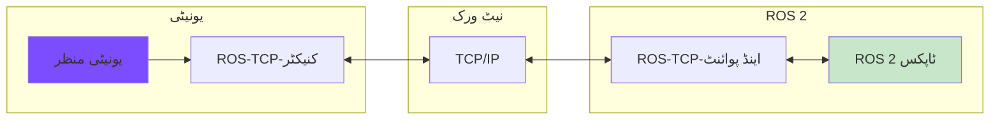
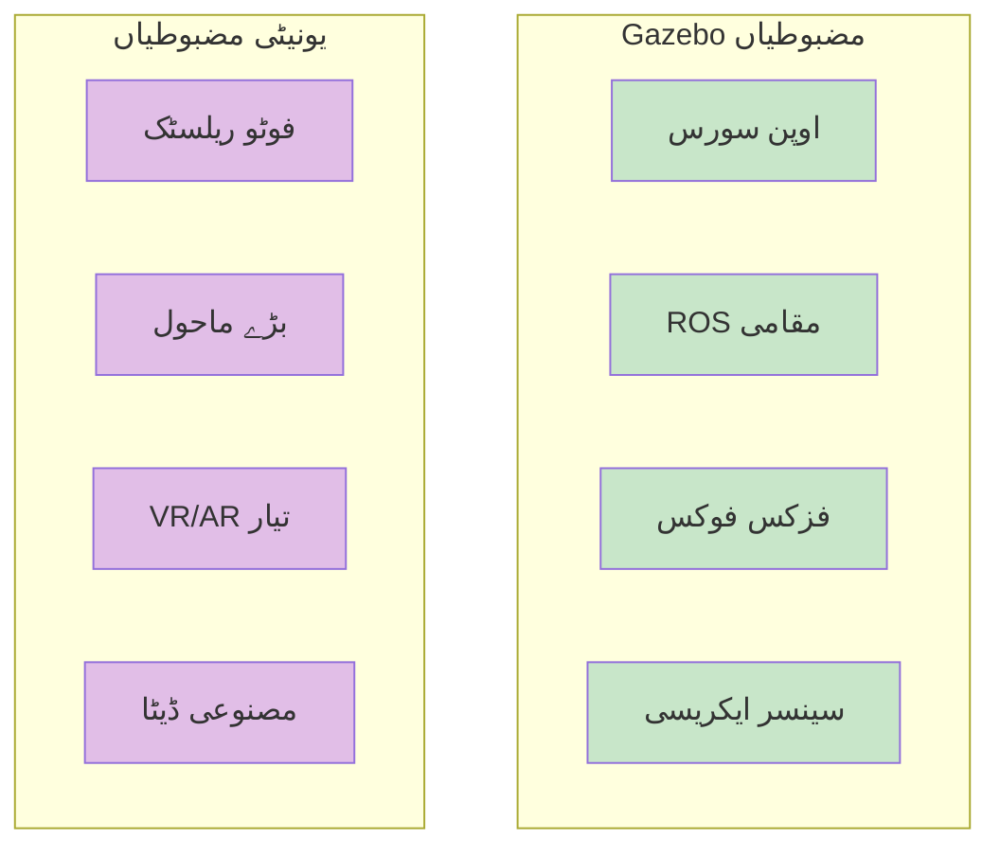
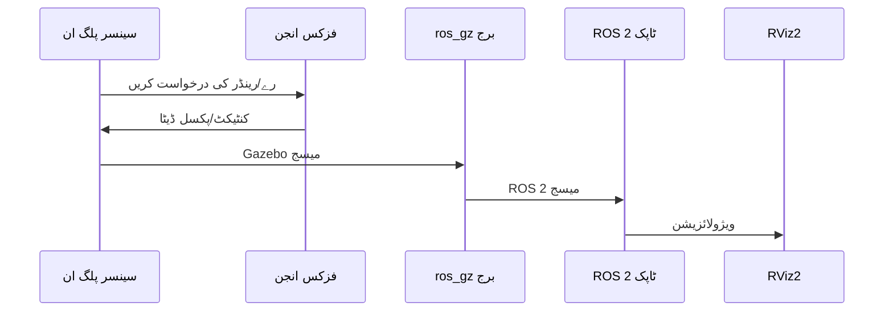
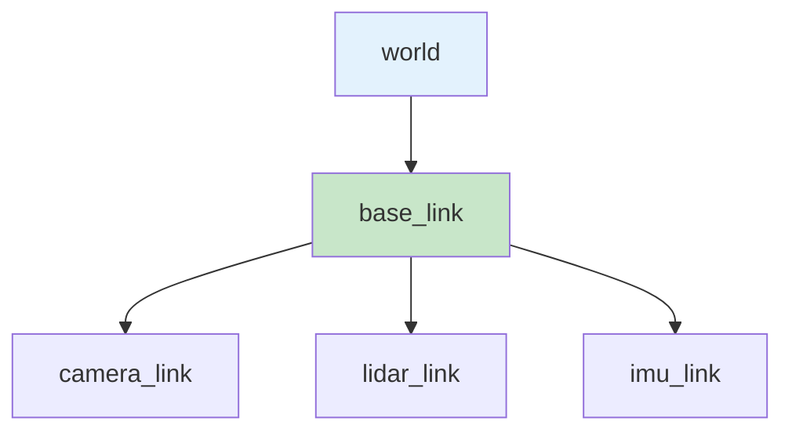

import Tabs from '@theme/Tabs';
import TabItem from '@theme/TabItem';
import QuizComponent from '@site/src/components/QuizComponent';

# لیسنس 3: سینسرز اور یونیٹی موازنہ

## سیکھنے کے اہداف

اس لیسنس کے اختتام تک، آپ کے اہل ہوں گے:

1. **LO-04**: ہائی فائیڈلٹی ویژول انٹرایکشن اور رینڈرنگ میں یونیٹی کا کردار سمجھیں
2. **LO-05**: سیمولیٹڈ سینسرز (کیمرے، LiDAR، IMU) اور ان کے ڈیٹا پائپ لائنز کو ROS 2 کے ساتھ کنفیگر کریں
3. مختلف روبوٹکس منظرناموں کے لیے Gazebo اور یونیٹی کا موازنہ کریں

---

## 3.1 یونیٹی برائے روبوٹکس جائزہ

جہاں Gazebo فزکس-ایکریٹ سیمولیشن میں بہترین ہے، **یونیٹی** مخصوص روبوٹکس ایپلیکیشنز کے لیے دلچسپ فوائد فراہم کرتی ہے، خاص طور پر ان کے لیے جن میں ہائی فائیڈلٹی ویژلز کی ضرورت ہو۔

### یونیٹی کیا ہے؟

یونیٹی ایک مالکانہ گیم انجن ہے جو **یونیٹی روبوٹکس ہب** کے ذریعے روبوٹکس سیمولیشن میں پھیل گئی ہے۔ یہ فراہم کرتی ہے:

- **فوٹو ریلسٹک رینڈرنگ**: رے ٹریسڈ گرافکس، HDR لائٹنگ
- **بڑے ماحول کی حمایت**: شہر، گودام، آؤٹ ڈور زمین
- **VR/AR انضمام**: ایمرسیو روبوٹ ٹیلی آپریشن
- **مصنوعی ڈیٹا جنریشن**: کمپیوٹر وژن کے لیے تربیتی ڈیٹا

### یونیٹی-ROS برج معماری



Gazebo کے مقامی ros_gz برج کے برعکس، یونیٹی کو درکار ہے:
1. **ROS-TCP-کنیکٹر** (یونیٹی پیکیج)
2. **ROS-TCP-اینڈ پوائنٹ** (ROS 2 پیکیج)
3. نیٹ ورک کمیونیکیشن (زیادہ تر localhost)

:::note تعلیمی توجہ
یہ کورس ہاتھ سے کام کرنے والی لیبز کے لیے Gazebo پر توجہ مرکز رکھتا ہے۔ یونیٹی مواد **مکمل** ہے - یہ سمجھنا کہ یونیٹی کو کب اور کیوں چننا ہے، بغیر یونیٹی انسٹال کرنے کی ضرورت کے۔
:::

---

## 3.2 Gazebo بمقابلہ یونیٹی موازنہ

صحیح سیمولیٹر کا انتخاب آپ کے پروجیکٹ کی ضروریات پر منحصر ہے۔

### موازنہ ٹیبل

| جہت | Gazebo | یونیٹی |
|-----------|--------|-------|
| **لائسنس** | اوپن سورس (Apache 2.0) | مالکانہ (مفت ٹیئر دستیاب) |
| **ROS انضمام** | مقامی ros_gz برج | ROS-یونیٹی برج (TCP) |
| **فزکس ایکریسی** | ہائی فائیڈلٹی انجن (ODE، بُلیٹ، DART) | گیم آپٹیمائیزڈ (PhysX) |
| **ویژل کوالٹی** | فعال، معتدل فائیڈلٹی | فوٹو ریلسٹک رینڈرنگ |
| **سینسر سیمولیشن** | مقامی پلگ انز، فزکلی بیسڈ | حسب ضرورت نفاذ کی ضرورت ہے |
| **سیکھنے کی ڈھلوان** | ROS/روبوٹکس پس منظر | یونیٹی/C# پس منظر |
| **کارکردگی** | CPU-بیسڈ، ہلکا وزن | GPU-ایکسلریٹڈ، بھاری |
| **استعمال کا کیس** | الگورتھم ڈیولپمنٹ، کنٹرول | ویژولائزیشن، مصنوعی ڈیٹا |



### فیصلہ فریم ورک

**Gazebo کا انتخاب کریں جب:**
- کنٹرول الگورتھم تیار کر رہے ہیں اور ٹیسٹ کر رہے ہیں
- فزکس ایکریسی اہم ہے (کنٹیکٹ، فریکشن)
- زیادہ تر ROS 2 ایکو سسٹم کے ساتھ کام کر رہے ہیں
- اوپن سورس ضرورت
- محدود GPU وسائل

**یونیٹی کا انتخاب کریں جب:**
- مصنوعی ڈیٹا کے ساتھ وژن ماڈلز تربیت دے رہے ہیں
- فوٹو ریلسٹک ڈیموں تیار کر رہے ہیں
- VR/AR ٹیلی آپریشن انٹرفیسز تیار کر رہے ہیں
- بڑے پیمانے کے ماحول تیار کر رہے ہیں (شہر، گودام)
- ہیومن-روبوٹ انٹرایکشن مطالعات

**ہائبرڈ اپروچ:**
کچھ ٹیمیں دونوں استعمال کرتی ہیں: الگورتھم ڈیولپمنٹ کے لیے Gazebo، حتمی ویژولائزیشن اور مصنوعی ڈیٹا جنریشن کے لیے یونیٹی۔

---

## 3.3 سیمولیٹڈ سینسرز کنفیگریشن

سینسرز آپ کے روبوٹ کی آنکھیں اور کان ہیں۔ Gazebo ROS 2 انضمام کے ساتھ عام سینسر ٹائپس کو سیمولیٹ کرنے کے لیے پلگ انز فراہم کرتا ہے۔

### سینسر ڈیٹا فلو



### کیمرہ سینسر

سب سے عام ادراک سینسر۔ RGB ایمیجز جنریٹ کرتا ہے۔

**Gazebo کنفیگریشن (SDF):**

```xml
<sensor name="camera" type="camera">
  <pose>0 0 0.1 0 0 0</pose>
  <camera>
    <horizontal_fov>1.047</horizontal_fov>  <!-- 60 ڈگری -->
    <image>
      <width>640</width>
      <height>480</height>
      <format>R8G8B8</format>
    </image>
    <clip>
      <near>0.1</near>
      <far>100</far>
    </clip>
  </camera>
  <always_on>true</always_on>
  <update_rate>30</update_rate>
  <topic>camera/image_raw</topic>
</sensor>
```

**ROS 2 میسج ٹائپ:** `sensor_msgs/msg/Image`

**برج کنفیگریشن:**
```bash
ros2 run ros_gz_bridge parameter_bridge \
  /camera/image_raw@sensor_msgs/msg/Image@gz.msgs.Image
```

### ڈیپتھ کیمرہ

رنگین ایمیجز اور ڈیپتھ پیمائش (ہر پکسل تک فاصلہ) فراہم کرتا ہے۔

**Gazebo کنفیگریشن:**

```xml
<sensor name="depth_camera" type="depth_camera">
  <pose>0 0 0.1 0 0 0</pose>
  <camera>
    <horizontal_fov>1.047</horizontal_fov>
    <image>
      <width>640</width>
      <height>480</height>
    </image>
    <clip>
      <near>0.1</near>
      <far>10</far>
    </clip>
  </camera>
  <always_on>true</always_on>
  <update_rate>30</update_rate>
  <topic>depth_camera/image</topic>
  <topic>depth_camera/points</topic>
</sensor>
```

**ROS 2 میسج ٹائپس:**
- `sensor_msgs/msg/Image` (ڈیپتھ ایمیج)
- `sensor_msgs/msg/PointCloud2` (3D پوائنٹ کلاؤڈ)

### LiDAR سینسر

لیزر رےز کا استعمال کرتے ہوئے فاصلے ناپتا ہے۔ نیویگیشن اور SLAM کے لیے ضروری۔

**Gazebo کنفیگریشن:**

```xml
<sensor name="lidar" type="gpu_lidar">
  <pose>0 0 0.2 0 0 0</pose>
  <lidar>
    <scan>
      <horizontal>
        <samples>360</samples>
        <resolution>1</resolution>
        <min_angle>-3.14159</min_angle>
        <max_angle>3.14159</max_angle>
      </horizontal>
    </scan>
    <range>
      <min>0.1</min>
      <max>30.0</max>
      <resolution>0.01</resolution>
    </range>
  </lidar>
  <always_on>true</always_on>
  <update_rate>10</update_rate>
  <topic>scan</topic>
</sensor>
```

**ROS 2 میسج ٹائپ:** `sensor_msgs/msg/LaserScan`

**برج کنفیگریشن:**
```bash
ros2 run ros_gz_bridge parameter_bridge \
  /scan@sensor_msgs/msg/LaserScan@gz.msgs.LaserScan
```

### IMU سینسر

اورینٹیشن، اینگولر ویلوسٹی، اور لینیئر ایکسلریشن ناپتا ہے۔

**Gazebo کنفیگریشن:**

```xml
<sensor name="imu" type="imu">
  <pose>0 0 0.1 0 0 0</pose>
  <imu>
    <angular_velocity>
      <x><noise type="gaussian"><mean>0</mean><stddev>0.01</stddev></noise></x>
      <y><noise type="gaussian"><mean>0</mean><stddev>0.01</stddev></noise></y>
      <z><noise type="gaussian"><mean>0</mean><stddev>0.01</stddev></noise></z>
    </angular_velocity>
    <linear_acceleration>
      <x><noise type="gaussian"><mean>0</mean><stddev>0.1</stddev></noise></x>
      <y><noise type="gaussian"><mean>0</mean><stddev>0.1</stddev></noise></y>
      <z><noise type="gaussian"><mean>0</mean><stddev>0.1</stddev></noise></z>
    </linear_acceleration>
  </imu>
  <always_on>true</always_on>
  <update_rate>100</update_rate>
  <topic>imu/data</topic>
</sensor>
```

**ROS 2 میسج ٹائپ:** `sensor_msgs/msg/Imu`

:::tip نوائز ماڈلز
حقیقی سینسرز میں نوائز ہوتا ہے۔ سیمولیشن میں نوائز کنفیگر کرنا الگورتھم کو حقیقی دنیا کی ناکامیوں کو سنبھالنے میں مدد دیتا ہے۔
:::

---

## 3.4 سینسر ڈیٹا پائپ لائنز

ایک بار جب سینسرز کنفیگر ہو جائیں، تو آپ کو ڈیٹا کو استعمال اور ویژولائز کرنے کی ضرورت ہوگی۔

### RViz2 میں ویژولائز کرنا

RViz2 معیاری ROS 2 ویژولائزیشن ٹول ہے۔

```bash
# RViz2 لانچ کریں
ros2 run rviz2 rviz2

# یا محفوظ کردہ کنفیگریشن کے ساتھ
ros2 run rviz2 rviz2 -d config.rviz
```

**ڈسپلےز شامل کرنا:**
1. ڈسپلےز پینل میں "Add" کلک کریں
2. ڈسپلے ٹائپ منتخب کریں:
   - **Image**: کیمرہ ٹاپکس کے لیے
   - **LaserScan**: LiDAR ٹاپکس کے لیے
   - **PointCloud2**: ڈیپتھ کیمرہ پوائنٹ کلاؤڈز کے لیے
   - **TF**: کوآرڈینیٹ فریم کے لیے
3. ٹاپک نام سیٹ کریں (مثلاً، `/camera/image_raw`)

### سینسر ڈیٹا پروسیس کرنا

کئی سینسرز کو سبسکرائیب کرنے والے نوڈ کی مثال:

```python
#!/usr/bin/env python3
"""کئی سینسرز سبسکرائیب کرنے والے کی مثال۔"

import rclpy
from rclpy.node import Node
from sensor_msgs.msg import Image, LaserScan, Imu

class SensorSubscriber(Node):
    def __init__(self):
        super().__init__('sensor_subscriber')

        # کیمرہ سبسکرپشن
        self.camera_sub = self.create_subscription(
            Image, '/camera/image_raw', self.camera_callback, 10)

        # LiDAR سبسکرپشن
        self.lidar_sub = self.create_subscription(
            LaserScan, '/scan', self.lidar_callback, 10)

        # IMU سبسکرپشن
        self.imu_sub = self.create_subscription(
            Imu, '/imu/data', self.imu_callback, 10)

        self.get_logger().info('سینسر سبسکرائیب شروع ہوا')

    def camera_callback(self, msg):
        self.get_logger().info(f'کیمرہ: {msg.width}x{msg.height}')

    def lidar_callback(self, msg):
        min_range = min(msg.ranges)
        self.get_logger().info(f'LiDAR: کم از کم فاصلہ = {min_range:.2f}م')

    def imu_callback(self, msg):
        orientation = msg.orientation
        self.get_logger().info(
            f'IMU: اورینٹیشن = ({orientation.x:.2f}, {orientation.y:.2f}, '
            f'{orientation.z:.2f}, {orientation.w:.2f})'
        )

def main():
    rclpy.init()
    node = SensorSubscriber()
    rclpy.spin(node)
    rclpy.shutdown()

if __name__ == '__main__':
    main()
```

### TF کوآرڈینیٹ فریم

سینسرز کے روبوٹ کے ریلیٹو کوآرڈینیٹ فریم ہوتے ہیں۔ **TF2** سسٹم ان ریلیشن شپس کو ٹریک کرتا ہے۔



**TF ٹری چیک کرنا:**
```bash
ros2 run tf2_tools view_frames
```

---

## 3.5 ماڈیول 2 جائزہ کوئز

ڈیجیٹل ٹوئن، فزکس سیمولیشن، Gazebo، اور سینسرز کی سمجھ کو ٹیسٹ کریں۔

<QuizComponent
  questions={[
    {
      question: "روبوٹکس میں ڈیجیٹل ٹوئن کیا ہے؟",
      options: [
        "روبوٹ سافٹ ویئر کی بیک اپ کاپی",
        "فزکل روبوٹ برتاؤ کو عکاس کرنے والا ہم وقت ساز مجازی نقل",
        "ٹیسٹ کے لیے ایک دوسرا فزکل روبوٹ",
        "روبوٹ کا نیٹ ورک کنکشن"
      ],
      correctIndex: 1,
      explanation: "ڈیجیٹل ٹوئن ایک مجازی نقل ہے جو فزکل روبوٹ کے ساتھ ہم وقت ساز ہے، محفوظ ٹیسٹنگ اور تصدیق کو فعال کرتی ہے۔"
    },
    {
      question: "مندرجہ ذیل میں سے کون سا سیمولیشن فرسٹ ڈیولپمنٹ کا فائدہ نہیں ہے؟",
      options: [
        "سیفٹی - ہارڈ ویئر کے نقصان کے بغیر ٹیسٹ کریں",
        "رفتار - ریل ٹائم سے تیز چلائیں",
        "گارنٹیڈ مکمل سیم ٹو ریل ٹرانسفر",
        "دہرائی کی قابلیت - بالکل ویسی ہی شرائط دوبارہ پیدا کریں"
      ],
      correctIndex: 2,
      explanation: "سیم ٹو ریل گیپ موجود ہے - سیمولیشن ایک تقریب ہے۔ ٹرانسفر کبھی 'گارنٹیڈ مکمل' نہیں ہوتا۔"
    },
    {
      question: "فزکس سیمولیشن میں انیشیا ٹینسر کا کیا کردار ہے؟",
      options: [
        "روبوٹ کا رنگ تعین کرتا ہے",
        "حقیقی گردش کے لیے ماس کیسے تقسیم ہے اس کی وضاحت کرتا ہے",
        "روبوٹ کی رفتار کی حد کنٹرول کرتا ہے",
        "روبوٹ کا آپریٹنگ ٹیمپریچر سیٹ کرتا ہے"
      ],
      correctIndex: 1,
      explanation: "انیشیا ٹینسر ماس تقسیم کی وضاحت کرتا ہے، جو اس بات کو متاثر کرتا ہے کہ جسم کیسے گردش کرتا ہے جب ٹورکس لاگو ہوتے ہیں۔"
    },
    {
      question: "Gazebo میں، ورلڈ فائلز کے لیے تجویز کردہ فارمیٹ کیا ہے؟",
      options: [
        "URDF",
        "JSON",
        "SDF",
        "YAML"
      ],
      correctIndex: 2,
      explanation: "SDF (سیمولیشن ڈسکرپشن فارمیٹ) Gazebo کے لیے مقامی ہے اور فزکس اور لائٹنگ سمیت مکمل ورلڈ ڈسکرپشن کی حمایت کرتا ہے۔"
    },
    {
      question: "ros_gz برج کیا کرتا ہے؟",
      options: [
        "ROS 2 کوڈ کمپائل کرتا ہے",
        "Gazebo ٹاپکس کو ROS 2 ٹاپکس سے منسلک کرتا ہے",
        "URDF فائلز جنریٹ کرتا ہے",
        "روبوٹ موٹرز کو براہ راست کنٹرول کرتا ہے"
      ],
      correctIndex: 1,
      explanation: "ros_gz برج Gazebo کے داخلی میسج ٹائپس اور ROS 2 میسج ٹائپس کے درمیان ترجمہ کرتا ہے۔"
    },
    {
      question: "Unity کو Gazebo پر کب چننا چاہیے؟",
      options: [
        "جب فزکس ایکریسی سب سے اوپر کی ترجیح ہو",
        "جب آپ کو اوپن سورس سافٹ ویئر کی ضرورت ہو",
        "جب فوٹو ریلسٹک مصنوعی تربیتی ڈیٹا تیار کر رہے ہوں",
        "جب GPU کے بغیر سسٹم پر چل رہے ہوں"
      ],
      correctIndex: 2,
      explanation: "Unity فوٹو ریلسٹک رینڈرنگ میں بہترین ہے، جو مصنوعی ڈیٹا جنریشن اور ویژل ڈیموں کے لیے مثالی ہے۔"
    },
    {
      question: "LiDAR سینسر عام طور پر کون سا ROS 2 میسج ٹائپ پبلش کرتا ہے؟",
      options: [
        "sensor_msgs/msg/Image",
        "geometry_msgs/msg/Twist",
        "sensor_msgs/msg/LaserScan",
        "std_msgs/msg/String"
      ],
      correctIndex: 2,
      explanation: "LiDAR سینسرز لیزر اسکین میسجز جاری کرتے ہیں جن میں مختلف زاویوں پر رینج پیمائش ہوتی ہے۔"
    },
    {
      question: "سیمولیٹڈ سینسرز میں نوائز شامل کرنے کا مقصد کیا ہے؟",
      options: [
        "سیمولیشن کو سست کرنا",
        "الگورتھم کو حقیقی دنیا کے سینسر کی ناکامیوں کے لیے تیار کرنا",
        "GPU استعمال بڑھانا",
        "سیمولیشن کو جان بوجھ کر توڑنا"
      ],
      correctIndex: 1,
      explanation: "نوائز شامل کرنا سیمولیٹڈ سینسرز کو حقیقی سینسرز کی طرح برتاؤ کرنے کے قابل بناتا ہے، جو الگورتھم کو حقیقی دنیا کی حالت کو سنبھالنے میں مدد دیتا ہے۔"
    },
    {
      question: "Gazebo میں ڈیفالٹ فزکس انجن کون سا ہے؟",
      options: [
        "PhysX",
        "Bullet",
        "ODE",
        "Havok"
      ],
      correctIndex: 2,
      explanation: "ODE (Open Dynamics Engine) Gazebo کا ڈیفالٹ فزکس انجن ہے، جو استحکام اور وسیع مطابقت کے لیے جانا جاتا ہے۔"
    },
    {
      question: "کون سا ٹول ROS 2 میں سینسر ڈیٹا اور TF فریم ویژولائز کرتا ہے؟",
      options: [
        "Gazebo",
        "RViz2",
        "Unity",
        "rqt_graph"
      ],
      correctIndex: 1,
      explanation: "RViz2 معیاری ROS 2 ویژولائزیشن ٹول ہے جو سینسر ڈیٹا، روبوٹ ماڈلز، اور TF کوآرڈینیٹ فریم دکھانے کے لیے ہے۔"
    }
  ]}
/>

---

## خلاصہ

اس لیسنس میں، آپ نے سیکھا:

- **یونیٹی کا کردار**: ہائی فائیڈلٹی ویژلز، مصنوعی ڈیٹا، VR/AR انضمام
- **Gazebo بمقابلہ یونیٹی**: فزکس بمقابلہ رینڈرنگ کے لیے مختلف مضبوطیاں
- **سینسر کنفیگریشن**: Gazebo میں کیمرہ، ڈیپتھ کیمرہ، LiDAR، IMU
- **ڈیٹا پائپ لائنز**: ROS 2 سے برج کرنا اور RViz2 میں ویژولائز کرنا

### ماڈیول 2 کلیدی نکات

1. **ڈیجیٹل ٹوئن** محفوظ، تیز، دہرائی کے قابل روبوٹ ڈیولپمنٹ کو فعال کرتے ہیں
2. **فزکس سیمولیشن** حقیقت کا تقریب کرتی ہے - اس کی حدود کو سمجھیں
3. **Gazebo** ROS 2 روبوٹکس سیمولیشن کے لیے جانا جاتا ہے
4. **یونیٹی** ویژولائزیشن-ہیوی ایپلیکیشنز کے لیے Gazebo کو مکمل کرتی ہے
5. **سینسرز** ادراک سے ایکشن کو جوڑتے ہیں - حقیقت کے لیے نوائز کے ساتھ انہیں کنفیگر کریں

---

## اگلا کیا ہے

ماڈیول 2 مکمل ہونے کے ساتھ، آپ سمجھتے ہیں:
- کیسے سیمولیشن روبوٹ ڈیولپمنٹ کو فعال کرتی ہے
- Gazebo کنفیگریشن اور ROS 2 انضمام
- سینسر ڈیٹا پائپ لائنز

**ماڈیول 3** میں، آپ ادراک الگورتھم کا جائزہ لیں گے جو نیویگیشن اور مینوپولیشن کے لیے سینسر ڈیٹا کو پروسیس کرتے ہیں۔

---

## حوالہ جات

اس ماڈیول کے لیے حوالہ جات [حوالہ جات](/docs/appendix/references) سیکشن میں دستیاب ہیں۔