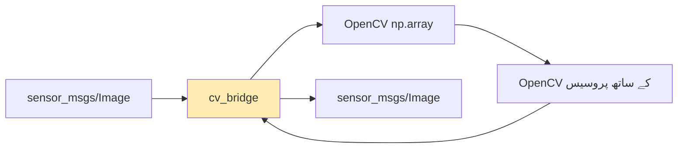

import Tabs from '@theme/Tabs';
import TabItem from '@theme/TabItem';

# لیسنس 1: کمپیوٹر وژن بنیادیں

## سیکھنے کے اہداف

اس لیسنس کے اختتام تک، آپ کے اہل ہوں گے:

1. **LO-01**: کمپیوٹر وژن کی بنیادیں اور روبوٹکس ادراک میں ان کا کردار سمجھیں
2. **LO-02**: Python میں بنیادی ایمیج پروسیسنگ آپریشنز کے لیے OpenCV استعمال کریں
3. **LO-03**: cv_bridge کا استعمال کرتے ہوئے ROS 2 ایمیج ٹاپکس کو سبسکرائیب اور پروسیس کریں
4. **LO-04**: کیمرہ کیلیبریشن کے تصورات اور ان کی اہمیت کی وضاحت کریں

---

## 1.1 کمپیوٹر وژن کا تعارف

کمپیوٹر وژن روبوٹس کو کیمرہ اور دیگر ایمیج سینسرز سے **بصری معلومات کی تشریح** کرنے کے قابل بناتا ہے۔ انسانوں کے برعکس جو بصری ڈیٹا کو آسانی سے پروسیس کرتے ہیں، روبوٹس کو خام پکسل ویلیوز کو دنیا کی معنی خیز نمائندگی میں تبدیل کرنا ہوتا ہے۔

### روبوٹکس میں کمپیوٹر وژن کیوں؟

حقیقی دنیا میں کام کرنے والے روبوٹس کو ضرورت ہے:
- **رکاوٹیں ڈیٹیکٹ** کرنا تاکہ محفوظ طریقے سے نیویگیٹ کر سکیں
- **اوبجیکٹس کو پہچاننا** مینوپولیشن کاموں کے لیے
- **موشن کو ٹریک** کرنا متحرک انٹرایکشن کے لیے
- **سائن اور مارکر پڑھنا** مقام کیلئے

ادراک پائپ لائن خام سینسر ڈیٹا کو قابل عمل معلومات میں تبدیل کرتا ہے:


### OpenCV کا کردار

**OpenCV** (Open Source Computer Vision Library) ایمیج پروسیسنگ کے لیے صنعتی معیار کی لائبریری ہے۔ 2000 میں انٹیل کے ذریعے جاری کیا گیا، یہ اب دنیا بھر میں روبوٹس، خودکار گاڑیوں، اور صنعتی آٹومیشن میں وژن سسٹم کو چلاتا ہے۔

اہم صلاحیات میں شامل ہیں:
- ایمیج فلٹرنگ اور ٹرانسفارمیشن
- ایج اور کنٹور ڈیٹیکشن
- کلر سپیس مینوپولیشن
- اوبجیکٹ ڈیٹیکشن اور ٹریکنگ
- کیمرہ کیلیبریشن ٹولز

:::tip OpenCV کیوں؟
OpenCV ایمیج کو صرف Python سے ہزاروں گنا تیز پروسیس کرتا ہے۔ ایک ہی OpenCV فنکشن کال سینکڑوں لائنوں کے دستی پکسل مینوپولیشن کو تبدیل کر سکتی ہے۔
:::

---

## 1.2 ROS 2 کے ساتھ OpenCV بنیادیں

ROS 2 سے انضمام سے پہلے، آئیے بنیادی OpenCV آپریشنز کو سمجھتے ہیں۔ تمام روبوٹکس وژن پائپ لائنز ان پرائمریز پر تعمیر ہوتے ہیں۔

### ایمیج کی نمائندگی

ڈیجیٹل ایمیجز کو ملٹی-ڈائیمینشنل ارےز کے طور پر نمائندہ کیا جاتا ہے:
- **گرے سکیل**: 2D ارے (اونچائی x چوڑائی)، ویلیوز 0-255
- **کلر (BGR)**: 3D ارے (اونچائی x چوڑائی x 3 چینلز)
- **ڈیپتھ**: 2D ارے فاصلہ ویلیوز کے ساتھ (میٹر یا ملی میٹر)

```python
import cv2
import numpy as np

# ایک خالی 480x640 کلر ایمیج بنائیں (BGR فارمیٹ)
image = np.zeros((480, 640, 3), dtype=np.uint8)

# قطار 100، کالم 200 پر پکسل تک رسائی حاصل کریں
pixel = image[100, 200]  # [B, G, R] ویلیوز لوٹاتا ہے

# پکسل کو ریڈ پر سیٹ کریں (BGR: بلو=0، گرین=0، ریڈ=255)
image[100, 200] = [0, 0, 255]

# ایمیج ابعاد حاصل کریں
height, width, channels = image.shape
```

### عام ایمیج آپریشنز

**کلر کنورژن**: روبوٹس اکثر کارکردگی کے لیے گرے سکیل ایمیجز پروسیس کرتے ہیں۔

```python
import cv2

# کلر ایمیج لوڈ کریں
color_img = cv2.imread('robot_view.png')

# BGR سے گرے سکیل میں تبدیل کریں
gray_img = cv2.cvtColor(color_img, cv2.COLOR_BGR2GRAY)

# BGR سے HSV میں تبدیل کریں (کلر فلٹرنگ کے لیے بہتر)
hsv_img = cv2.cvtColor(color_img, cv2.COLOR_BGR2HSV)
```

**گاؤسین بلر**: ایج ڈیٹیکشن سے پہلے نوائز کم کرتا ہے۔

```python
# 5x5 کرنل کے ساتھ گاؤسین بلر لاگو کریں
blurred = cv2.GaussianBlur(gray_img, (5, 5), 0)
```

**ایج ڈیٹیکشن**: کینی الگورتھم کا استعمال کرتے ہوئے باؤنڈریز کی شناخت کرتا ہے۔

```python
# کینی ایج ڈیٹیکشن
edges = cv2.Canny(blurred, threshold1=50, threshold2=150)
```

### کلر فلٹرنگ کی مثال

کلر فلٹرنگ رنگین لائنز کو فالو کرنے یا رنگین اوبجیکٹس کو ڈیٹیکٹ کرنے جیسے کاموں کے لیے ضروری ہے:

```python
import cv2
import numpy as np

def filter_red_objects(image):
    """HSV کلر سپیس کا استعمال کرتے ہوئے BGR ایمیج سے ریڈ اوبجیکٹس فلٹر کریں"
    # HSV میں تبدیل کریں
    hsv = cv2.cvtColor(image, cv2.COLOR_BGR2HSV)

    # ریڈ کلر رینج کی وضاحت کریں (hue کے ارد گرد لپیٹتا ہے)
    lower_red1 = np.array([0, 100, 100])
    upper_red1 = np.array([10, 255, 255])
    lower_red2 = np.array([160, 100, 100])
    upper_red2 = np.array([180, 255, 255])

    # دونوں ریڈ رینج کے لیے ماسکس بنائیں
    mask1 = cv2.inRange(hsv, lower_red1, upper_red1)
    mask2 = cv2.inRange(hsv, lower_red2, upper_red2)
    mask = cv2.bitwise_or(mask1, mask2)

    # اصل ایمیج پر ماسک لاگو کریں
    result = cv2.bitwise_and(image, image, mask=mask)
    return result, mask
```

---

## 1.3 ROS 2 ایمیج ٹرانسپورٹ

ROS 2 نوڈز کے درمیان ایمیج ڈیٹا منتقل کرنے کے لیے معیاری انفراسٹرکچر فراہم کرتا ہے۔ ادراک سسٹم تیار کرنے کے لیے اس ٹرانسپورٹ لیئر کو سمجھنا ضروری ہے۔

### sensor_msgs/Image میسج

کیمرہ ڈیٹا ROS 2 کے ذریعے `sensor_msgs/msg/Image` میسجز کے طور پر بہتا ہے:

```yaml
# sensor_msgs/msg/Image سٹرکچر
std_msgs/Header header    # ٹائم اسٹیمپ اور فریم_آئی ڈی
uint32 height             # پکسلز میں ایمیج اونچائی
uint32 width              # پکسلز میں ایمیج چوڑائی
string encoding           # پکسل انکوڈنگ (مثلاً، "bgr8"، "mono8")
uint8 is_bigendian        # ڈیٹا اینڈینس
uint32 step               # بائٹس میں مکمل قطار کی لمبائی
uint8[] data              # اصل ایمیج ڈیٹا
```

عام انکوڈنگس میں شامل ہیں:
- `bgr8`: 8-بٹ BGR کلر (OpenCV ڈیفالٹ)
- `rgb8`: 8-بٹ RGB کلر
- `mono8`: 8-بٹ گرے سکیل
- `32FC1`: 32-بٹ فلوٹ سنگل چینل (ڈیپتھ ایمیجز)

### cv_bridge پیکیج

**cv_bridge** ROS 2 ایمیج میسجز اور OpenCV numpy ارےز کے درمیان تبدیل کرتا ہے:



### بنیادی ایمیج سبسکرائیب نوڈ

یہاں ایک مکمل ROS 2 نوڈ ہے جو کیمرہ ایمیجز کو سبسکرائیب کرتا ہے اور انہیں پروسیس کرتا ہے:

```python
import rclpy
from rclpy.node import Node
from sensor_msgs.msg import Image
from cv_bridge import CvBridge
import cv2

class ImageSubscriber(Node):
    def __init__(self):
        super().__init__('image_subscriber')
        self.bridge = CvBridge()
        self.subscription = self.create_subscription(
            Image,
            '/camera/image_raw',
            self.image_callback,
            10)

    def image_callback(self, msg):
        # ROS ایمیج کو OpenCV فارمیٹ میں تبدیل کریں
        cv_image = self.bridge.imgmsg_to_cv2(msg, 'bgr8')

        # ایمیج کو پروسیس کریں
        gray = cv2.cvtColor(cv_image, cv2.COLOR_BGR2GRAY)
        edges = cv2.Canny(gray, 50, 150)

        # پروسیسنگ کا نتیجہ لاگ کریں
        self.get_logger().info(f'فریم پروسیس کیا گیا: {edges.shape}')

def main(args=None):
    rclpy.init(args=args)
    node = ImageSubscriber()
    rclpy.spin(node)
    node.destroy_node()
    rclpy.shutdown()
```

### ایمیج پروسیسنگ پائپ لائن نوڈ

ایک مکمل مثال جو پروسیس کردہ نتائج کو پبلش کرتی ہے:

```python
import rclpy
from rclpy.node import Node
from sensor_msgs.msg import Image
from cv_bridge import CvBridge
import cv2
import numpy as np

class ImageProcessor(Node):
    def __init__(self):
        super().__init__('image_processor')
        self.bridge = CvBridge()

        # خام کیمرہ ایمیجز کے لیے سبسکرائیب
        self.sub = self.create_subscription(
            Image, '/camera/image_raw',
            self.process_image, 10)

        # پروسیس کردہ ایمیجز کے لیے پبلشر
        self.pub = self.create_publisher(
            Image, '/camera/image_processed', 10)

    def process_image(self, msg):
        # OpenCV فارمیٹ میں تبدیل کریں
        frame = self.bridge.imgmsg_to_cv2(msg, 'bgr8')

        # پائپ لائن پروسیسنگ لاگو کریں
        gray = cv2.cvtColor(frame, cv2.COLOR_BGR2GRAY)
        blurred = cv2.GaussianBlur(gray, (5, 5), 0)
        edges = cv2.Canny(blurred, 50, 150)

        # ایج کو پبلش کرنے کے لیے BGR میں تبدیل کریں
        edges_bgr = cv2.cvtColor(edges, cv2.COLOR_GRAY2BGR)

        # پروسیس کردہ ایمیج پبلش کریں
        out_msg = self.bridge.cv2_to_imgmsg(edges_bgr, 'bgr8')
        out_msg.header = msg.header  # ٹائم اسٹیمپ محفوظ رکھیں
        self.pub.publish(out_msg)
```

---

## 1.4 کیمرہ کیلیبریشن تصورات

حقیقی کیمرہ **ڈسٹورشن** متعارف کراتے ہیں جسے درست کرنا ضروری ہے تاکہ درست ادراک ہو سکے۔ کیمرہ کیلیبریشن 3D دنیا کے پوائنٹس اور ان کے 2D ایمیج پروجیکشن کے درمیان ریاضی کے رشتے کا تعین کرتا ہے۔

### کیلیبریشن کیوں اہم ہے

غیر کیلیبریٹڈ کیمرہ پیدا کرتے ہیں:
- **بارل ڈسٹورشن**: سیدھی لائنز خمیدا نظر آتی ہیں
- **غلط پیمائش**: فاصلہ کے حسابات غلط ہوتے ہیں
- **خراب 3D ریکن سٹرکشن**: اسٹیریو وژن ناکام ہو جاتا ہے

### انٹرنسک پیرامیٹرز

**انٹرنسک پیرامیٹرز** کیمرہ کی اندرونی جیومیٹری کی وضاحت کرتے ہیں:

- **فوکل لمبائی** ($f_x$, $f_y$): لینس میگنیفکیشن
- **پرنسپل پوائنٹ** ($c_x$, $c_y$): ایمیج سینٹر آفسیٹ
- **ڈسٹورشن کوائف**: لینس ایبیریشن کی اصلاح

یہ **کیمرہ میٹرکس** تشکیل دیتے ہیں:

K = [fx  0  cx]
    [0  fy  cy]
    [0   0   1]

### ایکسٹرنسک پیرامیٹرز

**ایکسٹرنسک پیرامیٹرز** کیمرہ کے دنیا میں مقام اور اورینٹیشن کی وضاحت کرتے ہیں:

- **ریوٹیشن میٹرکس** ($R$): کیمرہ اورینٹیشن
- **ٹرانسلیشن ویکٹر** ($t$): کیمرہ مقام

### کیلیبریشن عمل کا جائزہ

1. ایک معلوم پیٹرن (چیکر بورڈ) کی ایمیجز کیپچر کریں
2. ہر ایمیج میں پیٹرن کورنرز کو ڈیٹیکٹ کریں
3. OpenCV کا استعمال کرتے ہوئے کیمرہ پیرامیٹرز کا حساب لگائیں
4. رن ٹائم استعمال کے لیے کیلیبریشن محفوظ کریں

```python
import cv2
import numpy as np

# کیلیبریشن استعمال کی مثال
def undistort_image(image, camera_matrix, dist_coeffs):
    """ایک ایمیج سے لینس ڈسٹورشن ہٹائیں"
    h, w = image.shape[:2]

    # بہترین نیا کیمرہ میٹرکس حاصل کریں
    new_matrix, roi = cv2.getOptimalNewCameraMatrix(
        camera_matrix, dist_coeffs, (w, h), 1, (w, h))

    # ایمیج کو بے ڈسٹورٹ کریں
    undistorted = cv2.undistort(
        image, camera_matrix, dist_coeffs, None, new_matrix)

    return undistorted
```

:::info ROS 2 کیمرہ انفو
کیلیبریشن پیرامیٹرز `/camera/camera_info` پر `sensor_msgs/msg/CameraInfo` میسجز کے طور پر پبلش کیے جاتے ہیں۔ ادراک نوڈز کو اس ٹاپک کو سبسکرائیب کرنا چاہئے تاکہ کیلیبریشن ڈیٹا تک رسائی حاصل کر سکیں۔
:::

---

## خلاصہ

اس لیسنس میں، آپ نے سیکھا:

- **کمپیوٹر وژن** خام پکسل ڈیٹا کو معنی خیز روبوٹ ادراک میں تبدیل کرتا ہے
- **OpenCV** کارآمد ایمیج پروسیسنگ پرائمریز فراہم کرتا ہے (بلر، ایج، کلر فلٹرنگ)
- **ROS 2 ایمیج ٹرانسپورٹ** sensor_msgs/Image کا استعمال کرتا ہے OpenCV انضمام کے لیے cv_bridge کے ساتھ
- **کیمرہ کیلیبریشن** درست پیمائش کے لیے لینس ڈسٹورشن کو درست کرتا ہے

### کلیدی نکات

1. پروسیسنگ سے پہلے ہمیشہ cv_bridge کا استعمال کرتے ہوئے ROS 2 ایمیجز کو OpenCV فارمیٹ میں تبدیل کریں
2. گرے سکیل تبدیلی اور بلر معیاری پری پروسیسنگ اسٹیپس ہیں
3. HSV کلر سپیس BGR سے بہتر ہے کلر-بیسڈ فلٹرنگ کے لیے
4. کیمرہ کیلیبریشن کسی بھی ایپلیکیشن کے لیے ضروری ہے جس میں درست پیمائش کی ضرورت ہو

---

## اگلا کیا ہے

[لیسنس 2: متعدد سینسرز کا انضمام](./lesson-02-multi-sensor) میں، آپ:
- LiDAR پوائنٹ کلاؤڈ اور ڈیپتھ سینسرز کے ساتھ کام کریں گے
- موشن اسٹیمیٹ کے لیے IMU ڈیٹا کو سمجھیں گے
- مضبوط ادراک کے لیے سینسر فیوژن تصورات سیکھیں گے

---

## حوالہ جات

اس لیسنس کے لیے حوالہ جات [حوالہ جات](/docs/appendix/references) سیکشن میں ماڈیول 3 کے تحت دستیاب ہیں۔