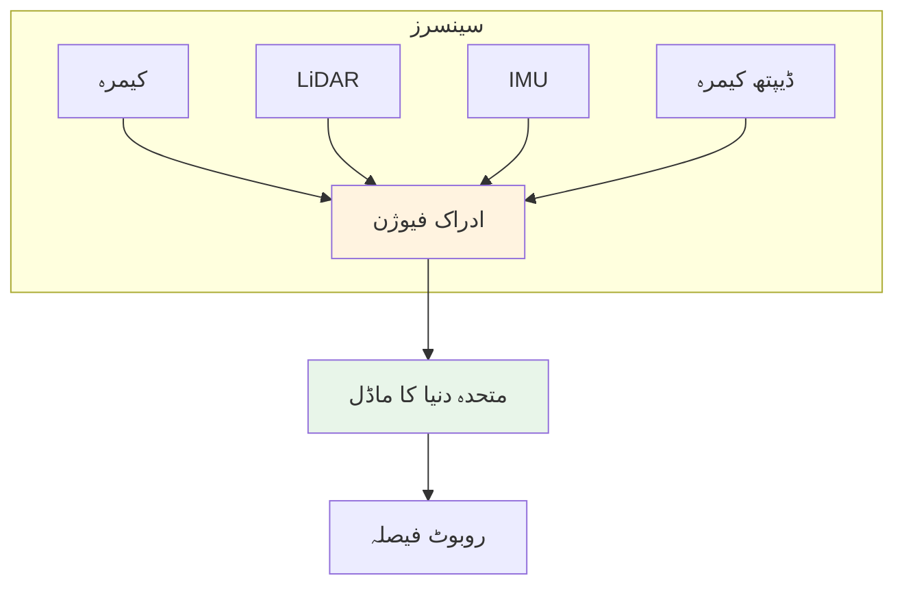
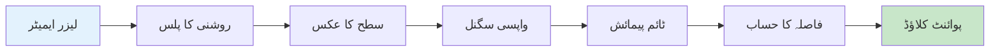
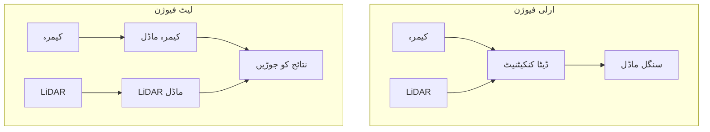

import Tabs from '@theme/Tabs';
import TabItem from '@theme/TabItem';

# لیسنس 2: متعدد سینسرز کا انضمام

## سیکھنے کے اہداف

اس لیسنس کے اختتام تک، آپ کے اہل ہوں گے:

1. **LO-01**: مختلف سینسر ٹائپس (LiDAR، IMU، ڈیپتھ کیمرے) اور ان کی ایپلیکیشنز کو سمجھیں
2. **LO-02**: ROS 2 سینسر میسج ٹائپس (PointCloud2، Imu، Image) کے ساتھ کام کریں
3. **LO-03**: LiDAR پوائنٹ کلاؤڈ ڈیٹا کو سبسکرائیب اور پروسیس کریں
4. **LO-04**: سینسر فیوژن تصورات اور مضبوط ادراک کے لیے ان کی اہمیت کی وضاحت کریں

---

## 2.1 سینسر ٹائپس کا جائزہ

جدید روبوٹس اپنے ماحول کو ادراک کرنے کے لیے ایک ساتھ کام کرنے والے متعدد سینسرز پر انحصار کرتے ہیں۔ ہر سینسر ٹائپ کے منفرد مضبوطیاں اور کمزوریاں ہیں، جس کی وجہ سے مضبوط ادراک کے لیے سینسر کی تنوع ضروری ہے۔

### متعدد سینسرز کیوں؟

ایک ہی سینسر تمام حالات میں مکمل نہیں ہے:

| سینسر | مضبوطی | کمزوری |
|--------|----------|----------|
| **کیمرہ** | مکمل رنگ/ٹیکسچر، کم لاگت | لائٹنگ سے متاثر، براہ راست ڈیپتھ نہیں |
| **LiDAR** | درست 3D پیمائش، اندھیرے میں کام کرتا ہے | مہنگا، پتلا ڈیٹا، کوئی رنگ نہیں |
| **IMU** | زیادہ فریکوینسی موشن ڈیٹا | وقت کے ساتھ ڈرائیف، کوئی مقام نہیں |
| **ڈیپتھ کیمرہ** | کم لاگت پر گھنی ڈیپتھ | محدود رینج، دھوپ سے متاثر |

سینسرز کو جوڑ کر، روبوٹس **ریڈونڈنسی** (اگر ایک ناکام ہو جائے تو بیک اپ) اور **کمپلیمنٹریٹی** (ایک سینسر دوسرے کے خلا کو پر کرتا ہے) حاصل کرتے ہیں۔



### سینسر منتخب کرنے کے ہدایات

- **اندرونی نیویگیشن**: ڈیپتھ کیمرہ + IMU (قیمت مؤثر، SLAM کے لیے اچھا)
- **بیرونی خودکاری**: LiDAR + کیمرہ + IMU (متغیر لائٹ میں کام کرتا ہے)
- **مینوپولیشن**: کیمرہ + ڈیپتھ کیمرہ (درست اوبجیکٹ مقام)
- **زیادہ رفتار موشن**: IMU ضروری (تیز تبدیلیوں کے لیے زیادہ اپ ڈیٹ کی شرح)

---

## 2.2 LiDAR اور پوائنٹ کلاؤڈ

**LiDAR** (لائٹ ڈیٹیکشن اینڈ رینجنگ) لیزر پلسز ایمیٹ کر کے اور ان کے واپس آنے کا وقت ناپ کر فاصلے کی پیمائش کرتا ہے۔ نتیجہ **پوائنٹ کلاؤڈ** ہے: 3D پوائنٹس کا مجموعہ جو ماحول میں سطحوں کی نمائندگی کرتا ہے۔

### LiDAR کیسے کام کرتا ہے

1. لیزر روشنی کا پلس ایمیٹ کرتا ہے
2. روشنی سطحوں سے عکس کھاتی ہے اور واپس آتی ہے
3. ٹائم آف فلائٹ فاصلہ کا تعین کرتا ہے: d = (c * t) / 2
4. گھومنے والا میکنزم متعدد زاویوں کو سکین کرتا ہے
5. تمام پیمائش سے پوائنٹ کلاؤڈ اکٹھا کیا جاتا ہے



### PointCloud2 میسج ٹائپ

LiDAR ڈیٹا `sensor_msgs/msg/PointCloud2` کے طور پر پبلش کیا جاتا ہے:

```yaml
# sensor_msgs/msg/PointCloud2 سٹرکچر
std_msgs/Header header       # ٹائم اسٹیمپ اور فریم_آئی ڈی
uint32 height                # اونچائی (غیر ترتیب کلاؤڈ کے لیے 1)
uint32 width                 # پوائنٹس کی تعداد
PointField[] fields          # پوائنٹ ڈیٹا کی تفصیل
bool is_bigendian            # اینڈینس
uint32 point_step            # فی پوائنٹ بائٹس
uint32 row_step              # فی قطار بائٹس
uint8[] data                 # پیکڈ پوائنٹ ڈیٹا
bool is_dense                # درست ہے اگر کوئی ناموزوں پوائنٹس نہ ہوں
```

ہر پوائنٹ عام طور پر یہ مشتمل ہوتا ہے: `x`, `y`, `z` کوآرڈینیٹس، علاوہ `intensity` اور `rgb` ویلیوز کے اختیاری طور پر۔

### LiDAR پوائنٹ کلاؤڈ سبسکرائیب

```python
import rclpy
from rclpy.node import Node
from sensor_msgs.msg import PointCloud2
import sensor_msgs_py.point_cloud2 as pc2
import numpy as np

class LidarSubscriber(Node):
    def __init__(self):
        super().__init__('lidar_subscriber')
        self.subscription = self.create_subscription(
            PointCloud2,
            '/lidar/points',
            self.lidar_callback,
            10)

    def lidar_callback(self, msg):
        # PointCloud2 کو numpy ارے میں تبدیل کریں
        points = []
        for point in pc2.read_points(msg, skip_nans=True):
            points.append([point[0], point[1], point[2]])

        cloud = np.array(points)
        self.get_logger().info(
            f'{len(cloud)} پوائنٹس وصول ہوئے، '
            f'رینج: {cloud[:, 0].min():.2f} سے {cloud[:, 0].max():.2f}م'
        )
```

### عام LiDAR پروسیسنگ آپریشنز

**گراؤنڈ پلین ہٹانا**: رکاوٹوں پر توجہ کے لیے فرش کے پوائنٹس کو فلٹر کریں:

```python
def remove_ground_plane(points, height_threshold=-0.3):
    """اونچائی کے تھریشولڈ (گراؤنڈ) سے نیچے کے پوائنٹس ہٹائیں"
    mask = points[:, 2] > height_threshold
    return points[mask]
```

**فاصلہ فلٹرنگ**: صرف رینج کے اندر کے پوائنٹس رکھیں:

```python
def filter_by_distance(points, min_dist=0.5, max_dist=10.0):
    """فاصلہ رینج کے اندر کے پوائنٹس رکھیں"
    distances = np.linalg.norm(points[:, :2], axis=1)
    mask = (distances > min_dist) & (distances < max_dist)
    return points[mask]
```

---

## 2.3 IMU اور انیشل سینسنگ

ایک **IMU** (انیشل میزورمینٹ یونٹ) ایکسلیرومیٹرز اور جائیروسکوپس کا استعمال کرتے ہوئے موشن کی پیمائش کرتا ہے۔ یہ روبوٹ کی حرکت کے بارے میں زیادہ فریکوینسی ڈیٹا فراہم کرتا ہے، جو توازن اور تیز کنٹرول کے لیے ضروری ہے۔

### IMU اجزاء

- **ایکسلیرومیٹر**: 3 ایکسز میں لینیئر ایکسلریشن (میٹر/سیکنڈ^2) کی پیمائش کرتا ہے
- **جائراسکوپ**: 3 ایکسز میں اینگولر ویلوسٹی (ریڈین/سیکنڈ) کی پیمائش کرتا ہے
- **میگنیٹومیٹر** (اختیاری): ہیڈنگ کے لیے مقناطیسی میدان کی پیمائش کرتا ہے

### Imu میسج ٹائپ

IMU ڈیٹا `sensor_msgs/msg/Imu` استعمال کرتا ہے:

```yaml
# sensor_msgs/msg/Imu سٹرکچر
std_msgs/Header header
geometry_msgs/Quaternion orientation       # موجودہ اورینٹیشن
float64[9] orientation_covariance
geometry_msgs/Vector3 angular_velocity     # گردش کی شرح (ریڈین/سیکنڈ)
float64[9] angular_velocity_covariance
geometry_msgs/Vector3 linear_acceleration  # ایکسلریشن (میٹر/سیکنڈ^2)
float64[9] linear_acceleration_covariance
```

### IMU ڈیٹا پروسیسنگ

```python
import rclpy
from rclpy.node import Node
from sensor_msgs.msg import Imu
import math

class ImuProcessor(Node):
    def __init__(self):
        super().__init__('imu_processor')
        self.subscription = self.create_subscription(
            Imu, '/imu/data', self.imu_callback, 10)

    def imu_callback(self, msg):
        # اینگولر ویلوسٹی نکالیں
        omega_x = msg.angular_velocity.x
        omega_y = msg.angular_velocity.y
        omega_z = msg.angular_velocity.z

        # لینیئر ایکسلریشن نکالیں
        accel_x = msg.linear_acceleration.x
        accel_y = msg.linear_acceleration.y
        accel_z = msg.linear_acceleration.z

        # ایکسلیرومیٹر سے ٹائلٹ حساب لگائیں
        roll = math.atan2(accel_y, accel_z)
        pitch = math.atan2(-accel_x,
            math.sqrt(accel_y**2 + accel_z**2))

        self.get_logger().info(
            f'رول: {math.degrees(roll):.1f} ڈگری، '
            f'پچ: {math.degrees(pitch):.1f} ڈگری'
        )
```

:::tip IMU ڈرائیف
IMU اورینٹیشن وقت کے ساتھ انٹیگریشن کی خرابیوں کی وجہ سے ڈرائیف کرتا ہے۔ درست طویل مدتی مقام کے لیے دیگر سینسرز (GPS، وژول اوڈومیٹری) کے ساتھ جوڑیں۔
:::

---

## 2.4 ڈیپتھ سینسرز اور 3D ادراک

**ڈیپتھ سینسرز** فی پکسل فاصلہ پیمائش فراہم کرتے ہیں، گھنی 3D نمائندگیاں بناتے ہیں۔ وہ مینوپولیشن اور اندرونی نیویگیشن کے لیے وسیع پیمانے پر استعمال ہوتے ہیں۔

### ڈیپتھ سینسر ٹیکنالوجیز

| ٹیکنالوجی | مثال | کام کیسے کرتا ہے | بہترین کے لیے |
|------------|---------|--------------|----------|
| **سٹرکچرڈ لائٹ** | انٹیل ریل سینس D400 | IR پیٹرن پروجیکٹ کرتا ہے، ڈسٹورشن ناپتا ہے | اندرون، مینوپولیشن |
| **ٹائم آف فلائٹ** | مائیکروسافٹ ایزور کنیکٹ | روشنی کا راؤنڈ ٹرپ ٹائم ناپتا ہے | اندرون/بیرون |
| **اسٹیریو وژن** | ZED کیمرہ | دو کیمرہ سے ٹرائی اینگولیٹ کرتا ہے | بیرون، طویل رینج |

### ڈیپتھ ایمیج میسج

ڈیپتھ ڈیٹا `sensor_msgs/msg/Image` کے طور پر پبلش کیا جاتا ہے خصوصی انکوڈنگز کے ساتھ:

- `16UC1`: 16-بٹ نامزد، ڈیپتھ ملی میٹر میں
- `32FC1`: 32-بٹ فلوٹ، ڈیپتھ میٹر میں

### ڈیپتھ ایمیج پروسیسنگ

```python
import rclpy
from rclpy.node import Node
from sensor_msgs.msg import Image
from cv_bridge import CvBridge
import numpy as np

class DepthProcessor(Node):
    def __init__(self):
        super().__init__('depth_processor')
        self.bridge = CvBridge()
        self.subscription = self.create_subscription(
            Image, '/camera/depth/image_raw',
            self.depth_callback, 10)

    def depth_callback(self, msg):
        # numpy میں تبدیل کریں (32FC1 = میٹر)
        depth = self.bridge.imgmsg_to_cv2(msg, '32FC1')

        # کم از کم فاصلہ (قریب ترین رکاوٹ) تلاش کریں
        valid_depths = depth[depth > 0]  # ناموزوں کو نظر انداز کریں
        if len(valid_depths) > 0:
            min_dist = np.min(valid_depths)
            self.get_logger().info(
                f'قریب ترین رکاوٹ: {min_dist:.2f}م'
            )
```

---

## 2.5 سینسر فیوژن تصورات

**سینسر فیوژن** متعدد سینسرز سے ڈیٹا کو جوڑ کر مزید درست اور قابل اعتماد اظہارات پیدا کرتا ہے جو کسی ایک سینسر کے مقابلے میں بہتر ہوتے ہیں۔

### سینسر فیوژن کیوں؟

1. **مکمل ڈیٹا**: کیمرہ رنگ فراہم کرتا ہے، LiDAR ڈیپتھ فراہم کرتا ہے
2. **ریڈونڈنسی**: اگر ایک سینسر ناکام ہو جائے، دیگر معاوضہ دیتے ہیں
3. **نوائز کمی**: متعدد پیمائشیں عدم یقینی کم کرتی ہیں
4. **کوریج**: مختلف سینسر مختلف حالات کو کور کرتے ہیں

### فیوژن کے طریقے



**ارلی فیوژن**: پروسیسنگ سے پہلے خام ڈیٹا کو جوڑیں
- فائدہ: مکمل سیاق و سباق دستیاب
- نقصان: مختلف ڈیٹا فارمیٹس، پیچیدہ الائمنٹ

**لیٹ فیوژن**: الگ الگ پروسیس، نتائج جوڑیں
- فائدہ: سادہ فی سینسر پروسیسنگ
- نقصان: ممکنہ طور پر تعلقات کھو سکتے ہیں

### ٹائم سنکرونائزیشن

سینسرز مختلف شرح اور وقت پر ڈیٹا پیدا کرتے ہیں۔ ROS 2 میں **میسج فلٹرز** سنکرونائز کرنے میں مدد کرتے ہیں:

```python
import rclpy
from rclpy.node import Node
from sensor_msgs.msg import Image, PointCloud2
from message_filters import Subscriber, ApproximateTimeSynchronizer

class SensorSynchronizer(Node):
    def __init__(self):
        super().__init__('sensor_sync')

        # سنکرونائزڈ سبسکرائیبرز بنائیں
        self.image_sub = Subscriber(self, Image, '/camera/image_raw')
        self.lidar_sub = Subscriber(self, PointCloud2, '/lidar/points')

        # 0.1s ٹولرنس کے ساتھ سنکرونائز
        self.sync = ApproximateTimeSynchronizer(
            [self.image_sub, self.lidar_sub],
            queue_size=10,
            slop=0.1)
        self.sync.registerCallback(self.sync_callback)

    def sync_callback(self, image_msg, lidar_msg):
        """جب سنکرونائزڈ میسجز آتے ہیں کال کیا جاتا ہے"
        self.get_logger().info(
            f'سنک: ایمیج {image_msg.header.stamp.sec} پر، '
            f'لیڈار {lidar_msg.header.stamp.sec} پر'
        )
        # الائمنٹ کیمرہ + LiDAR ڈیٹا کو ایک ساتھ پروسیس کریں
```

### کوآرڈینیٹ فریم الائمنٹ

سینسرز کے مختلف کوآرڈینیٹ فریم ہوتے ہیں۔ **TF2** کا استعمال کر کے ان کے درمیان ٹرانسفارم کریں:

```python
from tf2_ros import Buffer, TransformListener
import tf2_geometry_msgs

class FrameTransformer(Node):
    def __init__(self):
        super().__init__('frame_transformer')
        self.tf_buffer = Buffer()
        self.tf_listener = TransformListener(self.tf_buffer, self)

    def transform_point(self, point, from_frame, to_frame):
        """کوآرڈینیٹ فریم کے درمیان پوائنٹ ٹرانسفارم کریں"
        try:
            transform = self.tf_buffer.lookup_transform(
                to_frame, from_frame,
                rclpy.time.Time())
            # ٹرانسفارم لاگو کریں
            return tf2_geometry_msgs.do_transform_point(
                point, transform)
        except Exception as e:
            self.get_logger().warn(f'ٹرانسفارم ناکام: {e}')
            return None
```

---

## خلاصہ

اس لیسنس میں، آپ نے سیکھا:

- **متعدد سینسر ٹائپس** مضبوط ادراک کے لیے مکمل صلاحیات فراہم کرتے ہیں
- **LiDAR** درست 3D پیمائش کے لیے پوائنٹ کلاؤڈ پیدا کرتا ہے
- **IMU** توازن کے لیے ضروری زیادہ فریکوینسی موشن ڈیٹا فراہم کرتا ہے
- **ڈیپتھ سینسرز** فی پکسل ڈیپتھ کی معلومات فراہم کرتے ہیں
- **سینسر فیوژن** بہتر درستی کے لیے ڈیٹا ذرائع کو جوڑتا ہے

### کلیدی نکات

1. کوئی ایک سینسر مکمل نہیں ہے؛ قابل اعتمادی کے لیے متعدد سینسرز جوڑیں
2. موثر پوائنٹ کلاؤڈ پروسیسنگ کے لیے `sensor_msgs_py.point_cloud2` استعمال کریں
3. IMU ڈیٹا وقت کے ساتھ ڈرائیف کرتا ہے؛ درستی کے لیے دیگر سینسرز کے ساتھ فیوژن کریں
4. متعدد سینسر ڈیٹا کو جوڑنے میں ٹائم سنکرونائزیشن اہم ہے

---

## اگلا کیا ہے

[لیسنس 3: ادراک پائپ لائنز](./lesson-03-perception-pipelines) میں، آپ:
- مکمل اوبجیکٹ ڈیٹیکشن پائپ لائنز بنائیں گے
- وقت کے ساتھ اوبجیکٹ ٹریکنگ نافذ کریں گے
- ادراک کو روبوٹ کنٹرول سسٹم سے جوڑیں گے

---

## حوالہ جات

اس لیسنس کے لیے حوالہ جات [حوالہ جات](/docs/appendix/references) سیکشن میں ماڈیول 3 کے تحت دستیاب ہیں۔