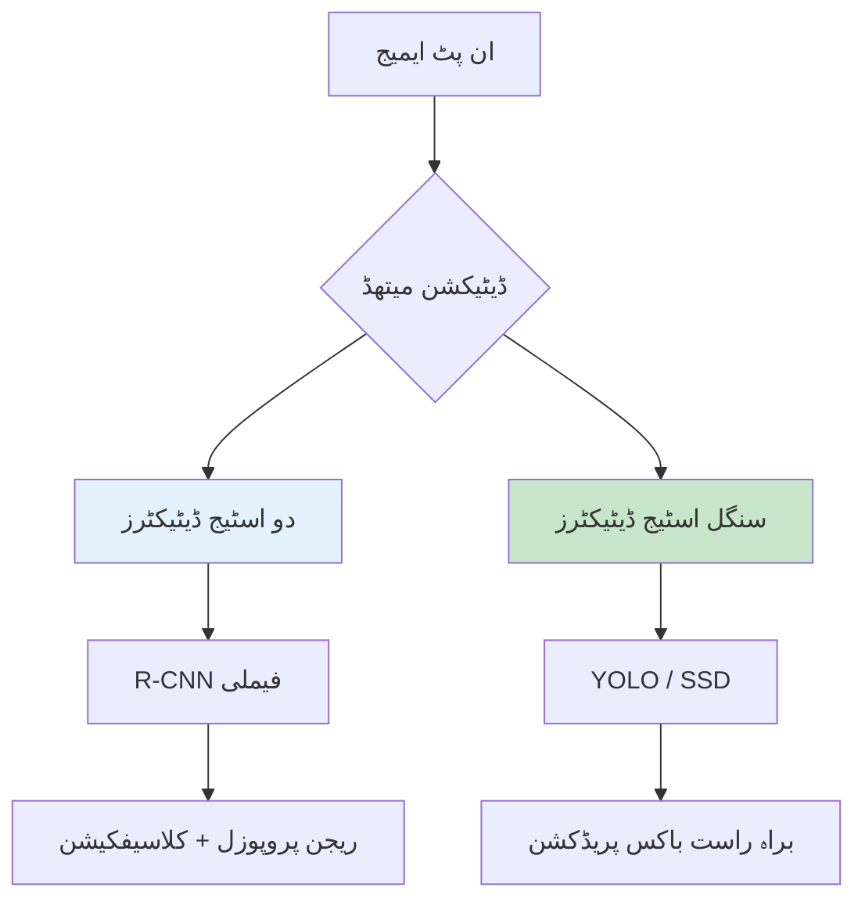
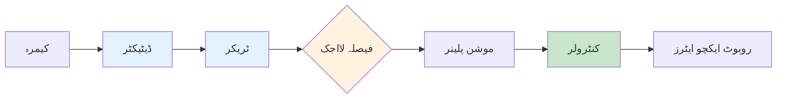

import Tabs from '@theme/Tabs';
import TabItem from '@theme/TabItem';
import QuizComponent from '@site/src/components/QuizComponent';

# لیسنس 3: ادراک پائپ لائنز

## سیکھنے کے اہداف

اس لیسنس کے اختتام تک، آپ کے اہل ہوں گے:

1. **LO-01**: اوبجیکٹ ڈیٹیکشن کی بنیادیں اور عام معماریات سمجھیں
2. **LO-02**: ویڈیو فریم کے ذریعے اوبجیکٹ ٹریکنگ نافذ کریں
3. **LO-03**: روبوٹ کنٹرول سسٹم کے ساتھ ادراک آؤٹ پٹس کو منسلک کریں
4. **LO-04**: معیاری میٹرکس کا استعمال کرتے ہوئے ادراک کارکردگی کا جائزہ لیں

---

## 3.1 اوبجیکٹ ڈیٹیکشن بنیادیں

اوبجیکٹ ڈیٹیکشن **کیا** ایمیج میں اوبجیکٹس ہیں اور **کہاں** وہ مقام ہے کی شناخت کرتا ہے۔ یہ خام پکسلز کو سیمینٹک سمجھ میں تبدیل کرتا ہے جس پر روبوٹس کارروائی کر سکتے ہیں۔

### ڈیٹیکشن آؤٹ پٹ فارمیٹ

اوبجیکٹ ڈیٹیکٹرز **باؤنڈنگ باکسز** پیدا کرتے ہیں جن میں ہے:
- **کلاس لیبل**: اوبجیکٹ کیا ہے (شخص، کرسی، روبوٹ)
- **کانفیڈنس اسکور**: ڈیٹیکٹر کتنا یقین رکھتا ہے (0.0 سے 1.0)
- **باؤنڈنگ باکس**: مقام بطور (x، y، چوڑائی، اونچائی)

```python
# ڈیٹیکشن آؤٹ پٹ کی مثال
detection = {
    'class': 'person',
    'confidence': 0.95,
    'bbox': {
        'x': 120,      # ٹاپ-لیفٹ x
        'y': 80,       # ٹاپ-لیفٹ y
        'width': 100,
        'height': 200
    }
}
```

### ڈیٹیکشن کے طریقے



**دو اسٹیج ڈیٹیکٹرز** (R-CNN، Faster R-CNN):
- پہلے ریجنز پروپوز کریں، پھر کلاسیفائز کریں
- زیادہ درستی، سست رفتار
- درستی کے لیے بہتر ایپلیکیشنز

**سنگل اسٹیج ڈیٹیکٹرز** (YOLO، SSD):
- ایمیج سے براہ راست پریڈکشن
- کم لیٹنسی، ریل ٹائم قابل
- روبوٹکس ایپلیکیشنز کے لیے بہتر

---

## 3.2 YOLO اور CNN انضمام

**YOLO** (You Only Look Once) روبوٹکس کے لیے سب سے مقبول ڈیٹیکٹر ہے اس کی رفتار اور درستی کے توازن کی وجہ سے۔ جدید ورژن (YOLOv5، YOLOv8) ایمبیڈڈ ہارڈ ویئر پر ریل ٹائم کارکردگی حاصل کرتے ہیں۔

### YOLO معماری کا جائزہ

YOLO ایمیج کو گرڈ میں تقسیم کرتا ہے اور ہر سیل کے لیے باکسز کی پیش گوئی کرتا ہے:

1. ایمیج CNN بیک بون سے گزرتا ہے
2. متعدد اسکیلز پر فیچر میپس پیدا ہوتے ہیں
3. ڈیٹیکشن ہیڈز باکسز + کلاسز کی پیش گوئی کرتے ہیں
4. نان-میکسیم سپریشن ڈوپلیکیٹس ہٹاتا ہے

### ROS 2 میں YOLO کا استعمال

```python
import rclpy
from rclpy.node import Node
from sensor_msgs.msg import Image
from vision_msgs.msg import Detection2DArray, Detection2D
from cv_bridge import CvBridge
import cv2
import numpy as np

class ObjectDetector(Node):
    def __init__(self):
        super().__init__('object_detector')
        self.bridge = CvBridge()

        # YOLO ماڈل لوڈ کریں (OpenCV DNN کا استعمال کرتے ہوئے)
        self.net = cv2.dnn.readNetFromONNX('yolov5s.onnx')
        self.classes = self.load_classes('coco.names')

        self.subscription = self.create_subscription(
            Image, '/camera/image_raw',
            self.detect_callback, 10)

        self.detection_pub = self.create_publisher(
            Detection2DArray, '/detections', 10)

    def detect_callback(self, msg):
        # OpenCV میں تبدیل کریں
        frame = self.bridge.imgmsg_to_cv2(msg, 'bgr8')

        # YOLO کے لیے پری پروسیس
        blob = cv2.dnn.blobFromImage(
            frame, 1/255.0, (640, 640),
            swapRB=True, crop=False)

        # انفرینس چلائیں
        self.net.setInput(blob)
        outputs = self.net.forward()

        # ڈیٹیکشنز کو پوسٹ-پروسیس کریں
        detections = self.process_outputs(
            outputs, frame.shape[:2])

        # ROS میسج کے طور پر پبلش کریں
        det_array = self.create_detection_msg(
            detections, msg.header)
        self.detection_pub.publish(det_array)

    def load_classes(self, filename):
        with open(filename, 'r') as f:
            return [line.strip() for line in f]
```

### ڈیٹیکشن میسج فارمیٹ

ROS 2 ڈیٹیکشن نتائج کے لیے `vision_msgs` استعمال کرتا ہے:

```yaml
# vision_msgs/msg/Detection2D
std_msgs/Header header
ObjectHypothesisWithPose[] results  # کلاس + کانفیڈنس
BoundingBox2D bbox                   # مقام
```

---

## 3.3 وقت کے ساتھ اوبجیکٹ ٹریکنگ

صرف ڈیٹیکشن فریم کو آزادانہ طور پر سمجھتا ہے۔ **ٹریکنگ** فریم کے ذریعے اوبجیکٹ شناخت کو برقرار رکھتا ہے، اس کو فعال کرتا ہے:
- موشن پریڈکشن
- ٹریجکٹری اینالیسز
- کنٹرول کے لیے مستحکم اوبجیکٹ حوالہ جات

### ڈیٹیکشن کے ذریعے سادہ ٹریکنگ

بنیادی طریقہ: اوور لیپ یا فاصلہ کا استعمال کرتے ہوئے فریم کے درمیان ڈیٹیکشنز کو میچ کریں۔

```python
import numpy as np
from collections import defaultdict

class SimpleTracker:
    def __init__(self, max_distance=50):
        self.tracks = {}  # track_id -> last_bbox
        self.next_id = 0
        self.max_distance = max_distance

    def update(self, detections):
        """ڈیٹیکشنز کو موجودہ ٹریکس سے میچ کریں۔"
        if not self.tracks:
            # پہلی ڈیٹیکشنز سے ٹریکس شروع کریں
            for det in detections:
                self.tracks[self.next_id] = det['bbox']
                det['track_id'] = self.next_id
                self.next_id += 1
            return detections

        # ٹریکس اور ڈیٹیکشنز کے درمیان فاصلے کا حساب لگائیں
        matched = []
        unmatched_dets = list(range(len(detections)))

        for track_id, track_bbox in self.tracks.items():
            best_match = None
            best_dist = self.max_distance

            for i in unmatched_dets:
                dist = self.bbox_distance(
                    track_bbox, detections[i]['bbox'])
                if dist < best_dist:
                    best_dist = dist
                    best_match = i

            if best_match is not None:
                matched.append((track_id, best_match))
                unmatched_dets.remove(best_match)

        # میچ کردہ ٹریکس کو اپ ڈیٹ کریں
        for track_id, det_idx in matched:
            self.tracks[track_id] = detections[det_idx]['bbox']
            detections[det_idx]['track_id'] = track_id

        # غیر میچ ڈیٹیکشنز کے لیے نئے ٹریکس بنائیں
        for det_idx in unmatched_dets:
            self.tracks[self.next_id] = detections[det_idx]['bbox']
            detections[det_idx]['track_id'] = self.next_id
            self.next_id += 1

        return detections

    def bbox_distance(self, bbox1, bbox2):
        """سینٹر سے سینٹر کا فاصلہ کا حساب لگائیں۔"
        c1 = (bbox1['x'] + bbox1['width']/2,
              bbox1['y'] + bbox1['height']/2)
        c2 = (bbox2['x'] + bbox2['width']/2,
              bbox2['y'] + bbox2['height']/2)
        return np.sqrt((c1[0]-c2[0])**2 + (c1[1]-c2[1])**2)
```

### اعلی درجے کی ٹریکنگ: کلمن فلٹر

موشن پریڈکشن کے ساتھ مضبوط ٹریکنگ کے لیے:

```python
import cv2

class KalmanTracker:
    def __init__(self):
        # اسٹیٹ: [x, y, vx, vy]
        self.kf = cv2.KalmanFilter(4, 2)

        # ٹرانزیشن میٹرکس (کن سٹنٹ ویلوسٹی ماڈل)
        self.kf.transitionMatrix = np.array([
            [1, 0, 1, 0],
            [0, 1, 0, 1],
            [0, 0, 1, 0],
            [0, 0, 0, 1]
        ], dtype=np.float32)

        # میزرمینٹ میٹرکس
        self.kf.measurementMatrix = np.array([
            [1, 0, 0, 0],
            [0, 1, 0, 0]
        ], dtype=np.float32)

    def predict(self):
        """اگلا مقام پریڈکٹ کریں۔"
        prediction = self.kf.predict()
        return prediction[0], prediction[1]

    def update(self, x, y):
        """میزرمینٹ کے ساتھ اپ ڈیٹ کریں۔"
        measurement = np.array([[x], [y]], dtype=np.float32)
        self.kf.correct(measurement)
```

---

## 3.4 ادراک سے ایکشن پائپ لائن

ادراک کو روبوٹ کنٹرول سے منسلک ہونا چاہئے تاکہ یہ مفید ہو سکے۔ یہ سیکشن ادراک آؤٹ پٹس اور روبوٹ ایکشنز کے درمیان انٹرفیس کو احاطہ کرتا ہے۔

### ادراک-کنٹرول انٹرفیس



### ٹارگٹ فالو نوڈ

ایک مثال نوڈ جو ڈیٹیکٹڈ شخص کو فالو کرتا ہے:

```python
import rclpy
from rclpy.node import Node
from vision_msgs.msg import Detection2DArray
from geometry_msgs.msg import Twist

class TargetFollower(Node):
    def __init__(self):
        super().__init__('target_follower')

        # ایمیج ابعاد
        self.image_width = 640
        self.image_center = self.image_width / 2

        # کنٹرول گینز
        self.angular_gain = 0.005
        self.linear_gain = 0.002

        self.det_sub = self.create_subscription(
            Detection2DArray, '/detections',
            self.detection_callback, 10)

        self.cmd_pub = self.create_publisher(
            Twist, '/cmd_vel', 10)

    def detection_callback(self, msg):
        # شخص ڈیٹیکشن تلاش کریں
        target = None
        for det in msg.detections:
            if det.results[0].hypothesis.class_id == 'person':
                if (target is None or
                    det.results[0].hypothesis.score >
                    target.results[0].hypothesis.score):
                    target = det

        cmd = Twist()

        if target is not None:
            # مقام کی خرابی کا حساب لگائیں
            bbox = target.bbox
            target_x = bbox.center.position.x
            target_area = bbox.size_x * bbox.size_y

            # اینگولر: ٹارگٹ کی طرف گھومیں
            x_error = target_x - self.image_center
            cmd.angular.z = -self.angular_gain * x_error

            # لینیئر: فاصلہ برقرار رکھیں (بذریعہ bbox ایریا)
            desired_area = 30000  # ٹارگٹ bbox ایریا
            area_error = desired_area - target_area
            cmd.linear.x = self.linear_gain * area_error
            cmd.linear.x = max(-0.5, min(0.5, cmd.linear.x))

        self.cmd_pub.publish(cmd)
```

---

## 3.5 کارکردگی اور درستی کے معیار

ادراک سسٹم کا جائزہ لینے کے لیے معیاری میٹرکس کی ضرورت ہوتی ہے تاکہ طریقے کو موازنہ کیا جا سکے اور بہتری کو ٹریک کیا جا سکے۔

### ڈیٹیکشن میٹرکس

**انٹرسیکشن اوور یونین (IoU)**:

IoU = اوور لیپ کا ایریا / یونین کا ایریا

اگر IoU گراؤنڈ ٹروتھ سے تھریشولڈ (عام طور پر 0.5) سے زیادہ ہے تو ڈیٹیکشن درست سمجھا جاتا ہے۔

**پریسیژن اور ریکال**:
- **پریسیژن**: تمام ڈیٹیکشنز میں سے کتنے درست ہیں؟
- **ریکال**: تمام گراؤنڈ ٹروتھ اوبجیکٹس میں سے کتنے ڈیٹیکٹ کیے گئے؟

**مین ایوریج پریسیژن (mAP)**:
- تمام کلاسز کے ذریعے ایوریج پریسیژن
- معیاری بینچ مارک میٹرک (مثلاً، COCO mAP)

```python
def calculate_iou(box1, box2):
    """دو باکسز کے درمیان IoU کا حساب لگائیں۔"
    # باکس فارمیٹ: [x, y, چوڑائی, اونچائی]
    x1 = max(box1[0], box2[0])
    y1 = max(box1[1], box2[1])
    x2 = min(box1[0]+box1[2], box2[0]+box2[2])
    y2 = min(box1[1]+box1[3], box2[1]+box2[3])

    intersection = max(0, x2-x1) * max(0, y2-y1)
    area1 = box1[2] * box1[3]
    area2 = box2[2] * box2[3]
    union = area1 + area2 - intersection

    return intersection / union if union > 0 else 0

def evaluate_detections(detections, ground_truth, iou_threshold=0.5):
    """پریسیژن اور ریکال کا حساب لگائیں۔"
    true_positives = 0
    false_positives = 0

    for det in detections:
        matched = False
        for gt in ground_truth:
            if calculate_iou(det, gt) >= iou_threshold:
                matched = True
                break
        if matched:
            true_positives += 1
        else:
            false_positives += 1

    precision = true_positives / (true_positives + false_positives)
    recall = true_positives / len(ground_truth)

    return precision, recall
```

### ٹریکنگ میٹرکس

**MOTA** (ملٹی اوبجیکٹ ٹریکنگ ایکریسی):
- جھوٹے مثبت، جھوٹے منفی، ID سوئچز کو جوڑتا ہے
- معیاری ٹریکنگ بینچ مارک

**ID سوئچز**:
- ٹریک کی شناخت تبدیل ہونے کی تعداد
- کم بہتر ہے

---

## خلاصہ

اس لیسنس میں، آپ نے سیکھا:

- **اوبجیکٹ ڈیٹیکشن** ایمیج میں اوبجیکٹس کی شناخت اور مقام کرتا ہے
- **YOLO** روبوٹکس کے لیے مناسب ریل ٹائم ڈیٹیکشن فراہم کرتا ہے
- **ٹریکنگ** ویڈیو فریم کے ذریعے اوبجیکٹ شناخت برقرار رکھتا ہے
- **ادراک-سے-ایکشن** انٹرفیسز وژن کو روبوٹ کنٹرول سے جوڑتے ہیں
- **میٹرکس** جیسے IoU اور mAP سسٹم کارکردگی کا جائزہ لیتے ہیں

### کلیدی نکات

1. ریل ٹائم روبوٹکس کے لیے سنگل اسٹیج ڈیٹیکٹرز (YOLO) منتخب کریں
2. ٹریکنگ کنٹرول کے لیے ضروری ٹیمپورل کنسسٹنسی جوڑتا ہے
3. باؤنڈنگ باکس فیڈ بیک کے ساتھ سادہ ویژول سروو بنایا جا سکتا ہے
4. ہمیشہ ڈیپلائمنٹ سے پہلے معیاری میٹرکس کے ساتھ جائزہ لیں

---

## ماڈیول 3 جائزہ کوئز

ادراک اور سینسرز کے تصورات کی آپ کی سمجھ کو ٹیسٹ کریں:

<QuizComponent questions={[
  {
    question: "روبوٹکس ادراک کے لیے LiDAR کا بنیادی فائدہ کیا ہے؟",
    options: [
      "کم قیمت",
      "لائٹنگ کے بارے میں براہ راست ڈیپتھ پیمائش",
      "زیادہ ریزولوشن ایمیجز",
      "رنگ کی معلومات"
    ],
    correctIndex: 1,
    explanation: "LiDAR ٹائم آف فلائٹ کا استعمال کرتے ہوئے براہ راست فاصلہ ناپتا ہے، مکمل اندھیرے یا زبردست دھوپ میں کام کرتا ہے جہاں کیمرے ناکام ہو سکتے ہیں۔"
  },
  {
    question: "ROS 2 میں cv_bridge کیا کرتا ہے؟",
    options: [
      "WiFi کو Ethernet سے جوڑتا ہے",
      "ROS ایمیج میسجز اور OpenCV ارےز کے درمیان تبدیل کرتا ہے",
      "ویڈیو سٹریمز کو کمپریس کرتا ہے",
      "کیمرے کیلیبریٹ کرتا ہے"
    ],
    correctIndex: 1,
    explanation: "cv_bridge sensor_msgs/Image اور OpenCV پروسیسنگ کے لیے numpy ارےز کے درمیان دو طرفہ تبدیلی فراہم کرتا ہے۔"
  },
  {
    question: "روبوٹکس کے لیے سینسر فیوژن کیوں اہم ہے؟",
    options: [
      "یہ سینسرز کی تعداد کم کرتا ہے",
      "یہ ریڈونڈنسی فراہم کرتا ہے اور سینسر کی کمزوریوں کو مکمل کرتا ہے",
      "یہ کیلیبریشن کی ضرورت ختم کر دیتا ہے",
      "یہ سافٹ ویئر معماری کو آسان بنا دیتا ہے"
    ],
    correctIndex: 1,
    explanation: "سینسر فیوژن متعدد سینسرز کو جوڑ کر ریڈونڈنسی (بیک اپ) اور کمپلیمنٹریٹی (ایک سینسر دوسرے کی کمزوریوں کو ڈھکتا ہے) فراہم کرتا ہے۔"
  },
  {
    question: "message_filters ApproximateTimeSynchronizer کا مقصد کیا ہے؟",
    options: [
      "بینڈ وڈتھ بچانے کے لیے میسجز کمپریس کریں",
      "ٹائم اسٹیمپ کے ذریعے مختلف سینسرز سے میسجز کو ہم وقت کریں",
      "غلط میسجز کو فلٹر کریں",
      "میسج پروسیسنگ کو تیز کریں"
    ],
    correctIndex: 1,
    explanation: "ApproximateTimeSynchronizer متعدد ٹاپکس سے میسجز کو ان کے ٹائم اسٹیمپ کی بنیاد پر الائن کرتا ہے، جو سینسر فیوژن کے لیے ضروری ہے۔"
  },
  {
    question: "رنگ پر مبنی اوبجیکٹ فلٹرنگ کے لیے کون سا کلر سپیس بہترین ہے؟",
    options: [
      "RGB",
      "BGR",
      "HSV",
      "گرے سکیل"
    ],
    correctIndex: 2,
    explanation: "HSV (ہیو، سیچوریشن، ویلیو) رنگ کی معلومات کو چمک سے الگ کرتا ہے، جو رنگ فلٹرنگ کو لائٹنگ تبدیلیوں کے لیے مزید مضبوط بنا دیتا ہے۔"
  },
  {
    question: "اوبجیکٹ ڈیٹیکشن میں IoU کیا ناپتا ہے؟",
    options: [
      "ان پٹ/آؤٹ پٹ استعمال",
      "پریڈکٹڈ اور گراؤنڈ ٹروتھ باکسز کے درمیان اوور لیپ",
      "ایمیج کوالٹی",
      "انفرینس رفتار"
    ],
    correctIndex: 1,
    explanation: "انٹرسیکشن اوور یونین (IoU) یہ ناپتا ہے کہ ایک پریڈکٹڈ باؤنڈنگ باکس گراؤنڈ ٹروتھ سے کتنی اچھی طرح میچ کرتا ہے، جو اوور لیپ ایریا کو یونین ایریا سے تقسیم کر کے حساب لگایا جاتا ہے۔"
  },
  {
    question: "YOLO جیسے سنگل اسٹیج ڈیٹیکٹرز دو اسٹیج ڈیٹیکٹرز سے تیز کیوں چلتے ہیں؟",
    options: [
      "وہ سادہ نیورل نیٹ ورکس استعمال کرتے ہیں",
      "وہ ریجن پروپوزل کے بغیر براہ راست باکسز پریڈکٹ کرتے ہیں",
      "وہ کم ریزولوشن ایمیجز پروسیس کرتے ہیں",
      "وہ کلاسیفکیشن چھوڑ دیتے ہیں"
    ],
    correctIndex: 1,
    explanation: "سنگل اسٹیج ڈیٹیکٹرز باؤنڈنگ باکسز اور کلاسز کو ایک پاس میں پریڈکٹ کرتے ہیں، جبکہ دو اسٹیج ڈیٹیکٹرز پہلے ریجنز پروپوز کرتے ہیں پھر انہیں کلاسیفائز کرتے ہیں۔"
  },
  {
    question: "ادراک پائپ لائن میں اوبجیکٹ ٹریکنگ کا مقصد کیا ہے؟",
    options: [
      "مزید اوبجیکٹس ڈیٹیکٹ کرنا",
      "ویڈیو فریم کے ذریعے اوبجیکٹ شناخت برقرار رکھنا",
      "ڈیٹیکشن درستی میں بہتری لانا",
      "کمپیوٹیشنل لوڈ کم کرنا"
    ],
    correctIndex: 1,
    explanation: "ٹریکنگ فریم کے ذریعے مسلسل اوبجیکٹ آئی ڈیز برقرار رکھتا ہے، جو موشن اینالیسز اور روبوٹ کنٹرول کے لیے مستحکم حوالہ جات کو فعال کرتا ہے۔"
  },
  {
    question: "ہیومنوڈ روبوٹ کے توازن کی پیمائش کے لیے آپ کون سا سینسر چنیں گے؟",
    options: [
      "کیمرہ",
      "LiDAR",
      "IMU",
      "ڈیپتھ کیمرہ"
    ],
    correctIndex: 2,
    explanation: "IMU (انیشل میزورمینٹ یونٹ) توازن کنٹرول کے لیے ضروری زیادہ فریکوینسی ایکسلریشن اور اینگولر ویلوسٹی ڈیٹا فراہم کرتا ہے۔"
  },
  {
    question: "کیمرہ کیلیبریشن کس چیز کے لیے درست کرتا ہے؟",
    options: [
      "رنگ کی درستی",
      "لینس ڈسٹورشن اور پیمائش کی درستی",
      "فریم ریٹ",
      "فوکس کی رفتار"
    ],
    correctIndex: 1,
    explanation: "کیمرہ کیلیبریشن انٹرنسک پیرامیٹرز (فوکل لمبائی، ڈسٹورشن) کا تعین کرتا ہے جو لینس ڈسٹورشن کو درست کرنے اور درست 3D پیمائش کے قابل بنانے کے لیے ضروری ہیں۔"
  },
  {
    question: "ROS 2 میں ڈیپتھ ایمیجز کا عام انکوڈنگ کیا ہے؟",
    options: [
      "bgr8",
      "rgb8",
      "32FC1 یا 16UC1",
      "mono8"
    ],
    correctIndex: 2,
    explanation: "ڈیپتھ ایمیجز فی پکسل فاصلہ ویلیوز کی نمائندگی کے لیے 32FC1 (32-بٹ فلوٹ، میٹر) یا 16UC1 (16-بٹ نامزد، ملی میٹر) استعمال کرتے ہیں۔"
  },
  {
    question: "ویژول سروو میں، روبوٹ عام طور پر کس چیز کو فالو کرتا ہے؟",
    options: [
      "GPS کوآرڈینیٹس",
      "ویژول فیچرز جیسے باؤنڈنگ باکس کا مقام",
      "ساؤنڈ سگنلز",
      "ٹیمپریچر گریڈینٹس"
    ],
    correctIndex: 1,
    explanation: "ویژول سروو ایمیج فیچرز (جیسے باؤنڈنگ باکس سینٹر مقام) کو فیڈ بیک کے طور پر استعمال کرتا ہے تاکہ ٹارگٹس کی طرف یا ان کے گرد روبوٹ موشن کنٹرول کیا جا سکے۔"
  }
]} />

---

## اگلا کیا ہے

ماڈیول 3 مکمل کرنے پر مبارکباد! آپ کے پاس اب ادراک سسٹم بنانے کے لیے بنیاد ہے۔

**ماڈیول 4: موشن پلاننگ اور کنٹرول** میں، آپ سیکھیں گے:
- راستہ پلاننگ الگورتھم
- مینوپولیٹرز کے لیے موشن کنٹرول
- نیویگیشن سٹیک انضمام

---

## حوالہ جات

اس لیسنس کے لیے حوالہ جات [حوالہ جات](/docs/appendix/references) سیکشن میں ماڈیول 3 کے تحت دستیاب ہیں۔