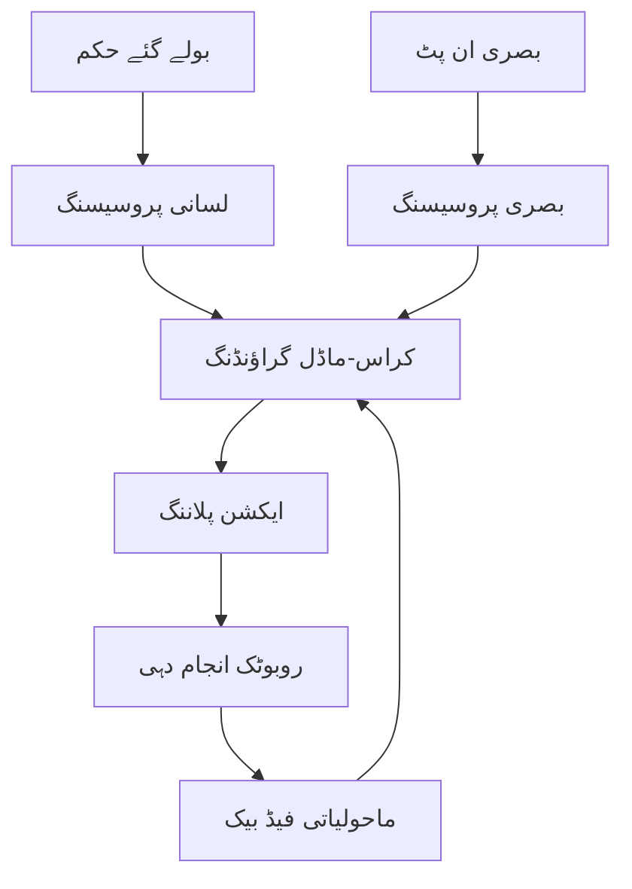
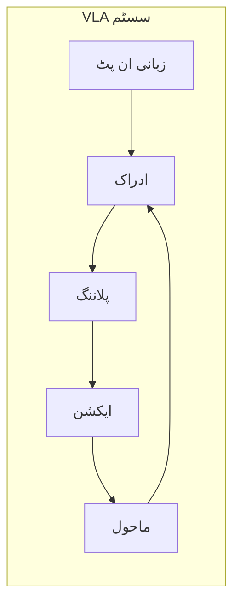

# وژن-لینگویج-ایکشن (VLA) پیراڈائم کا تعارف

## سیکھنے کے اہداف

اس لیسنس کے اختتام تک، آپ کے اہل ہوں گے:
- وژن-لینگویج-ایکشن (VLA) پیراڈائم اور فزکل AI میں اس کی اہمیت کی وضاحت کرنا
- یہ وضاحت کرنا کہ VLA سسٹم وژن، لینگویج، اور ایکشن کمپوننٹس کو کیسے انضمام کرتے ہیں
- روبوٹکس میں VLA سسٹم کے حقیقی دنیا کے اطلاقیے شناخت کرنا
- ملٹی ماڈل AI اور امبدڈ کوگنیشن کے درمیان تعلق کو سمجھنا

## 1.1 VLA کیا ہے؟

وژن-لینگویج-ایکشن (VLA) پیراڈائم فزکل AI میں ایک بڑی تبدیلی کی نمائندگی کرتا ہے جہاں روبوٹس قدرتی زبان کے حکم، وژن کے ذریعے اپنے ماحول کو ادراک کر سکتے ہیں، اور مناسب ایکشنز انجام دے سکتے ہیں۔ یہ ملٹی ماڈل انضمام روبوٹس کو انسانی ماحول میں بے مثال لچک اور انٹیلی جنس کے ساتھ کام کرنے کے قابل بناتا ہے۔

روایتی روبوٹکس سسٹم اکثر علیحدگی میں کام کرتے ہیں، ادراک، پلاننگ، اور انجام دہی کے لیے الگ الگ ماڈیولز کے ساتھ۔ اس کے برعکس، VLA سسٹم ایک متحدہ فریم ورک تخلیق کرتے ہیں جہاں یہ اجزاء ایک دوسرے کے ساتھ مربوط طور پر کام کرتے ہیں۔ جب ایک انسان کہتا ہے "براہ کرم میز سے لال کپ لے کر دیں،" ایک VLA سسٹم کو:

1. **سمجھنا** زبان کے حکم کو لسانی طور پر
2. **ادراک** ماحول کو لال کپ کو تلاش کرنے کے لیے
3. **پلان** ایک ایکشن کی ترتیب کو پہنچنے اور کپ کو تھامنے کے لیے
4. **انجام دینا** منصوبے کو روبوٹک ایکچو ایٹرز کا استعمال کرتے ہوئے

یہ مربوطہ نقطہ نظر انسانی کوگنیشن کو عکاس کرتا ہے، جہاں ادراک، زبان، اور ایکشن گہرائی سے جڑے ہوتے ہیں۔ VLA پیراڈائم روبوٹس کو غیر منظم ماحول میں قدرتی انسانی بات چیت کے ساتھ کام کرنے کے قابل بناتا ہے۔

## 1.2 ملٹی ماڈل AI اصول

ملٹی ماڈل AI سسٹم ایک وقت میں متعدد حسی چینلز سے معلومات کو پروسیس کرتے ہیں۔ VLA سسٹم میں، یہ چینلز شامل ہیں:

- **بصری ان پٹ**: کیمرہ فیڈز، ڈیپتھ سینسرز، LiDAR ڈیٹا
- **لسانی ان پٹ**: بولے گئے حکم، لکھے ہوئے ہدایات
- **ایکشن آؤٹ پٹ**: موٹر کمانڈز، روبوٹک حرکات

اہم اصول **کراس-ماڈل گراؤنڈنگ** ہے - مختلف ماڈلز میں تصورات کو جوڑنے کی صلاحیت۔ مثال کے طور پر، جب ایک VLA سسٹم "لال گیند" سنتا ہے، تو اسے لسانی تصور "لال" اور "گیند" کو ماحول میں بصری خصوصیات سے جوڑنا چاہئے۔

```python
# مثال: VLA سسٹم میں کراس-ماڈل گراؤنڈنگ
class CrossModalGrounding:
    def __init__(self):
        self.vision_model = VisionModel()
        self.language_model = LanguageModel()

    def ground_command(self, command, visual_input):
        # لسانی حکم کو پارس کریں
        linguistic_features = self.language_model.parse(command)

        # بصری خصوصیات نکالیں
        visual_features = self.vision_model.analyze(visual_input)

        # لسانی تصورات کو بصری اداروں سے میچ کریں
        grounded_entities = self.match_features(
            linguistic_features,
            visual_features
        )

        return grounded_entities
```

## 1.3 VLA سسٹم میں امبدڈ کوگنیشن

امبدڈ کوگنیشن تجویز کرتا ہے کہ انٹیلی جنس ایک ایجنٹ اور اس کے ماحول کے درمیان بات چیت سے نکلتی ہے۔ VLA سسٹم یہ اصول اس طرح عمل میں لاتے ہیں:

- ادراک کو بہتر بنانے کے لیے ماحولیاتی فیڈ بیک کا استعمال کرنا
- جسمانی پابندیوں کی بنیاد پر رویہ کو ایڈجسٹ کرنا
- دنیا کے ساتھ بات چیت کے ذریعے سیکھنا

VLA سسٹم میں، روبوٹ کی جسمانی شکل اور سینسریموٹر صلاحیات براہ راست اس کے کوگنیٹو عمل کو متاثر کرتی ہیں۔ یہ روایتی AI سے مختلف ہے جو م abstract ڈیٹا پر کام کرتا ہے، کیونکہ VLA سسٹم کو حقیقی دنیا کی فزکس، جگہ کے تعلقات، اور وقت کی پابندیوں کا احتساب کرنا چاہئے۔

## 1.4 حقیقی دنیا کے VLA اطلاقیے

VLA سسٹم مختلف شعبوں کو تبدیل کر رہے ہیں:

- **مددگار روبوٹکس**: روزمرہ کے کاموں میں بوڑھے یا معذور افراد کی مدد کرنا
- **صنعتی آٹومیشن**: انسان-روبوٹ تعاون کے ساتھ لچکدار تیاری
- **سروس روبوٹکس**: کسٹمر سروس، صفائی، اور مہمان نوازی کے اطلاقیے
- **تلاش اور بچاؤ**: خودکار سسٹم جو آفت کے منظرناموں میں پیچیدہ حکم کو سمجھتے اور انجام دیتے ہیں

موجودہ تحقیق مضبوطی میں بہتری، غیر واضح حکم کو سنبھالنے، اور متنوع ماحول اور کاموں تک پھیلنے پر توجہ مرکز رکھتی ہے۔

## خلاصہ

VLA پیراڈائم فزکل AI میں ایک اہم پیشرفت کی نمائندگی کرتا ہے، جو روبوٹس کو قدرتی زبان کے حکم کو سمجھنے اور ادراک اور ایکشن سسٹم کے ذریعے انجام دینے کے قابل بناتا ہے۔ یہ نقطہ نظر ہمیں واقعی خودمختار روبوٹس کے قریب لاتا ہے جو روزمرہ کے ماحول میں انسانوں کے ساتھ قدرتی طور پر بات چیت کر سکتے ہیں۔

اگلی لیسنس میں، ہم VLA سسٹم کے مخصوص اجزاء کو تلاش کریں گے اور دیکھیں گے کہ وہ مکمل پائپ لائنز تشکیل دینے کے لیے کیسے انضمام کرتے ہیں۔

## کلیدی اصطلاحات

- **وژن-لینگویج-ایکشن (VLA)**: وژن، زبان، اور روبوٹک ایکشن کو جوڑنے والا مربوط سسٹم
- **ملٹی ماڈل AI**: ایک وقت میں متعدد حسی ان پٹس کو پروسیس کرنے والے سسٹم
- **کراس-ماڈل گراؤنڈنگ**: مختلف حسی ماڈلز کے درمیان تصورات کو جوڑنا
- **امبدڈ کوگنیشن**: ایجنٹ-ماحول کی بات چیت سے نکلنے والی انٹیلی جنس



