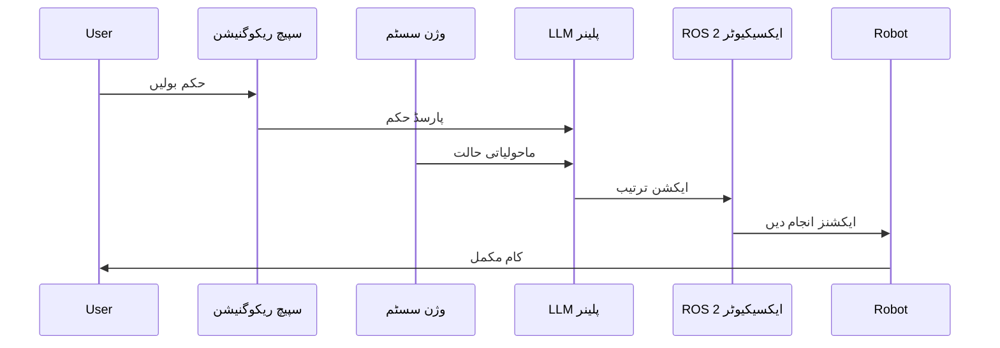
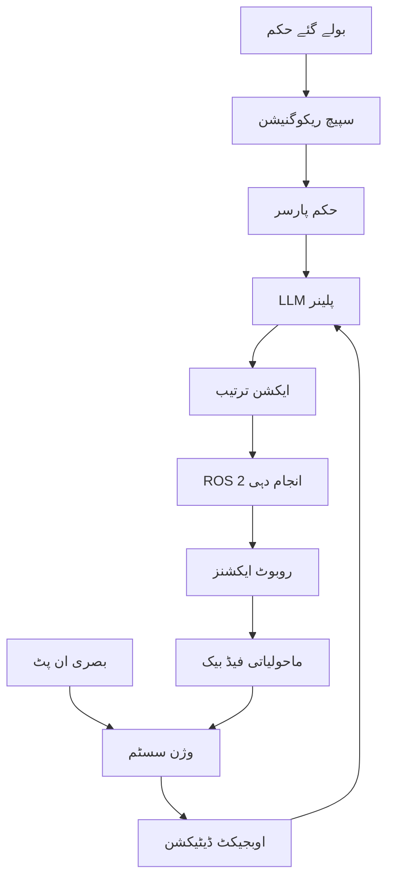

# VLA پائپ لائن اجزاء اور انضمام

## سیکھنے کے اہداف

اس لیسنس کے اختتام تک، آپ کے اہل ہوں گے:
- VLA پائپ لائن کے اہم اجزاء کی وضاحت کرنا
- یہ وضاحت کرنا کہ سپیچ ریکوگنیشن وژن اور ایکشن سسٹم کے ساتھ کیسے انضمام کرتا ہے
- VLA سسٹم میں LLM-بیسڈ کوگنیٹو پلاننگ کو سمجھنا
- مکمل VLA پائپ لائن کے ذریعے معلومات کے بہاؤ کی شناخت کرنا
- ROS 2 کا استعمال کرتے ہوئے بنیادی VLA پائپ لائن اجزاء نافذ کرنا

## 2.1 VLA بطور ملٹی ماڈل انضمام

VLA پائپ لائن متعدد AI اجزاء کا ایک ترقی یافتہ انضمام ہے جو ہم آہنگی سے کام کرتے ہیں۔ روایتی سسٹم کے برعکس جہاں اجزاء علیحدگی میں کام کرتے ہیں، VLA سسٹم کو وژن، زبان، اور ایکشن ماڈیولز کے درمیان سخت ہم آہنگی کی ضرورت ہوتی ہے۔

اہم بصیرت یہ ہے کہ ہر جزو دوسروں کی طرف سے فراہم کردہ معلومات سے فائدہ اٹھاتا ہے۔ بصری سیاق و سباق زبان کی سمجھ کو بہتر بناتا ہے، لسانی حکم بصری توجہ کی رہنمائی کرتے ہیں، اور دونوں ایکشن کے انتخاب کو مطلع کرتے ہیں۔ یہ ایک غنی، مربوطہ سسٹم تخلیق کرتا ہے جو پیچیدہ، حقیقی دنیا کے کاموں کو سنبھال سکتا ہے۔

## 2.2 سپیچ ریکوگنیشن اور حکم کا پارس

سپیچ ریکوگنیشن جزو بولے گئے حکم کو منظم متن میں تبدیل کرتا ہے جسے سسٹم پروسیس کر سکتا ہے۔ جدید نقطہ نظر OpenAI کے وہیسپر جیسے ٹرانسفارمر-بیسڈ ماڈلز کا استعمال کرتے ہیں، جو متنوع ایکوسٹک حالات میں زبردست درستی فراہم کرتے ہیں۔

```python
# مثال: سپیچ ریکوگنیشن اور حکم کا پارس
class SpeechRecognitionModule:
    def __init__(self):
        self.whisper_model = load_whisper_model()
        self.command_parser = CommandParser()

    def process_audio(self, audio_input):
        # آڈیو کو متن میں تبدیل کریں
        text = self.whisper_model.transcribe(audio_input)

        # حکم کی ساخت پارس کریں
        parsed_command = self.command_parser.parse(text)

        return parsed_command

class CommandParser:
    def parse(self, text_command):
        # ایکشن، اوبجیکٹ، اور مقام نکالیں
        action = self.extract_action(text_command)
        target_object = self.extract_object(text_command)
        location = self.extract_location(text_command)

        return {
            'action': action,
            'object': target_object,
            'location': location,
            'confidence': self.calculate_confidence(text_command)
        }
```

حکم کا پارسر غیر واضح حکم کو سنبھالنا چاہئے اور ممکنہ طور پر صارف سے وضاحت کی درخواست کرنا چاہئے۔ مثال کے طور پر، "گیند اٹھائیں" کو اضافی معلومات کی ضرورت ہو سکتی ہے کہ کون سی گیند اگر متعدد قابل دید ہوں۔

## 2.3 LLM-بیسڈ کوگنیٹو پلاننگ

بڑے زبانی ماڈلز (LLMs) VLA سسٹم میں کوگنیٹو پلاننگ جزو کے طور پر کام کرتے ہیں، بلند سطح کے حکم کو قابل انجام ایکشن ترتیب میں تبدیل کرتے ہیں۔ LLM کو حکم کو سمجھنا چاہئے، ماحولیاتی پابندیوں پر غور کرنا چاہئے، اور مخصوص روبوٹ ایکشنز کی ایک ترتیب تیار کرنا چاہئے۔

```python
# مثال: LLM-بیسڈ کوگنیٹو پلاننگ
class CognitivePlanner:
    def __init__(self, llm_model):
        self.llm = llm_model
        self.prompt_templates = PromptTemplates()

    def plan_sequence(self, command, environment_state):
        # حکم اور ماحولیاتی سیاق و سباق کے ساتھ پرامپٹ تخلیق کریں
        prompt = self.prompt_templates.create_planning_prompt(
            command=command,
            environment=environment_state
        )

        # ایکشن ترتیب تیار کریں
        action_sequence = self.llm.generate(prompt)

        # ایکشن ترتیب کو پارس اور تصدیق کریں
        validated_sequence = self.validate_actions(action_sequence)

        return validated_sequence

class PromptTemplates:
    def create_planning_prompt(self, command, environment):
        return f"""
        حکم کو مدنظر رکھتے ہوئے: "{command}"
        اور ماحولیاتی حالت: {environment}

        حکم کو پورا کرنے کے لیے روبوٹ ایکشنز کی ایک ترتیب تیار کریں۔
        ہر ایکشن مخصوص اور قابل انجام ہونا چاہئے۔
        JSON فارمیٹ میں ایکشن ترتیب لوٹائیں۔
        """
```

پلاننگ جزو کو ایکشن ترتیب تیار کرتے وقت روبوٹ کی صلاحیات، ماحولیاتی پابندیوں، اور سیفٹی کی ضروریات پر غور کرنا چاہئے۔

## 2.4 ROS 2 ایکشن انجام دہی

ایکشن انجام دہی جزو منصوبہ بندی شدہ ترتیب کو ROS 2 ایکشن انٹرفیسز کا استعمال کرتے ہوئے حقیقی روبوٹ حرکات میں تبدیل کرتا ہے۔ اس میں ایکشن سرورز کو مقاصد بھیجنا، پیشرفت کو مانیٹر کرنا، اور ناکامی یا غیر متوقع حالات کو سنبھالنا شامل ہے۔

```python
# مثال: ROS 2 ایکشن انجام دہی
import rclpy
from rclpy.action import ActionClient
from rcl_interfaces.action import FollowJointTrajectory

class ActionExecutor:
    def __init__(self, node):
        self.node = node
        self.action_client = ActionClient(
            node,
            FollowJointTrajectory,
            'joint_trajectory_controller/follow_joint_trajectory'
        )

    def execute_action(self, action_plan):
        for action in action_plan:
            # ایکشن مقصد بھیجیں
            goal = self.create_goal(action)
            future = self.action_client.send_goal_async(goal)

            # نتیجہ کے لیے ٹائم آؤٹ کے ساتھ انتظار کریں
            rclpy.spin_until_future_complete(self.node, future)

            if not future.result().accepted:
                # ایکشن کی رد کارروائی کریں
                return self.handle_failure(action)

        return True

    def create_goal(self, action):
        # ایکشن کو ROS 2 ٹریجکٹری مقصد میں تبدیل کریں
        pass
```

## 2.5 اوبجیکٹ-ویئر ایکشنز کے لیے وژن انضمام

وژن انضمام VLA سسٹم کو ماحول میں اوبجیکٹس کو ادراک اور تعامل کرنے کے قابل بناتا ہے۔ اس میں اوبجیکٹ ڈیٹیکشن، پوز اسٹیمیٹ، اور منظر کی سمجھ شامل ہے جو پلاننگ اور انجام دہی دونوں کے ادوار کو مطلع کرتا ہے۔

```python
# مثال: وژن انضمام
class VisionIntegration:
    def __init__(self):
        self.object_detector = ObjectDetector()
        self.pose_estimator = PoseEstimator()

    def analyze_environment(self):
        # ایمیج کیپچر کریں
        image = self.capture_image()

        # اوبجیکٹس ڈیٹیکٹ کریں
        objects = self.object_detector.detect(image)

        # پوزز کا تخمینہ لگائیں
        poses = self.pose_estimator.estimate(objects, image)

        # ماحولیاتی نمائندگی تخلیق کریں
        environment_state = {
            'objects': objects,
            'poses': poses,
            'relationships': self.compute_relationships(objects, poses)
        }

        return environment_state
```

## 2.6 VLA پائپ لائن بہاؤ

مکمل VLA پائپ لائن اس طرح بہتا ہے:

1. **ان پٹ**: سپیچ ریکوگنیشن ماڈیول کے ذریعے بولے گئے حکم کو وصول کیا گیا
2. **پارسنگ**: حکم کو منظم نمائندگی میں تبدیل کیا گیا
3. **ماحولیاتی تجزیہ**: وژن سسٹم موجودہ منظر کا تجزیہ کرتا ہے
4. **پلاننگ**: LLM حکم اور ماحول کی بنیاد پر ایکشن ترتیب تیار کرتا ہے
5. **انجام دہی**: ROS 2 انٹرفیسز ایکشن ترتیب کو انجام دیتے ہیں
6. **مانیٹرنگ**: سسٹم انجام دہی کو مانیٹر کرتا ہے اور فیڈ بیک فراہم کرتا ہے



## خلاصہ

VLA پائپ لائن انضمام کو سپیچ ریکوگنیشن، وژن پروسیسنگ، LLM پلاننگ، اور ROS 2 ایکسیکیوشن اجزاء کے درمیان احتیاط سے ہم آہنگی کی ضرورت ہوتی ہے۔ ہر جزو کو مناسب انٹرفیسز فراہم کرنا چاہئے اور ناکامیوں کو نرمی سے سنبھالنا چاہئے۔ VLA سسٹم کی کامیابی ان اجزاء کے درمیان معلومات کے بے رکاوٹ بہاؤ پر منحصر ہے۔

اگلی لیسنس میں، ہم مکمل سسٹم انضمام کو تلاش کریں گے اور مینی پروجیکٹس کے ساتھ اینڈ-ٹو-اینڈ VLA سسٹم نافذ کریں گے۔

## کلیدی اصطلاحات

- **VLA پائپ لائن**: وژن-زبان-ایکشن کاموں کو پروسیس کرنے کے لیے مربوط سسٹم
- **سپیچ ریکوگنیشن**: پروسیسنگ کے لیے آڈیو کو متن میں تبدیل کرنا
- **کوگنیٹو پلاننگ**: LLMs کا استعمال کرتے ہوئے بلند سطح کے کام کی تقسیم
- **ایکشن انجام دہی**: منصوبوں کو روبوٹ حرکات میں تبدیل کرنا
- **ملٹی ماڈل انضمام**: متعدد حسی چینلز سے معلومات کو جوڑنا

