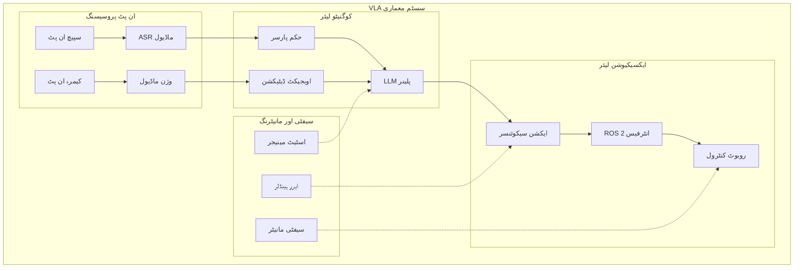

import QuizComponent from '@site/src/components/QuizComponent';

# اینڈ ٹو اینڈ VLA سسٹم اور مینی پروجیکٹس

## سیکھنے کے اہداف

اس لیسنس کے اختتام تک، آپ کے اہل ہوں گے:
- مکمل VLA سسٹم معماریوں کو ڈیزائن اور نافذ کرنا
- VLA سسٹم میں ریل ٹائم پروسیسنگ کی پابندیوں کو سنبھالنا
- سیفٹی اور خرابی کے انتظام کے میکنزم نافذ کرنا
- اینڈ ٹو اینڈ VLA اطلاقیے بنانا اور ڈیپلائی کرنا
- VLA سسٹم کارکردگی اور حدود کا جائزہ لینا

## 3.1 مکمل VLA سسٹم معماری

ایک مکمل VLA سسٹم تمام اجزاء کو ایک مضبوط، ریل ٹائم معماری میں انضمام کرتا ہے جو قدرتی زبان کے حکم کو پروسیس کرنے اور روبوٹک ایکشنز انجام دینے کے قابل ہے۔ معماری کو مندرجہ ذیل کو سنبھالنا چاہئے:

- ریل ٹائم کارکردگی کی ضروریات
- سیفٹی اور قابل اعتمادی کی پابندیاں
- خرابی کی بازیافت اور فیل بیک میکنزمز
- صارف کی بات چیت اور فیڈ بیک



مارچا معمول کے طور پر اسٹیٹ-بیسڈ نقطہ نظر کو فالو کرتا ہے جہاں سسٹم مختلف آپریشنل اسٹیٹس کے درمیان منتقل ہوتا ہے ان پٹس، ایکسیکیوشن کی حیثیت، اور ماحولیاتی حالات کی بنیاد پر۔

## 3.2 انضمام کی چیلنجز

مکمل VLA سسٹم بنانا کئی انضمام کی چیلنجز پیش کرتا ہے:

### ٹائمنگ اور ہم وقت سازی
مختلف اجزاء مختلف رفتار پر کام کرتے ہیں۔ وژن پروسیسنگ 100ms لے سکتی ہے، LLM کوائف 1-2 سیکنڈ، اور ایکشن انجام دہی متغیر وقت۔ سسٹم کو ان ٹائمنگ کے فرق کو مؤثر طریقے سے سنبھالنا چاہئے۔

### ڈیٹا کنسسٹنسی
VLA پروسیسنگ کے دوران ماحول تبدیل ہو جاتا ہے۔ 2 سیکنڈ پہلے کے منظر کی بنیاد پر تیار کردہ منصوبہ اس وقت غلط ہو سکتا ہے جب یہ انجام دیا جائے۔

### خرابی کا پھیلاؤ
ایک جزو میں خرابیاں (مثلاً، غلط سپیچ کی پہچان) پورے پائپ لائن میں پھیل سکتی ہیں، غلط ایکشنز کے نتیجے میں۔

```python
# مثال: VLA پائپ لائن آرکیسٹریٹر
class VLAPipelineOrchestrator:
    def __init__(self):
        self.speech_recognizer = SpeechRecognitionModule()
        self.vision_system = VisionIntegration()
        self.planner = CognitivePlanner()
        self.executor = ActionExecutor()
        self.safety_monitor = SafetyMonitor()

    def process_command(self, audio_input):
        # یقینی بنائیں کہ تمام اجزاء ہم وقت ہیں
        environment_state = self.vision_system.analyze_environment()
        command = self.speech_recognizer.process_audio(audio_input)

        # موجودہ حالت کے ساتھ پلان
        action_sequence = self.planner.plan_sequence(
            command, environment_state
        )

        # انجام دہی سے پہلے سیفٹی کی تصدیق کریں
        if self.safety_monitor.validate_action_sequence(action_sequence):
            return self.executor.execute_action(action_sequence)
        else:
            return self.handle_safety_violation(action_sequence)
```

## 3.3 ریل ٹائم پروسیسنگ کے خیالات

VLA سسٹم کو جواب دہ بات چیت فراہم کرنے کے لیے ریل ٹائم پابندیوں کو پورا کرنا چاہئے:

- **ادراک لیٹنسی**: وژن پروسیسنگ کو 100ms کے اندر رکھیں
- **پلاننگ لیٹنسی**: درستی برقرار رکھتے ہوئے LLM کوائف کو رفتار کے لیے آپٹیمائز کریں
- **ایکشن انجام دہی**: انجام دہی کے ٹائمنگ کو مانیٹر کریں اور اس کے مطابق ایڈجسٹ کریں
- **فیڈ بیک لوپ**: طویل کاموں کے دوران بیچ کا فیڈ بیک فراہم کریں

## 3.4 VLA سسٹم میں سیفٹی اور خرابی کا انتظام

انسانی ماحول میں کام کرنے والے VLA سسٹم میں سیفٹی انتہائی اہم ہے:

### سیفٹی مانیٹرنگ
- سیفٹی پابندیوں کے خلاف ایکشن پلانز کی جاری مانیٹرنگ
- کولیژن ایوائڈنس اور ورک سپیس کی حدود
- ایمرجنسی سٹاپ میکنزمز

### خرابی کا انتظام
- جب اجزاء ناکام ہوں تو نرمی سے کم کام کرنا
- غیر واضح حکم کے لیے صارف فیڈ بیک
- انجام دہی کی ناکامیوں سے بازیافت

```python
# مثال: سیفٹی مانیٹرنگ اور خرابی کا انتظام
class SafetyMonitor:
    def __init__(self):
        self.workspace_limits = self.load_workspace_limits()
        self.collision_checker = CollisionChecker()

    def validate_action_sequence(self, action_sequence):
        for action in action_sequence:
            if not self.is_safe(action):
                return False
        return True

    def is_safe(self, action):
        # ورک سپیس کی حدود چیک کریں
        if not self.is_in_workspace(action):
            return False

        # ممکنہ کولیژن کے لیے چیک کریں
        if self.collision_checker.would_collide(action):
            return False

        return True

class ErrorHandler:
    def handle_execution_error(self, error, current_state):
        if error.type == "EXECUTION_FAILED":
            return self.plan_alternative_action(error, current_state)
        elif error.type == "PERCEPTION_FAILED":
            return self.request_perception_retry(error)
        elif error.type == "PLANNING_FAILED":
            return self.request_command_clarification(error)
```

## 3.5 مینی پروجیکٹ کی تفصیل

اس سیکشن میں، ہم دو جامع مینی پروجیکٹس پر کام کریں گے جو مکمل VLA سسٹم نافذ کرتے ہیں:

### مینی پروجیکٹ 1: سادہ VLA سسٹم
ایک بنیادی VLA سسٹم تیار کریں جو کر سکے:
- سادہ بولے گئے حکم کی پہچان
- ماحول میں اوبجیکٹس کو ڈیٹیکٹ کرنا
- بنیادی مینوپولیشن کام انجام دینا
- عام خرابی کے کیسز کو سنبھالنا

### مینی پروجیکٹ 2: اعلی درجے کا VLA سسٹم
بنیادی سسٹم کو یوں بڑھائیں:
- اوبجیکٹ-ویئر حکم کی پروسیسنگ
- متعدد اسٹیپ ایکشن پلاننگ
- اعلی درجے کی سیفٹی مانیٹرنگ
- کارکردگی کی آپٹیمائزیشن

## خلاصہ

مکمل VLA سسٹم متعدد ترقی یافتہ AI اجزاء کو مربوط، محفوظ، اور مؤثر روبوٹک سسٹم میں انضمام کی نمائندگی کرتے ہیں۔ کامیابی کے لیے ریل ٹائم پابندیوں، سیفٹی کے خیالات، خرابی کے انتظام، اور سسٹم معماری پر احتیاط سے توجہ دینے کی ضرورت ہے۔ جیسے ہی یہ سسٹم پختہ ہوتے ہیں، وہ روزمرہ کے ماحول میں زیادہ قدرتی اور سمجھدار انسان-روبوٹ بات چیت کو فعال کریں گے۔

یہ ماڈیول 4 وژن-زبان-ایکشن سسٹم پر ختم ہوتا ہے۔ آپ کے پاس اب وژن، زبان، اور ایکشن کو فزکل AI اطلاقیوں میں مکمل VLA سسٹم ڈیزائن، نافذ، اور جائزہ لینے کا علم ہے۔

## کلیدی اصطلاحات

- **VLA سسٹم معماری**: وژن-زبان-ایکشن انضمام کے لیے مکمل سسٹم ڈیزائن
- **ریل ٹائم پروسیسنگ**: جواب دہ کارروائی کے لیے ٹائمنگ کی پابندیوں کو پورا کرنا
- **سیفٹی مانیٹرنگ**: سیفٹی تسلی کے لیے سسٹم ایکشنز کی جاری چیکنگ
- **خرابی کی بازیافت**: سسٹم ناکامیوں سے سنبھالنے اور بازیافت کے میکنزمز
- **اسٹیٹ مینجمنٹ**: مختلف آپریشنل موڈز کے ذریعے سسٹم اسٹیٹ کو ٹریک کرنا

## ماڈیول 4 جائزہ کوئز

وژن-زبان-ایکشن سسٹم کی آپ کی سمجھ کو ٹیسٹ کریں۔

<QuizComponent
  questions={[
    {
      question: "VLA سسٹم کے تین اہم اجزاء کیا ہیں؟",
      options: [
        "ڈیٹا بیس، سرور، کلائنٹ",
        "وژن، زبان، ایکشن",
        "ان پٹ، پروسیس، آؤٹ پٹ",
        "ہارڈ ویئر، سافٹ ویئر، نیٹ ورک"
      ],
      correctIndex: 1,
      explanation: "VLA سسٹم وژن (ماحول کا ادراک)، زبان (حکم کی سمجھ)، اور ایکشن (حرکات کا انجام) اجزاء کو انضمام کرتے ہیں۔"
    },
    {
      question: "VLA سسٹم میں انضمام کی اہم چیلنجز میں سے ایک کیا ہے؟",
      options: [
        "کمپوننٹس کے درمیان رنگ میچ کرنا",
        "مختلف پروسیسنگ کی رفتار کے درمیان ٹائمنگ اور ہم وقت سازی",
        "مطابق کیبلز تلاش کرنا",
        "ممالک کے درمیان زبان کا ترجمہ"
      ],
      correctIndex: 1,
      explanation: "VLA کے مختلف اجزاء مختلف رفتار پر کام کرتے ہیں - وژن 100ms لے سکتا ہے، LLM کوائف 1-2 سیکنڈ۔ ان ٹائمنگ کے فرق کا انتظام ایک کلیدی چیلنج ہے۔"
    },
    {
      question: "VLA سسٹم میں کراس-ماڈل گراؤنڈنگ کا مقصد کیا ہے؟",
      options: [
        "الیکٹریکل کمپوننٹس کو جوڑنا",
        "زبانی حوالہ جات کو منظر میں بصری اوبجیکٹس سے جوڑنا",
        "روبوٹ کو فرش سے منسلک کرنا",
        "نیٹ ورک کنکشن قائم کرنا"
      ],
      correctIndex: 1,
      explanation: "کراس-ماڈل گراؤنڈنگ زبانی حوالہ جات (مثلاً، 'لال کپ') کو بصری منظر میں ڈیٹیکٹ کردہ اوبجیکٹس سے جوڑتی ہے۔"
    },
    {
      question: "VLA سسٹم کے لیے سیفٹی کا کون سا خیال اہم ہے؟",
      options: [
        "صارف انٹرفیس کا رنگ سکیم",
        "ایمرجنسی سٹاپ میکنزمز اور کولیژن ایوائڈنس",
        "مارکیٹنگ بجٹ کا تعین",
        "ویب سائٹ ڈیزائن کے انتخاب"
      ],
      correctIndex: 1,
      explanation: "VLA سسٹم میں سیفٹی میں ایمرجنسی سٹاپس، کولیژن ایوائڈنس، ورک سپیس کی حدود، اور ایکشن سیفٹی کی جاری مانیٹرنگ شامل ہے۔"
    },
    {
      question: "امبدڈ کوگنیشن VLA سسٹم سے کیسے متعلق ہے؟",
      options: [
        "یہ روبوٹ کے جسمانی وزن کا حوالہ دیتا ہے",
        "انٹیلی جنس جسم، دماغ، اور ماحول کے درمیان بات چیت سے نکلتی ہے",
        "یہ کمپیوٹر کیس ڈیزائن کا تفصیل دیتا ہے",
        "یہ الیکٹریکل مزاحمت کو ناپتا ہے"
      ],
      correctIndex: 1,
      explanation: "امبدڈ کوگنیشن تجویز کرتا ہے کہ انٹیلی جنس صرف معلومات پروسیسنگ کے بارے نہیں ہے، بلکہ ایجنٹ کے جسم، دماغ، اور ماحول کے درمیان متحرک بات چیت سے نکلتی ہے۔"
    },
    {
      question: "VLA سسٹم میں کوگنیٹو پلینر کا کردار کیا ہے؟",
      options: [
        "ٹیم میٹنگز کا شیڈول بنانا",
        "قدرتی زبان کے حکم سے ایکشن ترتیب تیار کرنا",
        "روبوٹ کی بجلی کی کھپت کا منصوبہ بنانا",
        "روبوٹ کی شکل کا ڈیزائن کرنا"
      ],
      correctIndex: 1,
      explanation: "کوگنیٹو پلینر (اکثر LLM-بیسڈ) قدرتی زبان کے حکم کو روبوٹ کے لیے قابل انجام ایکشن ترتیب میں تبدیل کرتا ہے۔"
    },
    {
      question: "VLA سسٹم کے لیے ریل ٹائم پروسیسنگ کا کون سا خیال اہم ہے؟",
      options: [
        "روبوٹ کا پینٹ رنگ",
        "جواب دہ بات چیت کے لیے ادراک لیٹنسی 100ms کے اندر رکھنا",
        "USB پورٹس کی تعداد",
        "اسکرین ریزولوشن"
      ],
      correctIndex: 1,
      explanation: "VLA سسٹم کو ریل ٹائم پابندیوں کو پورا کرنا چاہئے - ادراک لیٹنسی 100ms کے اندر ہونی چاہئے تاکہ جواب دہ بات چیت فراہم کی جا سکے۔"
    },
    {
      question: "جب VLA سسٹم ممکنہ کولیژن کا پتہ لگائے تو کیا ہونا چاہئے؟",
      options: [
        "منصوبہ بند ایکشن کے ساتھ جاری رکھیں",
        "ایمرجنسی سٹاپ یا رکاوٹ کے گرد نیویگیٹ کو متحرک کریں",
        "وارننگ کو نظر انداز کریں",
        "تیزی سے ختم کرنے کے لیے رفتار بڑھائیں"
      ],
      correctIndex: 1,
      explanation: "سیفٹی مانیٹرنگ خطرناک ایکشنز کو روکنی چاہئے اور یا تو روبوٹ کو روک دے یا متبادل محفوظ راستہ منصوبہ بند کرے۔"
    },
    {
      question: "VLA سسٹم میں خرابی کا پھیلاؤ کیا ہے؟",
      options: [
        "ای میل کے ذریعے خرابی کے پیغامات پھیلانا",
        "ایک جزو میں خرابیاں پورے پائپ لائن میں پھیل جاتی ہیں",
        "غلط طور پر فائلیں کاپی کرنا",
        "نیٹ ورک پیکٹ کا نقصان"
      ],
      correctIndex: 1,
      explanation: "خرابی کا پھیلاؤ وہ ہوتا ہے جب ایک جزو میں خرابیاں (مثلاً، غلط سپیچ کی پہچان) پورے VLA پائپ لائن میں پھیل جاتی ہیں، جس کے نتیجے میں غلط ایکشنز آتے ہیں۔"
    },
    {
      question: "VLA سسٹم میں سپیچ ٹو ٹیکسٹ تبدیلی کا انتظام کون سا جزو کرتا ہے؟",
      options: [
        "ایکشن ایکسیکیوٹر",
        "ASR (آٹومیٹک سپیچ ریکوگنیشن) ماڈیول",
        "موٹر کنٹرولر",
        "پاور سپلائی"
      ],
      correctIndex: 1,
      explanation: "ASR (آٹومیٹک سپیچ ریکوگنیشن) ماڈیول بولے گئے حکم کو ٹیکسٹ میں تبدیل کرتا ہے جسے زبان کی سمجھ کے اجزاء پروسیس کر سکتے ہیں۔"
    }
  ]}
/>